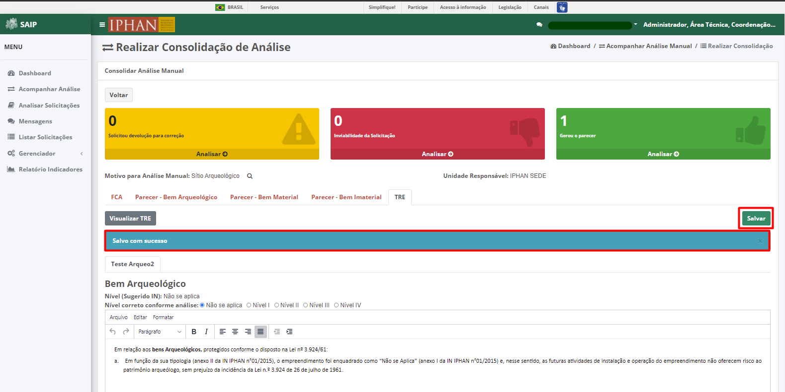

Acompanhar Análise
=============================

.. meta::
 :description: Apresentação do Acompanhar Análise.
  
Para acessar, as solicitações para que possa atribuir e consolidar a análise manual, acionar a opção **Acompanhar Análise** no menu lateral esquerdo.

.. image:: ../images/SAIP_Interno_Acompanhar_Analise.png
   :alt: SAIP Interno Acompanhar Análise Menu Aberto

Pesquisar Solicitação
------------------------

Em **Pesquisar Solicitação**, na parte superior se encontram os filtros de pesquisa como **Unidade**, **Motivo** e **Situação**. Tendo as opções de ação **limpar** e **pesquisar**.

.. image:: ../images/SAIP_Interno_Acompanhar_Analise_Perquisar_Solicitacao_Filtros.png
   :alt: SAIP Interno Acompanhar Análise Filtros

.. note::
   Sempre que preencher os filtros clique no botão **Pesquisar**, para que a ação seja executada ou **Limpar** para que os filtros sejam removidos.

.. image:: ../images/SAIP_Interno_Acompanhar_Analise_Perquisar_Solicitacao_Filtros_Pesquisar.png
   :alt: SAIP Interno Acompanhar Análise Pesquisar

.. image:: ../images/SAIP_Interno_Acompanhar_Analise_Perquisar_Solicitacao_Filtros_Limpar.png
   :alt: SAIP Interno Acompanhar Análise Limpar

   
Em **Pesquisar Solicitação**, na parte inferior encontram se os registros totais de solicitações ou o resultado da pesquisa realizada com os filtros. As colunas apresentadas são: **Solicitação**, **Solicitante**, **Interessado**, **Unidade Responsável**, **Motivo Análise Manual** e **Ações**.

.. note::
   O sistema permite que você ordene as colunas por ordem crescente ou decrescente, conforme o clique nos títulos de cada coluna.

.. image:: ../images/SAIP_Interno_Acompanhar_Analise_Perquisar_Solicitacao_Ordena_Resultado.png
   :alt: SAIP Interno Acompanhar Análise Ordena Resultado

.. note::
   Na lista de solicitações, o sistema apresenta a paginação a cada 10 registros. É possível selecionar a página desejada e nas extremidades há a opção de selecionar os ícones de página anterior e próxima página. 

.. image:: ../images/SAIP_Interno_Acompanhar_Analise_Perquisar_Solicitacao_Paginacao.png
   :alt: SAIP Interno Acompanhar Análise Paginação

Na lista, há as ações de **Atribuir Análise Manual** e **Consolidar Análise Manual**, respectivamente.

.. image:: ../images/SAIP_Interno_Acompanhar_Analise_Acoes.png
  :alt: SAIP Interno Acompanhar Análise Ações

.. note::
   As ações são apresentadas, de acordo com a **Situação** atual da solicitação.

   
Atribuir Análise Manual
---------------------------
Ao ter uma solicitação recém chegada, é apresentado a ação **Atribuir solicitação**, onde ao acionada é redirecionado para tela de **Realizar Atribuição de Análise**, onde será possível atribuir para cada área técnica responsável.

.. image:: ../images/SAIP_Interno_Acompanhar_Analise_Acao_Atribuir.png
  :alt: SAIP Interno ação Atribuir Análise 

Realizar Atribuição de Análise
---------------------------------
     
Em **Análise manual**, encontram-se as opções, como, **Motivo para Análise Manual**, **Unidade Responsável**, e os botões de **Voltar**, ** Devolver para Correção** e ** Atribuir Solicitação**.
  
.. image:: ../images/SAIP_Interno_Acompanhar_Analise_Realizar_Atribuicao_Analise_Analise_Manual.png 
  :alt: SAIP Interno Realizar Atribuicao Análise campos

.. note::
   Selecionando a lupa, será apresentado o motivo para a análise manual

.. image:: ../images/SAIP_Interno_Acompanhar_Analise_Realizar_Atribuicao_Analise_Analise_Manual_Lupa.png 
  :alt: SAIP Interno Realizar Atribuicao Análise campos Lupa Motivo

.. note::
  Selecionando a o botão voltar, o sistema retornará para tela de acompanhar analise.

.. image:: ../images/SAIP_Interno_Acompanhar_Analise_Realizar_Atribuicao_Analise_Analise_Manual_Voltar.png 
  :alt: SAIP Interno Realizar Atribuicao Análise botão voltar

.. image:: ../images/SAIP_Interno_Acompanhar_Analise.png
  :alt: SAIP Interno Realizar Atribuicao Análise botão voltar

Devolver para Correção
-------------------------
 
Selecionando o botão devolver para correção, é apresentado um campo onde será informado o motivo da correção, fazendo com que a solicitação retorne para ajustes.

.. image:: ../images/SAIP_Interno_Acompanhar_Analise_Realizar_Atribuicao_Analise_Analise_Manual_Devolver.png 
  :alt: SAIP Interno Realizar Atribuicao Análise botão Devolver

São apresentados os botões **Cancelar** e **Confirmar Correção**, os quais respectivamente, um realiza o fechamento do campo e o outro confirma a correção da solicitação.

Atribuir Solicitação
-------------------------
Ao selecionar o botão **Atribuir Solicitação**, é apresentado um campo **Atribuir Análise Manual**, onde é apresentado os campos a serem informados, a **unidade** e **Área Técnica responsável**.

.. image:: ../images/SAIP_Interno_Acompanhar_Analise_Realizar_Atribuicao_Analise_Analise_Manual_Botao_Atribuir_Solicitacao.png 
  :alt: SAIP Interno Realizar Atribuicao Análise botão atribuir Solicitação

.. note:: 
  São apresentados os botões **Cancelar** e **Atribuir**, os quais respectivamente, um realiza o fechamento do campo e o outro confirma a atribuição da solicitação.

 
FCA 
-----

Em **FCA**, encontram-se a opção, **Interessado**, e aos dados da solicitação, como, **Empreendimento/ART**, **Área Diretamente Afetada - ADA**, **Área de Influência Direta - AID**, **Município(s)**, **Elementos do Projeto de Engenharia**, **Previsão de Impacto ** e **Processos em outros órgãos**.

.. image:: ../images/SAIP_Interno_Acompanhar_Analise_Realizar_Atribuicao_Analise_Analise_Manual_FCA.png   
  :alt: SAIP Interno Realizar Atribuicao Análise FCA

Ao selecionar a lupa do campo interessando, é apresentado na tela os dados do interessado, contendo campos, como, **Tipo**, **CNPJ**, **Razão Social**, **Porte da Empresa**, **CPF**, **Responsável Legal**, **CEP**, **Endereço Comercial**, **Complemento**, **Bairro**, **UF**, **Cidade**, **E-mail**, **Telefone Fixo** e **Telefone Celular**.

.. note:: 
     Na parte inferior se encontra o botão fechar, onde acionado, fecha as informações apresentadas.

.. image:: ../images/SAIP_Interno_Acompanhar_Analise_Realizar_Atribuicao_Analise_FCA_Lupa_Dados_Interessado.png   
  :alt: SAIP Interno Realizar Atribuicao Dados Interessado  

Selecionando os dados da solicitação, como, **Empreendimento/ART**, **Área Diretamente Afetada - ADA**, **Área de Influência Direta - AID**, **Município(s)**, **Elementos do Projeto de Engenharia**, **Previsão de Impacto** e **Processos em outros órgãos**, o sistema abre apresentando as informações pertinentes. 

.. image:: ../images/SAIP_Interno_Acompanhar_Analise_Realizar_Atribuicao_Analise_FCA_Itens_Empreedimento.png 
   :alt: SAIP Interno Acompanhar Analise Realizar Atribuicao Analise FCA Itens Empreedimento

.. note::
   Ao selecionar outro campo, caso tenha algum campo aberto, o sistema esconde o mesmo automaticamente. 

.. image:: ../images/SAIP_Interno_Acompanhar_Analise_Realizar_Atribuicao_Analise_FCA_Itens_Empreedimento_Aberto.png
   :alt: SAIP Interno Acompanhar Analise Realizar Atribuicao Analise FCA Itens Empreedimento Aberto

Em **Área Diretamente Afetada - ADA**, o sistema apresenta as informações de Bens culturais de âmbito federal na ADA. Contendo os campos, UF e Município.

.. note:: 
    No botão **Detalha ADA** o sistema abre uma nova guia apresentando o mapa detalhado.

.. image:: ../images/SAIP_Interno_Acompanhar_Analise_Realizar_Atribuicao_Analise_FCA_Itens_Area_Diretamente.png
   :alt: SAIP Interno Acompanhar Analise Realizar Atribuicao Analise FCA Itens Area Diretamente

Em **Bens culturais de âmbito federal na ADA**, o sistema apresenta as informações de Bens culturais de âmbito federal na ADA, contendo as colunas, Bem Cultural, Nome, Natureza/Categoria, Tipo/Abrangência, UF e Cidade.

.. note:: 
  No botão **Detalha AID** o sistema abre uma nova guia apresentando o mapa detalhado.

.. image:: ../images/SAIP_Interno_Acompanhar_Analise_Realizar_Atribuicao_Analise_FCA_Itens_Area_Influencia.png
   :alt: SAIP Interno Acompanhar Analise Realizar Atribuicao Analise FCA Itens Area Influencia

Em **Município(s)**, é apresentado os bens culturais de âmbito federal na ADA, contendo as colunas, Bem Cultural, Nome, Natureza/Categoria, Tipo/Abrangência, UF e Cidade.

.. note:: 
   No botão **Visualizar Município(s)** o sistema abre uma nova guia apresentando o mapa detalhado. Acionando os nomes da coluna, é possível ordenar os resultados.

Em **Elementos do projeto de engenharia**, tem-se a descrição detalhada do projeto de engenharia, contendo arquivos anexados. 

.. image:: ../images/SAIP_Interno_Acompanhar_Analise_Realizar_Atribuicao_Analise_FCA_Itens_Elementos.png
   :alt: SAIP Interno Acompanhar Analise Realizar Atribuicao Análise FCA Itens Elemento

Em **previsão de Impacto**, tem-se as informações onde apresenta se há previsão de impacto (direto ou indireto), sendo eles: Bens culturais acautelados em âmbito Federal?, Terras Indígenas?, Cavidades naturais subterrâneas?, Área urbana?, Práticas e/ou locais utilizados ou referenciados para a produção e reprodução cultural de bens culturais registrados em âmbito Federal?, Terras Quilombolas?, Meio aquático? e Centro histórico tombado?.

.. image:: ../images/SAIP_Interno_Acompanhar_Analise_Realizar_Atribuicao_Analise_FCA_Itens_Previsao.png
    :alt: SAIP Interno companhar Analise Realizar Atribuicao Analise FCA Itens Previsão

Em **Processos em outros órgãos**, tem-se as informações onde apresenta se há processos existentes em órgão (Federais, estadual ou Municipal), contendo os campos, Tipo do Órgão, Nº do processo, Nome do Órgão, Unidade responsável, E-mail, Telefone, Licença Ambiental e Qual.

.. image:: ../images/SAIP_Interno_Acompanhar_Analise_Realizar_Atribuicao_Analise_FCA_Itens_Processos.png
    :alt: SAIP Interno Acompanhar Analise Realizar Atribuicao Análise FCA Itens Processos

Consolidar Analise Manual 
--------------------------
Ao selecionar ação **Consolidar Analise Manual** é levado para a página de **Realizar Consolidação de Análise*, contendo os campos: **Voltar**, **Solicitou devolução para correção**, **Inviabilidade da Solicitação**, **Gerou o parecer**, **Motivo para Análise Manual**, **Unidade Responsável**, **Parecer - Bem Arqueológico**, **Parecer - Bem Material**, **Parecer - Bem Imaterial**, TRE.

                                          
.. image:: ../images/SAIP_Interno_Acompanhar_Analise_Realizar_Consolidacao_Analise.png
   :alt: SAIP Interno Consolidar Analise Manual Consolidar Análise

Em **Solicitou devolução para correção** ao selecionar a opção "Analisar", é aberto um quadro "Análise de correções" onde é apresentado as solicitãções que foi devolvida para correção.
                                                              

.. note:: 
 No quadro tem-se duas opçãoes, **Cancelar** e **Encaminhar Correção**, ao selecionar **Cancelar** o quadro é fechado, selecionando **Encaminhar Correção**,situação da solicitação para Aguardando Correção, na qual não será apresentada ao Usuário Interno e apresentar o motivo nas notificações do usuário que realizou a solicitação e para os Analistas que pediram a correção.

                           
Em **Inviabilidade da Solicitação**, ao selecionar a opção "Analisar", é aberto um quadro "Análise de Indeferimentos" onde é apresentado as solicitãções que foi indeferidas.
                                              

No quadro tem-se duas opçãoes, **Cancelar** e **Recomendar Indeferimento**, ao selecionar **Cancelar** o quadro é fechado, selecionando **Recomendar Indeferimento**, é apresentada uma nova janela de **Indeferimento**, podendo **cancelar**, ao selecionado volta para o quadro anterior, ou a opção o **Gerar Indeferimento**.

.. image:: ../images/SAIP_Interno_Acompanhar_Analise_Realizar_Consolidacao_Analise_Inviabilidade_Solicitacao_Analise_Indeferimento.png
   :alt: SAIP Interno Consolidar Analise Manual Consolidar Análise

.. image:: ../images/SAIP_Interno_Acompanhar_Analise_Realizar_Consolidacao_Analise_Inviabilidade_Solicitacao_Analise_Indeferimento_Modal_Indeferimento.png
   :alt: SAIP Interno Consolidar Analise Manual Consolidar Análise

Em **Gerou o parecer**, ao selecionar a opção **Analisar**, é aberto um quadro "Análise de Geração de Pareceres", onde é apresentado as solicitãções que foi gerado parecer.
                           

.. note:: 
    No quadro tem-se duas opções, **Cancelar** e **Aprovar Parecer**, ao selecionar **Cancelar** o quadro é fechado, selecionando **Aprovar Parecer**, é apresentado a mensagem de confirmação e ao confirmar, o sistema aprova o parecer, gera o TRE e encaminhar mensagem para os envolvidos. 

.. image:: ../images/SAIP_Interno_Acompanhar_Analise_Realizar_Consolidacao_Analise_Gerou_Parecer_Cancelar_Aprovar_Parecer.png
    :alt: SAIP Interno Consolidar Analise Manual Consolidar Análise

Motivo para Análise Manual
--------------------------
Ao selecionar a lupa  ao lado de "Motivo para Análise Manual", é aberto um quadro **Motivo**, onde é apresentado as informações e o motivo da análise.

.. note:: 
    No quadro tem uma botão, **Fechar**, onde ao ser acionado o mesmo é fechado.

.. image:: ../images/SAIP_Interno_Acompanhar_Analise_Realizar_Consolidacao_Analise_Motivo_Analise_Manual.png
    :alt: SAIP Interno Consolidar Analise Manual Consolidar Análise

Unidade Responsável
--------------------------
Ao lado do campo **Unidade Responsável**, é apresentado o nome.

.. image:: ../images/SAIP_Interno_Acompanhar_Analise_Realizar_Consolidacao_Analise_Unidade_Responsavel.png
   :alt: SAIP Interno Consolidar Analise Manual Consolidar Análise

FCA - Consolidar Análise Manual
-------------------------------
Ao selecionar a lupa  ao lado de **Interessado**, é aberto um quadro,**Dados do Interessado**, onde é apresentado todos os dados do solicitante.
                                                   

.. note:: 
   No quadro tem uma botão, **Fechar**, onde ao  ser acionado o mesmo é fechado.

.. image:: ../images/SAIP_Interno_Acompanhar_Analise_Realizar_Consolidacao_Analise_Motivo_Analise_Manual_Interessado_Moldal.png               
   :alt: SAIP Interno Consolidar Analise Manual Consolidar Análise

Parecer - Bem Arqueológico 
---------------------------
Em **Parecer - Bem Arqueológico**, selecionando o botão **Retificar Parecer**, é apresentando informação de retificação para o parecer gerado pelo Analista.

    
.. note:: 
     No quadro tem uma botão, **Cancelar**, onde ao ser acionado as alterações são canceladas, **Salvar**, onde as informações inseridas do parecer são salvas como rascunho e "Gerar Parecer". quando selecionado, é gerado o parecer com o texto preenchido pelo usuário em formato de documento.

.. image:: ../images/SAIP_Interno_Acompanhar_Analise_Realizar_Consolidacao_Analise_Motivo_Analise_Manual_Parecer_Bem_Arqueologico_Retificar_Parecer.png
     :alt: SAIP Interno Consolidar Analise Manual Consolidar Análise

Parecer - Bem Material
--------------------------
Em "Parecer - Bem Material", selecionando o botão **Retificar Parecer**, é apresentando informação de retificação para o parecer gerado pelo Analista.

    
.. note:: 
     No quadro tem uma botão, **Cancelar**, onde ao ser acionado as alterações são canceladas, **Salvar**, onde as informações inseridas do parecer são salvas como rascunho e "Gerar Parecer". quando selecionado, é gerado o parecer com o texto preenchido pelo usuário em formato de documento.
                                                                          

Parecer - Bem Imaterial 
--------------------------
Em **Parecer - Bem Imaterial**, selecionando o botão **Retificar Parecer**, é apresentando informação de retificação para o parecer gerado pelo Analista.

.. note:: 
     No quadro tem uma botão, **Cancelar**, onde ao ser acionado as alterações são canceladas, **Salvar** onde as informações inseridas do parecer são salvas como rascunho e **Gerar Parecer**. quando selecionado, é gerado o parecer com o texto preenchido pelo usuário em formato de documento.

.. image:: ../images/SAIP_Interno_Acompanhar_Analise_Realizar_Consolidacao_Analise_Motivo_Analise_Manual_Parecer_Bem_Imaterial_Retificar_Parecer.png
   :alt: SAIP Interno Consolidar Analise Manual Consolidar Análise

TRE
---
Em **TRE**, é apresetado os botões **Visualzar TRE** e **Salvar**, contendo os campos **Bem Arqueológico**, **Bem Tombado**, **Bem Valorado** e **Bem Imaterial**.

Visualzar TRE
--------------

Em **Visualzar TRE**, ao acionado é apresentado uma janela **Termo de Referência Específico**, com informações alteradas.
                                                 
.. image:: ../images/SAIP_Interno_Acompanhar_Analise_Realizar_Consolidacao_Analise_Motivo_Analise_Manual_Parecer_TRE_Visualizar_TRE.png
     :alt: SAIP Interno Consolidar Analise Manual Consolidar Análise

.. note:: 
    Selecionado o botão "Fechar", a janela contendo as informações é fechada.

Salvar
---------
Em **Salvar**, ao acionado é apresentado uma mesagem "Salvo com sucesso", informando que as alterações realizadas foram gravadas.
                                                               

            
.. note:: 
   Selecionado o botão "x", a janela de sucesso e removida da página.

.. image:: ../images/SAIP_Interno_Acompanhar_Analise_Realizar_Consolidacao_Analise_Motivo_Analise_Manual_Parecer_TRE_Salvar_Fechar.png
   :alt: SAIP Interno Consolidar Analise Manual Consolidar Análise

Bem Arqueológico
--------------------------
Em ***Bem Arqueológico**, é apresentado o o campo **Nível(Sugerido IN)**, **Nível correto conforme análise**, pode ser marcada uma das opções, sendo, **Não se aplica**, **Nível I**, **Nível II**, **Nível III** e **Nível IV**. 
                                 
.. image:: ../images/SAIP_Interno_Acompanhar_Analise_Realizar_Consolidacao_Analise_Motivo_Analise_Manual_Parecer_TRE_Bem_Arqueologico.png
   :alt: SAIP Interno Consolidar Analise Manual Consolidar Análise

.. note:: 
   O texto padrão de cada nível apresentado muda, conforme cadastrado no sistema.

.. image:: ../images/SAIP_Interno_Acompanhar_Analise_Realizar_Consolidacao_Analise_Motivo_Analise_Manual_Parecer_TRE_Bem_Arqueologico_Mensagem.png
    :alt: SAIP Interno Consolidar Analise Manual Consolidar Análise

Bem Tombado
--------------------------
Em ***Bem Tombado**, é apresentado o o campo **Nível(Sugerido IN)**, **Nível correto conforme análise**, pode ser marcada uma das opções, sendo, **Com impacto** e **Sem Impacto**. 

.. image:: ../images/SAIP_Interno_Acompanhar_Analise_Realizar_Consolidacao_Analise_Motivo_Analise_Manual_Parecer_TRE_Bem_Tombado.png
    :alt: SAIP Interno Consolidar Analise Manual Consolidar Análise

.. note:: 
  O texto padrão de cada nível apresentado muda, conforme cadastrado no sistema.

.. image:: ../images/SAIP_Interno_Acompanhar_Analise_Realizar_Consolidacao_Analise_Motivo_Analise_Manual_Parecer_TRE_Bem_Tombado_Mensagem.png
    :alt: SAIP Interno Consolidar Analise Manual Consolidar Análise

Bem Valorado
--------------------------
Em ***Bem Valorado**, é apresentado o o campo **Nível(Sugerido IN)**, **Nível correto conforme análise**, pode ser marcada uma das opções, sendo, **Com impacto** e **Sem Impacto**. 

 
.. note:: 
    O texto padrão de cada nível apresentado muda, conforme cadastrado no sistema.

.. image:: ../images/SAIP_Interno_Acompanhar_Analise_Realizar_Consolidacao_Analise_Motivo_Analise_Manual_Parecer_TRE_Bem_Valorado_Mensagem.png
    :alt: SAIP Interno Consolidar Analise Manual Consolidar Análise

Bem Imaterial
--------------------------
Em ***Bem Imaterial**, é apresentado o o campo **Nível(Sugerido IN)**, **Nível correto conforme análise**, pode ser marcada uma das opções, sendo, **Sem Impacto**,  Com Impacto (TCE)**, **Com Impacto (Relatório)**, **Com Impacto (Relatório e TCE)**. 
                            
.. image:: ../images/SAIP_Interno_Acompanhar_Analise_Realizar_Consolidacao_Analise_Motivo_Analise_Manual_Parecer_TRE_Bem_Imaterial.png
     :alt: SAIP Interno Consolidar Analise Manual Consolidar Análise
       
.. note:: 
    O texto padrão de cada nível apresentado muda, conforme cadastrado no sistema.

