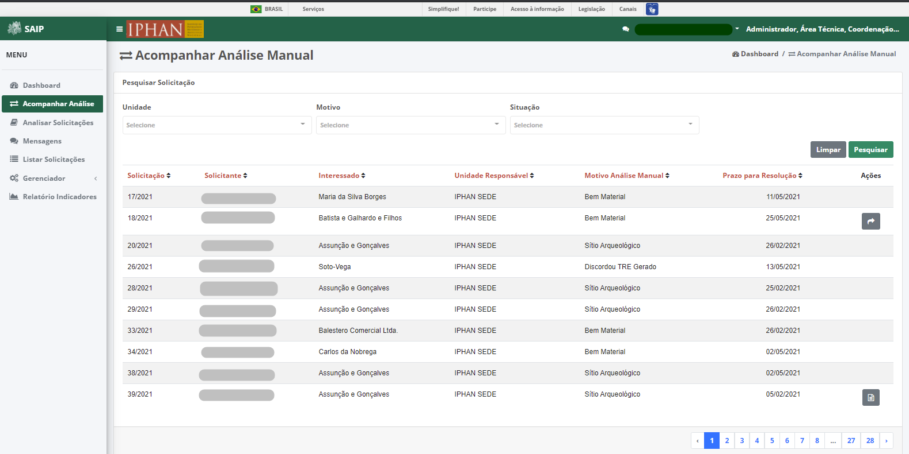
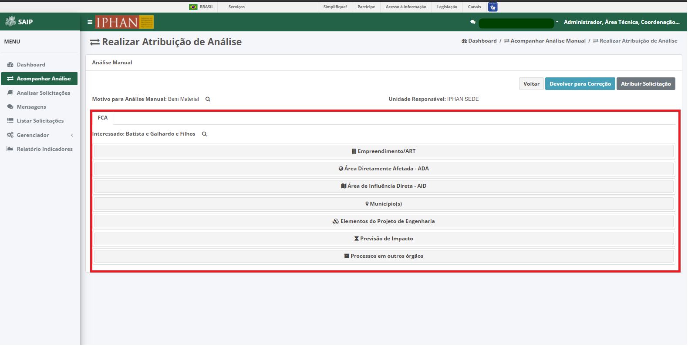
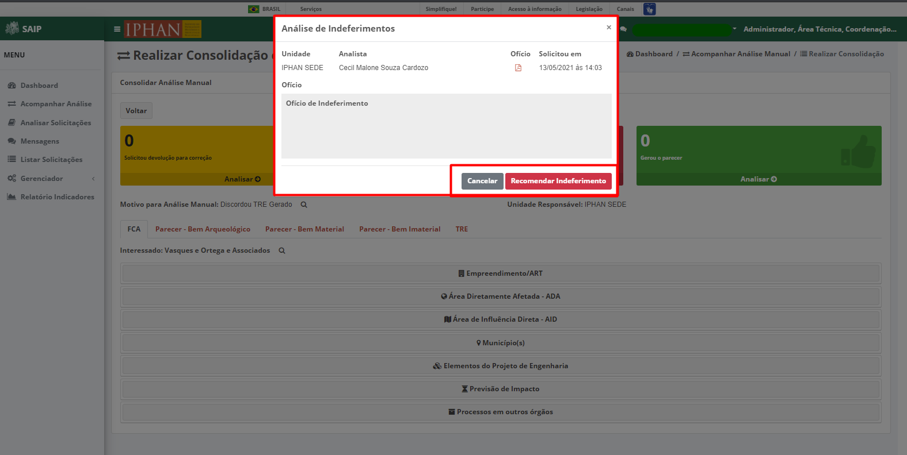
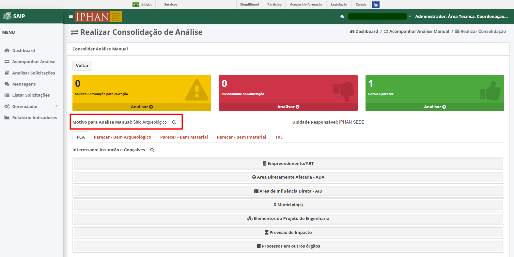

Acompanhar Análise
=============================

.. meta::
 :description: Apresentação do Acompanhar Análise.
  
Ao selecionar a opção de menu **Acompanhar Análise**, são disponibilizados os acessos às solicitações para atribuição e consolidação da análise manual.

.. image:: ../images/SAIP_Interno_Acompanhar_Analise_Menu.png
   :alt: SAIP Interno Acompanhar Análise Menu

Pesquisar Solicitação
------------------------

Na parte superior do **Pesquisar Solicitação** são disponibilizados os filtros de pesquisa: **Unidade**, **Motivo** e **Situação**, e ainda as opções de ação: **Limpar** e **Pesquisar**.

.. note::
   Para que a ação de pesquisa seja executada, faz-se necessário que se preencha os filtros disponíveis e acione o botão **Pesquisar**; para que os filtros sejam removidos faz-se necessário que se acione o botão **Limpar**.

.. image:: ../images/SAIP_Interno_Acompanhar_Analise_Perquisar_Solicitacao_Filtros_Pesquisar.png
   :alt: SAIP Interno Acompanhar Análise Pesquisar

   
Como resultado do **Pesquisar Solicitação** são apresentadas as colunas: **Solicitação**, **Solicitante**, **Interessado**, **Unidade Responsável**, **Motivo Análise Manual**, **Prazo para Resolução** e **Ações**, e a quantidade total de registros.

.. image:: ../images/SAIP_Interno_Acompanhar_Analise_Perquisar_Solicitacao_Filtros_Resultado.png
   :alt: SAIP Interno Acompanhar Análise Resultado

.. note::
   O sistema permite que haja a ordenação das colunas na forma crescente ou decrescente, conforme o clique nos títulos de cada coluna.

.. note::
   A lista de resultado do **Pesquisar Solicitação** apresenta paginação de 10 em 10 registros, as páginas por meio das quais o usuário pode navegar entre elas, e as opções de navegação para as próxima página e página anterior.

Como ações disponíveis na lista de resultado do **Pesquisar Solicitação**, tem-se: **Atribuir Análise Manual** e **Consolidar Análise Manual**.

.. note::
   As ações são apresentadas, de acordo com a **Situação** atual da solicitação.

   
Atribuir Análise Manual
---------------------------
A ação **Atribuir Solicitação** é disponibilizada para a solicitação recém chegada, e, uma vez acionada, redireciona o usuário para a tela de **Realizar Atribuição de Análise**, onde será possível atribuir essa solicitação para cada área técnica responsável pela análise.

.. image:: ../images/SAIP_Interno_Acompanhar_Analise_Realizar_Atribuicao_Analise.png 
  :alt: SAIP Interno Realizar Atribuicao Análise 

Realizar Atribuição de Análise
---------------------------------
     
No item de acompanhar análise **Análise Manual**, são disponibilizadas as opções: **Motivo para Análise Manual** e **Unidade Responsável**, e os botões: **Voltar**, **Devolver para Correção** e **Atribuir Solicitação**.
  

.. note::
   Ao acionar a lupa, serão apresentados os possíveis motivos para a análise manual.

.. image:: ../images/SAIP_Interno_Acompanhar_Analise_Realizar_Atribuicao_Analise_Analise_Manual_Lupa_Motivo.png 
   :alt: SAIP Interno Realizar Atribuicao Análise campos Lupa Motivo Moldal

.. note::
   Ao acionar o botão **Voltar**, o sistema retornará para a tela **Acompanhar Análise**.

Devolver para Correção
-------------------------
 
Ao acionar o botão **Devolver para Correção**, o campo **Motivo da Correção** é apresentado para que seja informado o referido motivo com o intuito de que sejam feitos ajustes na solicitação.

.. image:: ../images/SAIP_Interno_Acompanhar_Analise_Realizar_Atribuicao_Analise_Analise_Manual_Devolver.png 
  :alt: SAIP Interno Realizar Atribuicao Análise botão Devolver

Os botões **Cancelar** e **Confirmar Correção** também são apresentados, para que a devolução para correção seja cancelada ou confirmada pelo usuário, respectivamente.

.. image:: ../images/SAIP_Interno_Acompanhar_Analise_Realizar_Atribuicao_Analise_Analise_Manual_Devolver_Motivo.png 
  :alt: SAIP Interno Realizar Atribuicao Análise botão Devolver motivo

Atribuir Solicitação
-------------------------

Ao acionar o botão **Atribuir Solicitação**, o campo **Atribuir Análise Manual** é apresentado para que sejam informadas as **Unidade** e *Área Técnica Responsável* que receberão a solicitação para a análise.

.. note:: 
   Os botões **Cancelar** e **Atribuir** também são apresentados, para que a atribuição seja cancelada ou confirmada pelo usuário, respectivamente.

.. image:: ../images/SAIP_Interno_Acompanhar_Analise_Realizar_Atribuicao_Analise_Analise_Manual_Atribuir_Solicitacao.png  
   :alt: SAIP Interno Realizar Atribuicao Análise botão Atribuir  

 
FCA 
-----

No item de acompanhar análise **FCA**, são disponibilizadas a opção **Interessado**, e os dados da solicitação: **Empreendimento/ART**, **Área Diretamente Afetada - ADA**, **Área de Influência Direta - AID**, **Município(s)**, **Elementos do Projeto de Engenharia**, **Previsão de Impacto** e **Processos em outros órgãos**.

  Ao acionar a lupa no campo interessado, serão apresentados os dados do interessado: **Tipo**, **CNPJ**, **Razão Social**, **Porte da Empresa**, **CPF**, **Responsável Legal**, **CEP**, **Endereço Comercial**, **Complemento**, **Bairro**, **UF**, **Cidade**, **E-mail**, **Telefone Fixo** e **Telefone Celular**.

.. note:: 
   Ao acionar o botão **Fechar**, o sistema fecha automaticamente o formulário contendo as informações do interessado.

  Ao clicar em um campo nos dados do interessado da solicitação, que não esteja visível, o sistema apresenta a informação pertinente ao respectivo campo. 

.. note::
   Ao selecionar um novo grupo de dados da solicitação que não esteja visível, o sistema fecha automaticamente o formulário que contém os dados da solicitação visíveis do ultimo grupo aberto, e apresenta o formulário com as informações do novo grupo de dados selecionado. 

No item de acompanhar análise **Área Diretamente Afetada - ADA**, são apresentadas as informações de Bens culturais de âmbito federal na ADA, contendo os campos: UF e Município.

.. note:: 
    Ao acionar o botão **Detalha ADA** o sistema abre uma nova guia apresentando o mapa detalhado.

Ao selecionar o grupo de dados **Bens culturais de âmbito federal na ADA**, o sistema apresenta as informações de **Bem Cultural**, **Nome**,** Natureza/Categoria**, **Tipo/Abrangência**, **UF** e **Cidade**.

.. note:: 
  Ao acionar o botão **Detalha AID**, o sistema abre uma nova guia apresentando o mapa detalhado.

Ao selecionar o grupo de dados **Município(s)**, o sistema apresenta as informações de **Bem Cultural**, **Nome**, **Natureza/Categoria**, **Tipo/Abrangência**, **UF** e **Cidade**.

.. note:: 
   Ao acionar o botão **Visualizar Município(s)** o sistema abre uma nova guia apresentando o mapa detalhado. Clicando no título da coluna, é possível ordenar os resultados.

.. image:: ../images/SAIP_Interno_Acompanhar_Analise_Realizar_Atribuicao_Analise_FCA_Itens_Municipios.png
    :alt: SAIP Interno Acompanhar Analise Realizar Atribuicao Analise FCA Itens Municipio

Ao selecionar o grupo de dados **Elementos do Projeto de Engenharia**, o sistema apresenta a descrição detalhada do projeto de engenharia, contendo os arquivos anexados. 

Ao selecionar o grupo de dados **Previsão de Impacto**, o sistema apresenta as informações sobre se há previsão de impacto (direto ou indireto), sendo elas: **Bens culturais acautelados em âmbito Federal?**, **Terras Indígenas?**, **Cavidades naturais subterrâneas?**, **Área urbana?**, **Práticas e/ou locais utilizados ou referenciados para a produção e reprodução cultural de bens culturais registrados em âmbito Federal?**, **Terras Quilombolas?**, **Meio aquático?** e **Centro histórico tombado?**.

Ao selecionar o grupo de dados **Processos em outros órgãos**, o sistema apresenta as informações sobre se há processos existentes em órgão (Federais, estadual ou Municipal), contendo os campos: **Tipo do Órgão**, **Nº do processo**, **Nome do Órgão**, **Unidade responsável**, **E-mail**, **Telefone**, **Licença Ambiental** e **Qual**.

Consolidar Analise Manual 
--------------------------

Ao selecionar a ação **Consolidar Analise Manual**, o sistema apresenta a página de **Realizar Consolidação de Análise**, contendo os campos: **Voltar**, **Solicitou devolução para correção**, **Inviabilidade da Solicitação**, **Gerou o Parecer**, **Motivo para Análise Manual**, **Unidade Responsável**, **Parecer - Bem Arqueológico**, **Parecer - Bem Material**, **Parecer - Bem Imaterial** e **TRE**.

.. image:: ../images/SAIP_Interno_Acompanhar_Analise_Consolidar_Analise_Acao.png
   :alt: SAIP Interno Consolidar Analise Manual Ação
                                          

Ao acionar a opção **Analisar** no quadro **Solicitou devolução para correção**, o sistema abre o formulário **Análise de correções**, no qual são apresentadas as solicitações que foram devolvidas para correção.
                                                              
.. image:: ../images/SAIP_Interno_Acompanhar_Analise_Realizar_Consolidacao_Analise_Solicitou_Devolucao_Correcao.png
   :alt:  SAIP Interno Consolidar Analise Manual Consolidar

.. note:: 
   Os botões **Cancelar** e **Encaminhar para Correção** também são apresentados, para que a análise de correções seja cancelada ou confirmada pelo usuário, respectivamente. Ao confirmar o encaminhamento, o sistema atualiza a situação da solicitação para “Aguardando Correção”. A partir desse momento, a solicitação não mais será apresentada ao Usuário Interno, restando apenas as notificações automaticas para o usuário que realizou a solicitação e para os Analistas que pediram a correção.

.. image:: ../images/SAIP_Interno_Acompanhar_Analise_Realizar_Consolidacao_Analise_Solicitou_Devolucao_Correcao_Encaminhar_Correcao.png
     :alt: SAIP Interno Consolidar Analise Manual Consolidar Análise
                           
Ao acionar a opção **Analisar** no quadro **Inviabilidade da Solicitação**, o sistema abre o formulário **Análise de Indeferimentos**, no qual são apresentandas as solicitações que foram indeferidas.
                                              
.. image:: ../images/SAIP_Interno_Acompanhar_Analise_Realizar_Consolidacao_Analise_Inviabilidade_Solicitacao.png
    :alt: SAIP Interno Consolidar Analise Manual Consolidar Análise

Os botões **Cancelar** e **Recomendar Indeferimento** também são apresentados, para que a recomendação do indeferimento seja cancelada ou confirmada pelo usuário, respectivamente. Ao clicar no botão **Recomendar Indeferimento**, o usuário poderá informar os termos do ofício de indeferimento e confirmar a geração do mesmo.

Ao acionar a opção **Analisar** no quadro **Gerou o parecer**, o sistema abre o formulário **Análise de Geração de Pareceres**, no qual são apresentandas as solicitações para as quais foram gerados pareceres.
                           
.. image:: ../images/SAIP_Interno_Acompanhar_Analise_Realizar_Consolidacao_Analise_Gerou_Parecer.png
   :alt: SAIP Interno Consolidar Analise Manual Consolidar Análise
.. note:: 
   Os botões **Cancelar** e **Aprovar Parecer** também são apresentados, para que a aprovação do parecer seja cancelada ou confirmada pelo usuário, respectivamente. Ao clicar no botão **Aprovar Parecer**, o sistema gera o TRE e acaminha mensagem para os envolvidos. 

.. image:: ../images/SAIP_Interno_Acompanhar_Analise_Realizar_Consolidacao_Analise_Gerou_Parecer_Cancelar_Aprovar_Parecer_Confirmacao.png
    :alt: SAIP Interno Consolidar Analise Manual Consolidar Análise

Motivo para Análise Manual
--------------------------

Ao acionar a lupa no campo **Motivo para Análise Mensal**, o sistema abre o formulário **Motivo**, no qual são apresentadas as informações referentes ao motivo da análise.

.. note:: 
   O botão **Fechar** também é apresentado, possibilitando o usuário fechar o formulário.

Unidade Responsável
--------------------------

Ao lado do campo **Unidade Responsável**, é apresentado o nome da unidade.

FCA - Consolidar Análise Manual
-------------------------------

Ao acionar a lupa no campo interessado, serão apresentados os dados do interessado: **Tipo**, **CNPJ**, **Razão Social**, **Porte da Empresa**, **CPF**, **Responsável Legal**, **CEP**, **Endereço Comercial**, **Complemento**, **Bairro**, **UF**, **Cidade**, **E-mail**, **Telefone Fixo** e **Telefone Celular**.
                                                   
.. image:: ../images/SAIP_Interno_Acompanhar_Analise_Realizar_Consolidacao_Analise_Motivo_Analise_Manual_Interessado.png
    :alt: SAIP Interno Consolidar Analise Manual Consolidar Análise

.. note:: 
   O botão **Fechar** também é apresentado, possibilitando o usuário fechar o formulário.

Parecer - Bem Arqueológico 
---------------------------

No item de acompanhar análise **Parecer - Bem Arqueológico**, ao acionar o botão **Retificar Parecer**, o sistema apresenta as informações para a retificação do parecer gerado pelo Analista.

.. image:: ../images/SAIP_Interno_Acompanhar_Analise_Realizar_Consolidacao_Analise_Motivo_Analise_Manual_Parecer_Bem_Arqueologico.png
   :alt: SAIP Interno Consolidar Analise Manual Consolidar Análise
    
.. note:: 
   Os botões **Cancelar**, **Salvar** e **Gerar Parecer** também são apresentados, para que a retificação do parecer seja cancelada, salva como rascunho ou confirmada pelo usuário, respectivamente.

Parecer - Bem Material
--------------------------

No item de acompanhar análise **Parecer - Bem Material**, ao acionar o botão **Retificar Parecer**, o sistema apresenta as informações para a retificação do parecer gerado pelo Analista.

.. image:: ../images/SAIP_Interno_Acompanhar_Analise_Realizar_Consolidacao_Analise_Motivo_Analise_Manual_Parecer_Bem_material.png
  :alt: SAIP Interno Consolidar Analise Manual Consolidar Análise
    
.. note:: 
   Os botões **Cancelar**, **Salvar** e **Gerar Parecer** também são apresentados, para que a retificação do parecer seja cancelada, salva como rascunho ou confirmada pelo usuário, respectivamente.
                                                                          
.. image:: ../images/SAIP_Interno_Acompanhar_Analise_Realizar_Consolidacao_Analise_Motivo_Analise_Manual_Parecer_Bem_material_Retificar_Parecer.png
    :alt: SAIP Interno Consolidar Analise Manual Consolidar Análise                                                      

Parecer - Bem Imaterial 
--------------------------

No item de acompanhar análise **Parecer - Bem Imaterial**, ao acionar o botão **Retificar Parecer**, o sistema apresenta as informações para a retificação do parecer gerado pelo Analista.

.. image:: ../images/SAIP_Interno_Acompanhar_Analise_Realizar_Consolidacao_Analise_Motivo_Analise_Manual_Parecer_Bem_Imaterial.png
   :alt: SAIP Interno Consolidar Analise Manual Consolidar Análise

.. note:: 
   Os botões **Cancelar**, **Salvar** e **Gerar Parecer** também são apresentados, para que a retificação do parecer seja cancelada, salva como rascunho ou confirmada pelo usuário, respectivamente.

TRE
---

No item de acompanhar análise **TRE**, são apresentados os botões **Visualzar TRE** e **Salvar**, e os campos **Bem Arqueológico**, **Bem Tombado**, **Bem Valorado** e **Bem Imaterial**.

.. image:: ../images/SAIP_Interno_Acompanhar_Analise_Realizar_Consolidacao_Analise_Motivo_Analise_Manual_Parecer_TRE.png
     :alt: SAIP Interno Consolidar Analise Manual Consolidar Análise

Visualzar TRE
--------------

Ao clicar no botão **Visualzar TRE**, o sistema apresenta o formulário contendo as informações atualizadas acerca doTermo de Referência Específico.
                                                 

.. note:: 
   O botão **Fechar** também é apresentado, possibilitando o usuário fechar o formulário.

.. image:: ../images/SAIP_Interno_Acompanhar_Analise_Realizar_Consolidacao_Analise_Motivo_Analise_Manual_Parecer_TRE_Visualizar_TRE_Fechar.png
      :alt: SAIP Interno Consolidar Analise Manual Consolidar Análise

Salvar
---------

Ao clicar no botão **Salvar**, o sistema registra as alterações realizadas e apresenta a mensagem de interação com o usuário: **Salvo com sucesso**.
                                                               
.. image:: ../images/SAIP_Interno_Acompanhar_Analise_Realizar_Consolidacao_Analise_Motivo_Analise_Manual_Parecer_TRE_Salvar.png
    :alt: SAIP Interno Consolidar Analise Manual Consolidar Análise
            
.. note:: 
   Ao clicar no botão de fechamento “**x**”, o sistema fecha automaticamente a mensagem de interação com o usuário.

Bem Arqueológico
--------------------------

No item **Bem Arqueológico**, são apresentados os campos: **Nível(Sugerido IN)** e **Nível correto conforme análise**, este último com as opções: **Não se aplica**, **Nível I**, **Nível II**, **Nível III** e **Nível IV**.
                                 

.. note:: 
   O texto padrão de cada nível apresentado muda, conforme cadastrado no sistema.

Bem Tombado
--------------------------

No item **Bem Tombado**, são apresentados os campos: **Nível(Sugerido IN)**, **Nível correto conforme análise**, este último com as opções: **Com impacto** e **Sem Impacto**. 

.. image:: ../images/SAIP_Interno_Acompanhar_Analise_Realizar_Consolidacao_Analise_Motivo_Analise_Manual_Parecer_TRE_Bem_Tombado.png
    :alt: SAIP Interno Consolidar Analise Manual Consolidar Análise

.. note:: 
  O texto padrão de cada nível apresentado muda, conforme cadastrado no sistema.

Bem Valorado
--------------------------

No item **Bem Valorado**, são apresentados os campos: **Nível(Sugerido IN)** e **Nível correto conforme análise**, este último com as opções: **Com impacto** e **Sem Impacto**. 

.. image:: ../images/SAIP_Interno_Acompanhar_Analise_Realizar_Consolidacao_Analise_Motivo_Analise_Manual_Parecer_TRE_Bem_Valorado.png
    :alt: SAIP Interno Consolidar Analise Manual Consolidar Análise
 
.. note:: 
    O texto padrão de cada nível apresentado muda, conforme cadastrado no sistema.

Bem Imaterial
--------------------------

No item **Bem Imaterial**, são apresentados os campos: **Nível(Sugerido IN)**, **Nível correto conforme análise**, este último com as opções: **Sem Impacto**,  **Com Impacto (TCE)**, **Com Impacto (Relatório)**, **Com Impacto (Relatório e TCE)**. 
                            

       
.. note:: 
    O texto padrão de cada nível apresentado muda, conforme cadastrado no sistema.

.. image:: ../images/SAIP_Interno_Acompanhar_Analise_Realizar_Consolidacao_Analise_Motivo_Analise_Manual_Parecer_TRE_Bem_Imaterial_Mensagem.png
        :alt: SAIP Interno Consolidar Analise Manual Consolidar Análise
