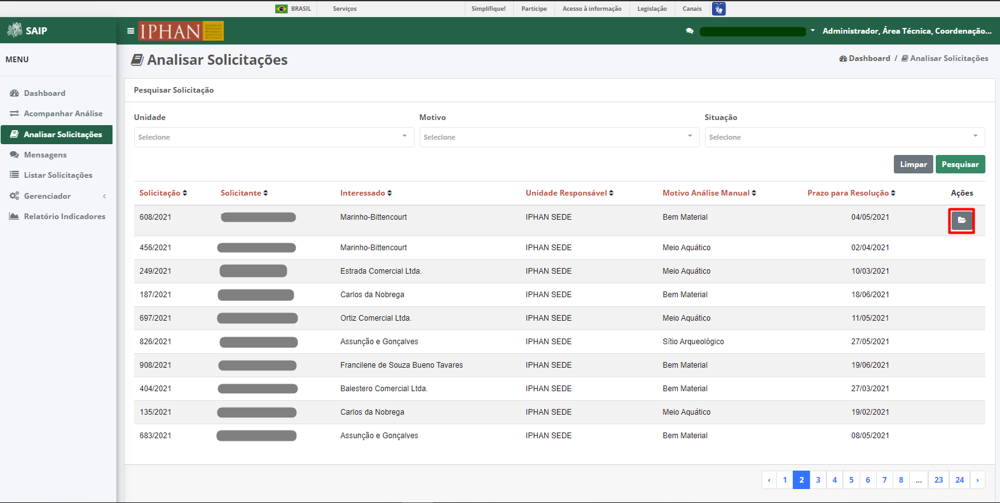

Analisar Solicitações
=============================

.. meta::
 :description: Apresentação do Analisar Solicitações.
  
Para acompanhar e realizar a análise manual das solicitações, pelo SAIP, clique na opção **Analisar Solicitações** no menu lateral esquerdo.

Pesquisar Solicitação
-----------------------
Em Pesquisar Solicitação, na parte superior se encontram os filtros de pesquisa como Unidade, Motivo e Situação, assim como os botões **Limpar** e **Pesquisar**.

.. note::
    Sempre que preencher os filtros clique no botão **Pesquisar**, para que a ação seja executada, e **Limpar** para remover os filtros selecionados.
   

Em Pesquisar Solicitação, na parte inferior encontra-se os registros totais de solicitações ou conforme os filtros informados. As colunas apresentadas são: Solicitação, Solicitante, Interessado, Unidade Responsável, Motivo Análise Manual, Prazo para Resolução e Ações.

.. note::
    O sistema permite que você ordene as colunas por ordem crescente ou decrescente, conforme o clique nos títulos de cada coluna.

.. image:: ../images/SAIP_Interno_Analisar_Solicitacoes_Pesquisar_Solicitacao_Ordenar.png
   :alt: SAIP Interno Acompanhar Análisar Solicitações

.. note::
     Na lista de solicitações, o sistema apresenta a paginação a cada 10 registros. É possível selecionar a página desejada e nas extremidades, há a opção de selecionar os ícones de página anterior e próxima página.

No resultado da pesquisa, na coluna Ações, há a opção **Analisar**.

.. note::
   A ação é apresentada, de acordo com a **Situação** atual da solicitação.

Analisar
---------
Ao acionar o botão **Analisar**, o sistema é redirecionado para a página de **Análise Manual**, onde se tem **Motivo para Análise Manual**, **Unidade Responsável**, **Interessado** e as informações preenchidas na Solicitação, presente na aba **FCA**. Assim como as ações **Voltar**, **Inviabilidade da Solicitação**, **Devolver para Correção** e **Gerar Parecer**.

.. note::
      Selecionando a lupa no campo **Motivo para Análise Manual**, é apresentado as informações do motivo da analise manual.
                   
 .. image:: ../images/SAIP_Interno_Analisar_Solicitacoes_Pesquisar_Solicitacao_Analise_Manual_Motivo.png
   :alt: SAIP Interno Acompanhar Análisar Solicitações
                            
.. image:: ../images/SAIP_Interno_Analisar_Solicitacoes_Pesquisar_Solicitacao_Analise_Manual_Motivo_Janela.png
  :alt: SAIP Interno Acompanhar Análisar Solicitações

.. note::
    Selecionando a lupa no campo **Interessado**, é apresentado os dados do Interessado.
                   
.. image:: ../images/SAIP_Interno_Analisar_Solicitacoes_Pesquisar_Solicitacao_Analise_Manual_Interessado.png
    :alt: SAIP Interno Acompanhar Análisar Solicitações

.. image:: ../images/SAIP_Interno_Analisar_Solicitacoes_Pesquisar_Solicitacao_Analise_Manual_Interessado_Janela.png
   :alt: SAIP Interno Acompanhar Análisar Solicitações

Inviabilidade da Solicitação
-----------------------------

Selecionando a opção **Inviabilidade da Solicitação**, o sistema apresenta a janela **Inviabilidade da Solicitação** para preenchimento do Ofício de Inviabilidade.

.. image:: ../images/SAIP_Interno_Analisar_Solicitacoes_Pesquisar_Solicitacao_Analise_Manual_Inviabilidade_Solicitacao.png
          :alt: SAIP Interno Acompanhar Análisar Solicitações

.. note:: 
      Ao selecionar a opção "Confirmar Inviabilidade", o sistema gera o ofício, altera a situação do registro e então é encerrada a análise.

Devolver para Correção
-----------------------------

Selecionando a opção **Devolver para Correção**, o sistema apresenta a janela **Motivo da Correção** para preenchimento do Motivo.

.. note:: 
      Ao selecionar a opção "Confirmar Correção", o sistema encaminha a solicitação para o solicitante, altera a situação do registro e então é encerrada a análise.

Gerar Parecer
----------------

Selecionando a opção **Gerar Parecer**, o sistema atualiza a página **Análise Manual**, com os botões **Voltar**, **Salvar** e **Confirmar Parecer**. E as informações como Motivo para Análise Manual, Unidade Responsável, Interessado, FCA e as abas de Parecer.

Em **Parecer - Bem Arqueologico**, contém as informações conforme análise, como Nível (Sugerido IN), Nível correto conforme análise, podendo ser, Não se aplica, Nível I, Nível II, Nível III e Nível IV.

.. image:: ../images/SAIP_Interno_Analisar_Solicitacoes_Pesquisar_Solicitacao_Analise_Manual_Gerar_Parecer_Analise_Parecer_Bem_Arqueologico.png
    :alt: SAIP Interno Acompanhar Análisar Solicitações

Em **Parecer - Bem Imaterial**, contém as informações conforme análise, como Nome do Empreendimento, Impacto conforme FCA, Impacto correto conforme análise, podendo ser, Sem Impacto, Com Impacto(TCE), Com Impacto(Relatório) e Com Impacto(Relatório e TCE).

.. image:: ../images/SAIP_Interno_Analisar_Solicitacoes_Pesquisar_Solicitacao_Analise_Manual_Gerar_Parecer_Analise_Parecer_Bem_Imaterial.png
    :alt: SAIP Interno Acompanhar Análisar Solicitações

Em **Parecer - Bem Material**, contém as informações conforme análise, como Impacto conforme FCA, Impacto correto conforme análise, podendo ser,Com Impacto ou Sem Impacto.

.. image:: ../images/SAIP_Interno_Analisar_Solicitacoes_Pesquisar_Solicitacao_Analise_Manual_Gerar_Parecer_Analise_Parecer_Bem_Material.png
   :alt: SAIP Interno Acompanhar Análisar Solicitações

.. note::
   Acionando o botão **Voltar** ele faz retornar para a página anterior, **Salvar** guarda as informações inseridas/editadas e apresenta um alerta de que os dados foram salvos com sucesso. 

.. note::
  **Confirmar Parecer**, realiza a confirmação da geração do parecer, gera o parecer, atualiza a situação do registro e redireciona para a página **Analisar Solicitações** .

