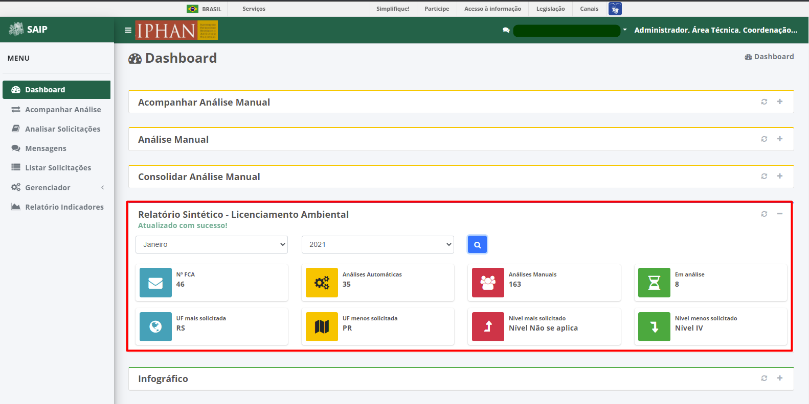

Dashboard
=============================

.. meta::
 :description: Apresentação do Dashboard.
  
Ao selecionar o menu **Dashboard**, são apresentados os seguintes dashboards: **Acompanhar Análise Manual**, **Análise Manual**, **Consolidar Análise Manual**, **Relatório Sintético - Licenciamento Ambiental**, **Infográfico - Solicitações por UF** e **Sistema**.

.. image:: ../images/Dashboard.png
   :alt: SAIP Interno Dashboard

.. image:: ../images/SAIP_Interno_Dashboard.png
   :alt: SAIP Interno Dashboard Aberto

.. note::
   O sistema apresenta as opções: **Acompanhar Análise Manual**, **Análise Manual** e **Consolidar Análise Manual**, de forma expandida, automaticamente, quando a opção Dashboard é selecionada.

.. note::
   Os dashboards são apresentados conforme o perfil do usuário no sistema. Caso não esteja sendo apresentado um determinado dashboard, o usuário deverá contactar o Administrador do sistema.

Carregar Dados
--------------------------------------------

Ao selecionar a opção **Carregar Dados**, o sistema atualiza as informações do respectivo dashboard.

.. image:: ../images/SAIP_Interno_Dashboard_Opcao_Atualizar_Aberto.png
   :alt: SAIP Interno Dashboard Carregar Dados Aberto

.. note::
 Ao atualizar as informações referentes ao Dashboard, caso o mesmo se encontre retraído, o mesmo será expandido apresentando as informações atualizadas.

Mostrar/Esconder
--------------------------------------------

Ao selecionar a opção **Mostrar**, o dashboard é expandido apresentando todas as informações pertinentes a ele; quando acionada a opção **Esconder**, o dashboard é retraído, apresentando apenas o seu nome.

.. image:: ../images/SAIP_Interno_Dashboard_Opcao_Esconder.png
   :alt: SAIP Interno Dashboard Esconder Dados

Acompanhar Análise Manual
--------------------------------------------

No item de dashboard **Acompanhar Análise Manual**, são apresentados 4 quadros, sendo eles: **Novas solicitações**, **Solicitações próximas ao prazo limite**, **Solicitações fora do prazo** e **Solicitações atribuídas**.

.. image:: ../images/SAIP_Interno_Dashboard_Acompanhar_Analise_Manual.png
   :alt: SAIP Interno Acompanhar Análise Manual Quadros

Ao selecionar **Mais informações** em um dos quadros apresentados, o sistema irá redirecionar automaticamente o usuário para a opção de menu **Acompanhar Análise**, onde serão aplicados os filtros relativos à solicitação desejada.

.. image:: ../images/SAIP_Interno_Dashboard_Acompanhar_Analise_Manual_Quadros.png
   :alt: SAIP Interno Acompanhar Análise Manual Quadros Informações

Análise Manual
--------------------------------------------
No item de dashboard **Análise Manual**, são apresentados 4 quadros, sendo eles: **Novas Análises**, **Análises próximas ao prazo limite**, **Analises fora do prazo** e **Análises realizadas**.

.. image:: ../images/SAIP_Interno_Dashboard_Analise_Manual_Quadros.png
   :alt: SAIP Interno Análise Manual Quadros

Ao selecionar **Mais informações** em dos quadros apresentados, o sistema irá redirecionar automaticamente o usuário para a opção de menu **Acompanhar Análise**, onde serão aplicados os filtros relativos à solicitação desejada.

Consolidar Análise Manual
---------------------------
No item de dashboard **Consolidar Análise Manual**, são apresentados 4 quadros, sendo eles: **Novas Consolidações**, **Consolidações próximas ao prazo limite**, **Consolidações fora do prazo** e **Consolidações realizadas**.
   
.. image:: ../images/SAIP_Interno_Dashboard_Consolidar_Analise_Manual_Quadros.png
   :alt: SAIP Interno Consolidar Análise Manual Quadros
   
Ao selecionar **Mais informações** em um dos quadros apresentados, o sistema irá redirecionar automaticamente o usúario para a opção de menu **Acompanhar Análise**, onde serão aplicados os filtros relativos à solicitação desejada.
   
.. image:: ../images/SAIP_Interno_Dashboard_Consolidar_Analise_Manual_Quadros_Informacoes.png
   :alt: SAIP Interno Acompanhar Consolidar Análise Manual Quadros Informações

Relatório Sintético - Licenciamento Ambiental
-----------------------------------------------

No item de dashboard **Relatório Sintético - Licenciamento Ambiental**, são apresentados 8 quadros, sendo eles: Nº FCA, Análises Automáticas, Análises Manuais, Em análise, UF mais solicitada, UF menos solicitada, Nível mais solicitado e Nível menos solicitado, contendo informações baseadas em todas as solicitações já realizadas.

   
Na parte superior há duas combos: uma contendo os meses, que por padrão traz a opção **Geral** e outra contendo os anos, por meio das quais p odem ser filtrados os resultados.
   
.. image:: ../images/SAIP_Interno_Relatorio_Sintetico_Licenciamento_Ambiental_Filtro_Mes.png
   :alt: SAIP Interno Relatório Sintético - Licenciamento Ambiental Filtro Mês

.. image:: ../images/SAIP_Interno_Relatorio_Sintetico_Licenciamento_Ambiental_Filtro_Ano.png
   :alt: SAIP Interno Relatório Sintético - Licenciamento Ambiental Filtro Ano 

.. note::
 Para que a ação de filtrar seja executada, faz-se necessário que se preencha os filtros disponíveis e acione a lupa.

.. image:: ../images/SAIP_Interno_Relatorio_Sintetico_Licenciamento_Ambiental_Filtro_Lupa.png
   :alt: SAIP Interno Relatório Sintético - Licenciamento Ambiental Filtro lupa
   

Infográfico
--------------------

No item de dashboard **Infográfico**, é apresentado um mapa onde se pode visualizar de forma intuitiva todas as solicitações por UF, contendo os campos: UF, Solicitações protocoladas, Solicitações analisadas e Solicitações em análise.

Na parte superior há duas combos: uma contendo os meses, que por padrão traz a opção **Geral** e outra contendo os anos, por meio das quais p odem ser filtrados os resultados.

.. image:: ../images/SAIP_Interno_Infografico_Filtro_Mes.png
   :alt: SAIP Interno Infográfico Filtro Mês

.. image:: ../images/SAIP_Interno_Infografico_Filtro_Ano.png
   :alt: SAIP Interno Infográfico Filtro Ano

.. note::
   Para que a ação de filtrar seja executada, faz-se necesário que se preencha os filtros disponíveis e acione a lupa.

.. image:: ../images/SAIP_Interno_Infografico_Lupa.png
   :alt: SSAIP Interno Infográfico Filtro Lupa
   

Ao selecionar uma UF no mapa, as informações referentes às solicitações da UF são automaticamente atualizadas e apresentadas.

.. image:: ../images/SAIP_Interno_Infografico_Mapa.png
   :alt: SAIP Interno Infográfico Mapa

.. image:: ../images/SAIP_Interno_Infografico_Selecao_Mapa.png
   :alt: SAIP Interno Infográfico Resultado Mapa

Sistema
---------
   
No item de dashboard **Sistema**, são apresentados 4 quadros, sendo eles: Usuários Cadastrados, Usuário mais ativo, Interessados Cadastrados e Interessado mais ativo.
     

      
Na parte superior há duas combos: uma contendo os meses, que por padrão traz a opção **Geral** e outra contendo os anos, por meio das quais podem ser filtrados os resultados.
      

   

   
.. note::
   Para que a ação de filtrar seja executada, faz-se necesário que se preencha os filtros disponíveis e acione a lupa.
   

      
.. image:: ../images/SAIP_Interno_Sistema_Filtro_Resultado.png
   :alt: SAIP Interno Sistema Filtro Resultado
   