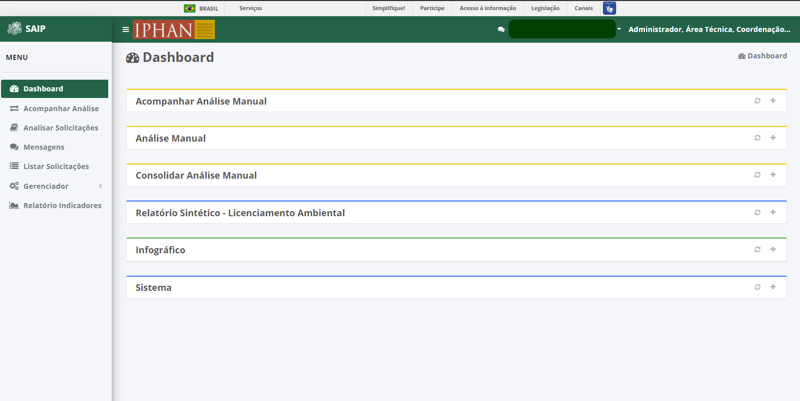

Dashboard
=============================

.. meta::
 :description: Apresentação do Dashboard.
  
Ao selecionar o menu **Dashboard**, é apresentado as opções: **Acompanhar Análise Manual**, **Análise Manual**, **Consolidar Análise Manual**, **Relatório Sintético - Licenciamento Ambiental**, **Infográfico - Solicitações por UF** e **Sistema**.

.. note::
   O sistema apresenta as opções: **Acompanhar Análise Manual**, **Análise Manual** e **Consolidar Análise Manual**, de forma aberta automaticamente ao ter a opção Dashboard selecionada.

Carregar Dados
--------------------------------------------

Ao selecionar a opção **Carregar Dados**,o sistema atualiza as informações do dashboard e apresenta.

.. image:: ../images/SAIP_Interno_Dashboard_Opcao_Atualizar.png
   :alt: SAIP Interno Dashboard Carregar Dados

.. image:: ../images/SAIP_Interno_Dashboard_Opcao_Atualizar_Aberto.png
   :alt: SAIP Interno Dashboard Carregar Dados Aberto

.. note::
 Ao atualizar as informações referente ao Dashboard, caso o mesmo se encontre escondido, ele abrirá apresentando as informações atualizadas.

Mostrar/Esconder
--------------------------------------------

Ao selecionar a opção **Mostrar**, o dashboard é aberto e assim apresentando todas as informações pertinentes, e quando acionada a opção **Esconder**, apenas o nome do Dashboard é apresentado.

.. image:: ../images/SAIP_Interno_Dashboard_Opcao_Mostrar.png
   :alt: SAIP Interno Dashboard Mostrar Dados

.. image:: ../images/SAIP_Interno_Dashboard_Opcao_Esconder.png
   :alt: SAIP Interno Dashboard Esconder Dados

Acompanhar Análise Manual
--------------------------------------------

Em **Acompanhar Análise Manual**, será apresentado 4 quadros sendo eles: **Novas solicitações**, **Solicitações próximas ao prazo limite**, **Solicitações fora do prazo** e **Solicitações atribuídas**.

Ao selecionar **Mais informações** de um dos quadros apresentados, o sistema irá redirecionar para **Acompanhar Análise**, onde será aplicado automaticamente os filtros relativos a solicitação desejada.

Análise Manual
--------------------------------------------
Em **Análise Manual**, será apresentado 4 quadros sendo eles: **Novas Análises**, **Análises próximas ao prazo limite**, **Analises fora do prazo** e **Análises realizadas**.

Ao selecionar **Mais informações** de um dos quadros apresentados, o sistema irá redirecionar para **Acompanhar Análise**, onde será aplicado automaticamente os filtros relativos a solicitação desejada.

.. image:: ../images/SAIP_Interno_Dashboard_Analise_Manual_Quadros_Informacoes.png
   :alt: SAIP Interno Acompanhar Análise Manual Quadros Informações

Consolidar Análise Manual
---------------------------
Em **Consolidar Análise Manual**, será apresentado 4 quadros sendo eles: **Novas Consolidações**, **Consolidações próximas ao prazo limite**, **Consolidações fora do prazo** e **Consolidações realizadas**.
   
.. image:: ../images/SAIP_Interno_Dashboard_Consolidar_Analise_Manual_Quadros.png
   :alt: SAIP Interno Consolidar Análise Manual Quadros
   
Ao selecionar **Mais informações** de um dos quadros apresentados, o sistema irá redirecionar para **Acompanhar Análise**, onde será aplicado automaticamente os filtros relativos a solicitação desejada.
   

Relatório Sintético - Licenciamento Ambiental
-----------------------------------------------

Em **Relatório Sintético - Licenciamento Ambiental**, é apresentado 8 quadros, sendo eles: Nº FCA, Análises Automáticas, Análises Manuais, Em análise, UF mais solicitada, UF menos solicitada, Nível mais solicitado e Nível menos solicitado, contendo informações com base em todas as solicitações já realizadas.

.. image:: ../images/SAIP_Interno_Relatorio_Sintetico_Licenciamento_Ambiental.png 
   :alt: SAIP Interno Relatório Sintético - Licenciamento Ambiental
   
Na parte superior encontra-se duas combos, onde se pode filtrar os resultados, uma contendo os meses, quepor padrão é selecionado a opção Geral e a outra contendo os anos.
   

.. note::
 Sempre que preencher os filtros, acionar a lupa, para que a ação seja executada.

   
.. image:: ../images/SAIP_Interno_Relatorio_Sintetico_Licenciamento_Ambiental_Filtro_Resultado.png
   :alt: SAIP Interno Relatório Sintético - Licenciamento Ambiental Filtro Reultado

Infográfico
--------------------

Em **Infográfico**, é apresentado um mapa onde se pode visualizar de forma intuitiva todas as solicitações por UF. contendo os campos: UF, Solicitações protocoladas, Solicitações analisadas e Solicitações em análise.

.. image:: ../images/SAIP_Interno_Infografico_Dashboard.png
   :alt: SAIP Interno Infográfico Dashboard

Na parte superior encontra-se duas combos, onde se pode filtrar os resultados, uma contendo os meses, que por padrão é selecionada a opção Geral e a outra contendo os anos.

.. image:: ../images/SAIP_Interno_Infografico_Filtro.png
   :alt: SAIP Interno Infográfico Filtro

.. image:: ../images/SAIP_Interno_Infografico_Filtro_Ano.png
   :alt: SAIP Interno Infográfico Filtro Ano

.. note::
 Sempre que preencher os filtros, acionar a lupa, para que a ação seja executada.

   
.. image:: ../images/SAIP_Interno_Infografico_Filtro_Resultado.png
   :alt: SAIP Interno Infográfico Filtro Reultado

Selecionando uma UF no mapa, os campos ao lado é automaticamente atualizado com as informações pertinentes ao estado.

Sistema
---------
   
Em **Sistema**, é apresentado 4 quadros, sendo eles: Usuários Cadastrados, Usuário mais ativo, Interessados Cadastrados e Interessado mais ativo.
     
.. image:: ../images/SAIP_Interno_Sistema_Dashboard.png
   :alt: SAIP Interno Sistema Dashboard
      
Na parte superior encontra-se duas combos, onde se pode filtrar os resultados, uma contendo os meses, que por padrão é selecionado a opção Geral e a outra contendo os anos.
      
.. image:: ../images/SAIP_Interno_Sistema_Filtro_Mes.png
   :alt: SAIP Interno Sistema Filtro Mes
   
.. image:: ../images/SAIP_Interno_Sistema_Filtro_Mes.png
      :alt: SAIP Interno Sistema Filtro Ano
   
.. note::
    Sempre que preencher os filtros, acionar a lupa, para que a ação seja executada.
   
.. image:: ../images/SAIP_Interno_Sistema_Filtro_Lupa.png
   :alt: SAIP Interno Sistema Filtro Lupa
      

   