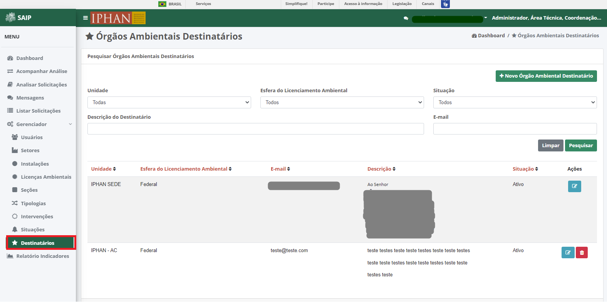
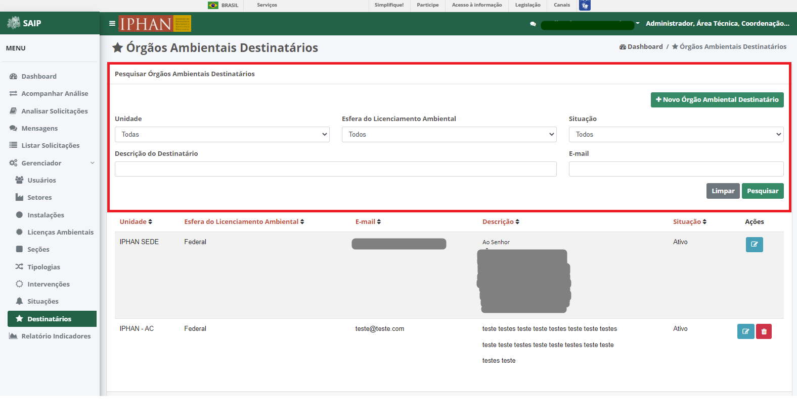
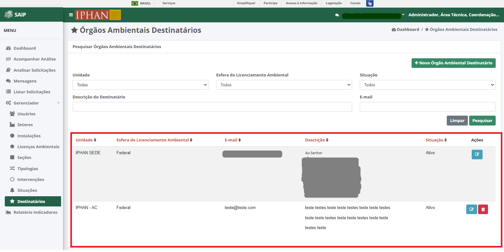
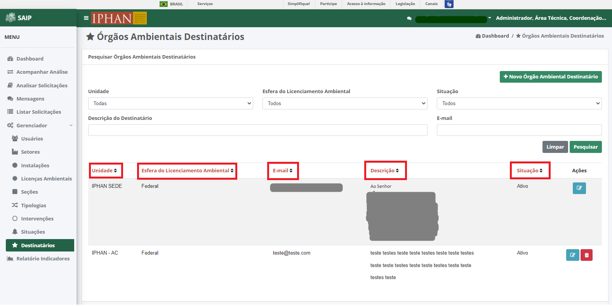
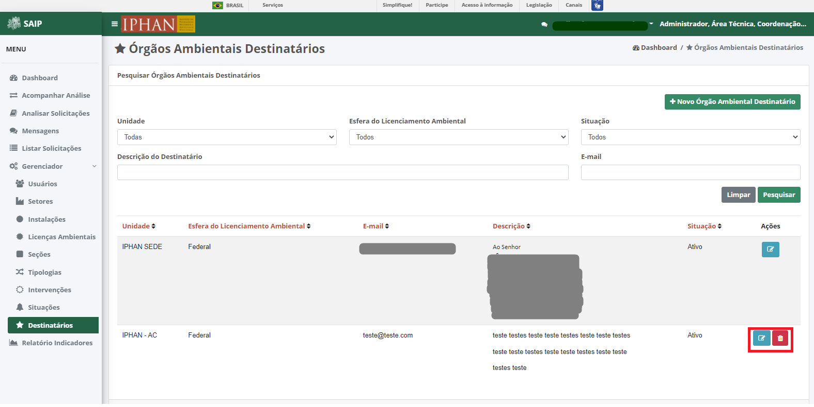
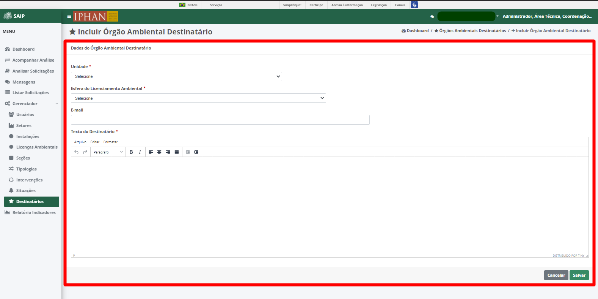
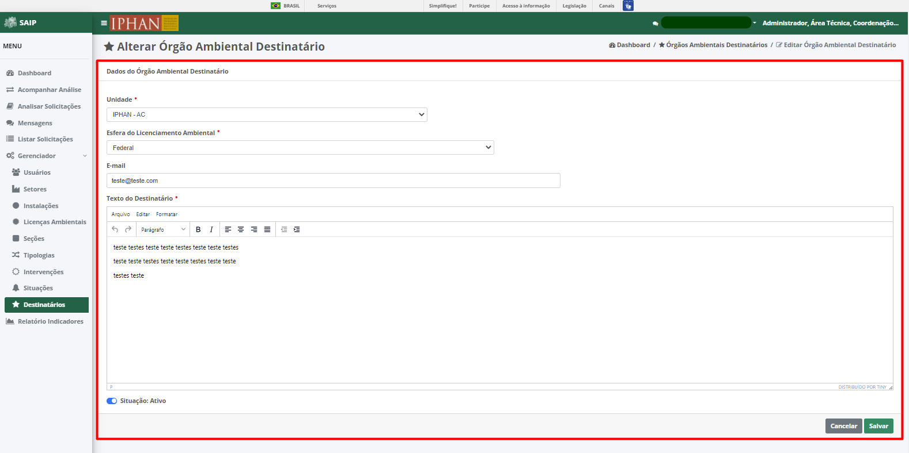
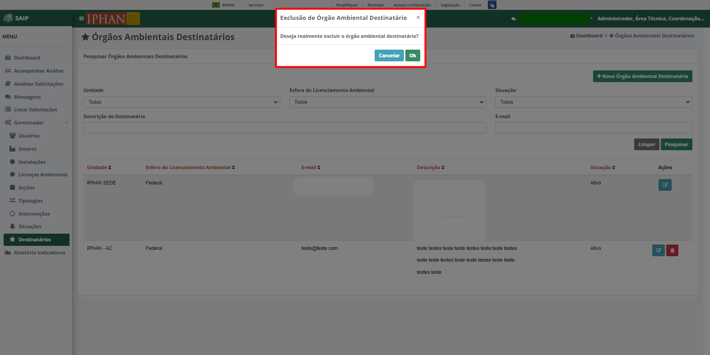

Destinatários
=============================

.. meta::
   :description: Apresentação do  Gerenciador - Usuários.
  
Para acessar o **Gerenciador de Destinatários de Órgãos Ambientais** do sistema, clique no menu **Gerenciador** no menu lateral esquerdo e então selecione a opção **Destinatários** no submenu lateral esquerdo, onde irá permitir gerenciar os Destinatários cadastrados.    
     

     
Em **Pesquisar Órgãos Ambientais Destinatários**, na parte superior se encontram os filtros de pesquisa como Unidade, Esfera do Licenciamento Ambiental, Situação, Descrição do Destinatário e E-mail. E o botão **Novo Órgão Ambiental Destinatário**, para cadastro de novos Destinatários.
     

.. note::
     Sempre que preencher os filtros clique no botão **Pesquisar**, para que a ação seja executada. Acionando **Limpar** os filtros são removidos.
     
.. image:: ../images/SAIP_Interno_Gerenciador_Destinatario_Pesquisar_Limpar.png
     :alt: SAIP Interno Gerenciador Destinatários Pesquisar
     
Em **Pesquisar Órgãos Ambientais Destinatários** na parte inferior, encontram-se os registros totais de Destinatários ou o resultado da pesquisa conforme os filtros informados. As colunas apresentadas, são, Unidade, Esfera do Licenciamento Ambiental, E-mail, Descrição, Situação e Ações.
                           

     
.. note::
     O sistema permite que você ordene as colunas por ordem crescente ou decrescente conforme se clica nos títulos de cada coluna.
                         

     
     
No resultado da pesquisa, há as ações de **Alterar Órgão Ambiental Destinatário** e **Excluir Órgão Ambiental Destinatário**, respectivamente.
     

     
Novo Órgão Ambiental Destinatário
-----------------------------------
     
Ao acionar o botão **Novo Órgão Ambiental Destinatário**, é apresentado a tela para incluir um novo Órgão Ambiental Destinatário, contendo os campos, Unidade eEsfera do Licenciamento Ambiental, E-mail e Texto do Destinatário.
     
.. note:: 
     Após inserir os dados do Órgão Ambiental Destinatário, é necessário acionar o botão **Salvar** para que seja cadastrado. O botão **Cancelar** retorna para a tela de Órgãos Ambientais Destinatários.
     

Alterar Órgão Ambiental Destinatário
-------------------------------------
     
Ao acionar o botão **Editar Órgão Ambiental Destinatário**, é apresentado a tela para alterar os dados de um Órgão Ambiental Destinatário, com os campos Nome e Descrição, e os botões **Cancelar**, onde retorna para a tela de **Órgãos Ambientais Destinatários**, sem alterações, e **Salvar**, onde salva as alterações realizadas e retorna para a tela de **Órgãos Ambientais Destinatários**.
     
.. note::
        Tem-se o campo **Situação**, onde se tem a opção de ativar ou inativar o Destinatário cadastrado. 
     

     
Excluir Órgão Ambiental Destinatário
------------------------------------
     
Ao acionar o botão **Excluir Órgão Ambiental Destinatário**, o sistema apresenta uma janela de **Exclusão de Órgão Ambiental Destinatário**, com os botões **Cancelar**, onde a operação de exclusão é cancelada e **OK**, onde é confirmada a exclusão do Destinatário.

