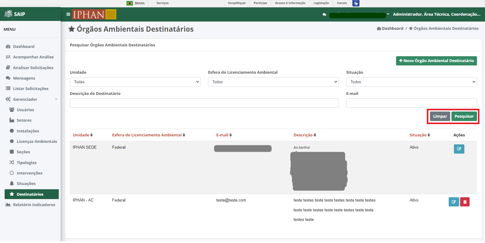

Destinatários
=============================

.. meta::
   :description: Apresentação do  Gerenciador - Usuários.
  
Para acessar o **Gerenciador de Órgãos Ambientais Destinatários**, o sistema disponibiliza a opção **Gerenciador**, no menu lateral esquerdo, e a opção **Destinatários**, no submenu.
     

     
Na parte superior do **Pesquisar Órgãos Ambientais Destinatários** são disponibilizados os filtros de pesquisa: **Unidade**, **Esfera do Licenciamento Ambiental**, **Situação**, **Descrição do Destinatário** e **E-mail**, e ainda as opções de ação: **Novo Órgão Ambiental Destinatário**, **Limpar** e **Pesquisar**.
     
.. image:: ../images/SAIP_Interno_Gerenciador_Destinatarios_Pesquisar_Destinatario.png
     :alt: SAIP Interno Gerenciador Destinatários Filtros
.. note::
     Para que a ação de pesquisa seja executada, faz-se necessário que se preencha os filtros disponíveis e acione o botão **Pesquisar**; para que os fitros sejam removidos faz-se necessário que se acione o botão **Limpar**.
     

     
Como resultado do **Pesquisar Órgãos Ambientais Destinatários** são apresentadas as colunas: **Unidade**, **Esfera do Licenciamento Ambiental**, **E-mail**, **Descrição**, **Situação** e **Ações**, e a quantidade total de registros.
                           

     
.. note::
     O sistema permite que haja a ordenação das colunas na forma crescente ou decrescente conforme se clica nos títulos de cada coluna.
                         
.. image:: ../images/SAIP_Interno_Gerenciador_Destinatarios_Pesquisar_Ordenar.png
      :alt: SAIP Interno Gerenciador Destinatários Ordenar
     
Como ações disponíveis na lista de resultado do **Pesquisar Órgãos Ambientais Destinatários**, tem-se: **Editar Órgão Ambiental Destinatário** e **Excluir Órgão Ambiental Destinatário**.
     
.. image:: ../images/SAIP_Interno_Gerenciador_Destinatarios_Acoes.png
      :alt: SAIP Interno Gerenciador Destinatários Ações
     
Novo Órgão Ambiental Destinatário
-----------------------------------
     
Ao acionar o botão **Nova Órgão Ambiental Destinatário**, o sistema apresenta uma tela para a inclusão dos dados de um novo órgão ambiental destinatário.
     
.. note:: 
     Os botões **Cancelar** e **Salvar** são disponibilizados, permitindo o cancelamento ou a gravação da inclusão, respectivamente.
     
.. image:: ../images/SAIP_Interno_Gerenciador_Destinatarios_Cadastrar_Destinatario.png
     :alt: SAIP Interno Gerenciador Destinatários Cadastrar Destinatário

Alterar Órgão Ambiental Destinatário
-------------------------------------
     
Ao acionar o botão **Editar Órgão Ambiental Destinatário**, o sistema apresenta uma tela para a alteração dos dados do órgão ambiental destinatário. Os botões **Cancelar** e **Alterar** são disponibilizados, permitindo o cancelamento ou a gravação da alteração, respectivamente.
     
.. note::
     No campo **Situação**, é permitido ativar ou inativar um Órgão Ambiental Destinatário já cadastrado.
     
.. image:: ../images/SAIP_Interno_Gerenciador_Destinatarios_Acoes_Editar_Destinatario.png
           :alt: SAIP Interno Gerenciador Editar Destinatário
     
Excluir Órgão Ambiental Destinatário
------------------------------------
     
Ao acionar o botão **Excluir Órgão Ambiental Destinatário**, o sistema apresenta uma tela para a confirmação da exclusão. Os botões **Cancelar** e **Ok** são disponibilizados, permitindo o cancelamento ou a confirmação da exclusão, respectivamente.

