Gerenciador
=============================

.. meta::
   :description: Apresentação do  Gerenciador - Usuários.
  
Para acessar o **Gerenciador** do sistema, clicar na opção **Gerenciador** no menu lateral esquerdo, onde possue os submenus.

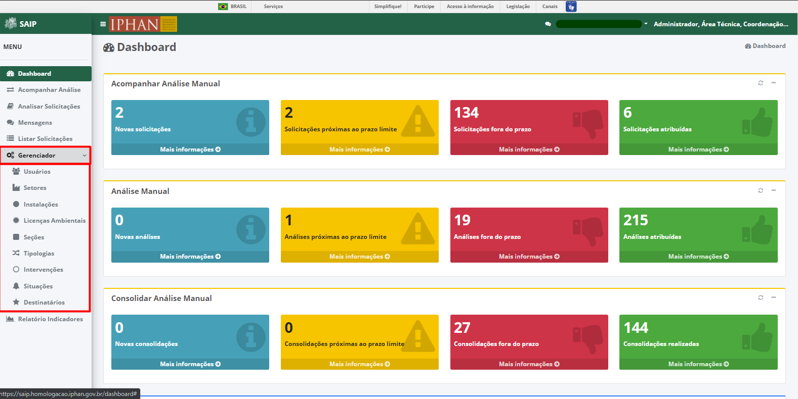

Usuários
---------
Para acessar o gerenciador de usuários, selecionar a opção **Usuários** no submenu lateral esquerdo, onde irá permitir gerenciar os Usuários cadastrados.

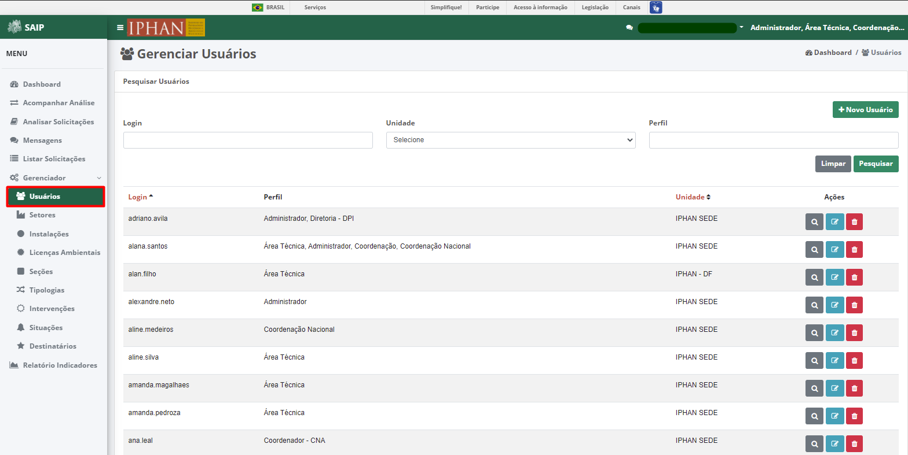

Em **Pesquisar Usuários**, na parte superior se encontram os filtros de pesquisa como Login, Unidade e Perfil. E o botão **Novo usuário**, para cadastro de novos usuários.

.. image:: ../images/SAIP_Interno_Gerenciador_Usuarios_Pesquisar_Usuarios.png
     :alt: SAIP Interno Gerenciador Pesquisar Usuários
.. note::
   Sempre que preencher os filtros clique no botão **Pesquisar**, para que a ação seja executada. Acionando **Limpar** os filtros são removidos.

.. image:: ../images/SAIP_Interno_Gerenciador_Usuarios_Pesquisar_Usuarios_Pesquisar_Limpar.png
     :alt: SAIP Interno Gerenciador Usuários Pesquisar

Em **Pesquisar Usuários** na parte inferior, encontram-se os registros totais de usuários ou o resultado da pesquisa realizada com os filtros. As colunas apresentadas são Login, Perfil, Unidade e Ações.

.. image:: ../images/SAIP_Interno_Gerenciador_Usuarios_Pesquisar_Usuarios_Pesquisar_Resultado.png
     :alt: SAIP Interno Gerenciador Usuários Resultado

.. note::
  O sistema permite que você ordene as colunas por ordem crescente ou decrescente conforme se clica nos títulos de cada coluna.

.. image:: ../images/SAIP_Interno_Gerenciador_Usuarios_Pesquisar_Usuarios_Pesquisar_Ordenar.png
     :alt: SAIP Interno Gerenciador Usuários Ordenar

.. note::
 Na lista de usuários, o sistema apresenta a paginação a cada 10 registros. É possível selecionar a página desejada e nas extremidades há a opção de selecionar os ícones de página anterior e próxima página.

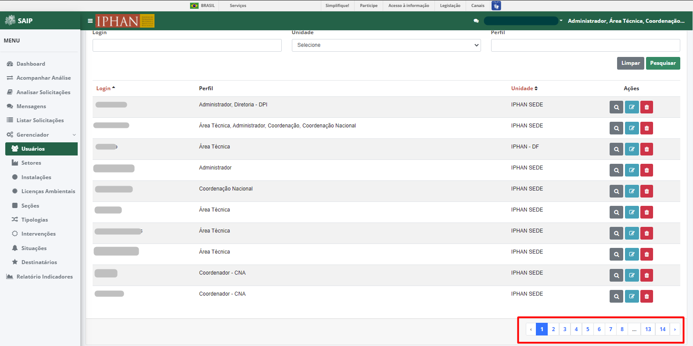

Na lista, há as ações de Visualizar Usuários, Editar Usuário e Excluir Usuário, respectivamente.

.. image:: ../images/SAIP_Interno_Gerenciador_Usuarios_Pesquisar_Usuarios_Acoes.png
     :alt: SAIP Interno Gerenciador Usuários Ações

Visualizar Usuário
----------------------- 

Ao acionar o botão **Visualizar Usuário**, o sistema apresenta uma janela com os dados do usuário. Caso deseje fechar a janela, clique no botão Fechar.

.. image:: ../images/SAIP_Interno_Gerenciador_Usuarios_Pesquisar_Usuarios_Acoes_Visualizar_Usuario.png
     :alt: SAIP Interno Gerenciador Visualizar Usuário

Editar usuário
----------------  

Ao acionar o botão **Editar usuário**, o sistema apresenta é apresentado a tela de **Alterar Usuário**, com os botões **Cancelar**, onde retorna para a tela de **Gerenciar Usuários**, sem alterações, e **Alterar** onde salva as alterações realizadas e retorna para a tela de **Gerenciar Usuários**.

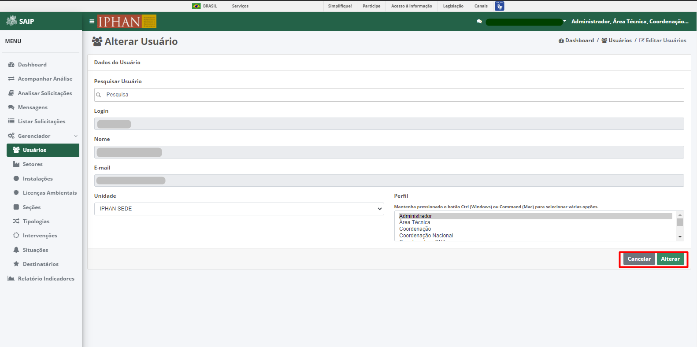

Excluir usuário
----------------- 

Ao acionar o botão **Excluir usuário**, o sistema apresenta uma janela de **Exclusão de usuário**, com os botões **Cancelar**, onde a operação de exclusão é cancelada e **OK**, onde é confirmada a exclusão do usuário.

.. image:: ../images/SAIP_Interno_Gerenciador_Usuarios_Pesquisar_Usuarios_Acoes_Excluir_Usuario.png
     :alt: SAIP Interno Gerenciador Excluir usuário

Novo usuário
-------------

Ao acionar o botão **Novo usuário**, é apresentado a tela para inclusão de um novo usuário, contendo os campos, Pesquisar Usuário, Login, Nome , E-mail , Unidade e Perfil.

.. note:: 
   Após inserir os dados do novo usuário, é necessário acionar o botão **Salvar** para que seja cadastrado. O botão **Cancelar** retorna para a tela de gereciamento de usuários.

.. image:: ../images/SAIP_Interno_Gerenciador_Usuarios_Pesquisar_Usuarios_Cadastrar_Usuario.png
            :alt: SAIP Interno Gerenciador Usuário Cadastrar Usuário

Setores
===========
   
Para acessar o gerenciador de usuários, selecionar a opção **Setores** no submenu lateral esquerdo, onde irá permitir gerenciar os setores cadastrados.

.. image:: ../images/SAIP_Interno_Gerenciador_Setores.png
     :alt: SAIP Interno Gereciador Setores

Em **Pesquisar Setores**, na parte superior se encontram os filtros de pesquisa como Nome, Descrição e Situação. E o botão **Novo Setor**, para cadastro de novos Setores.

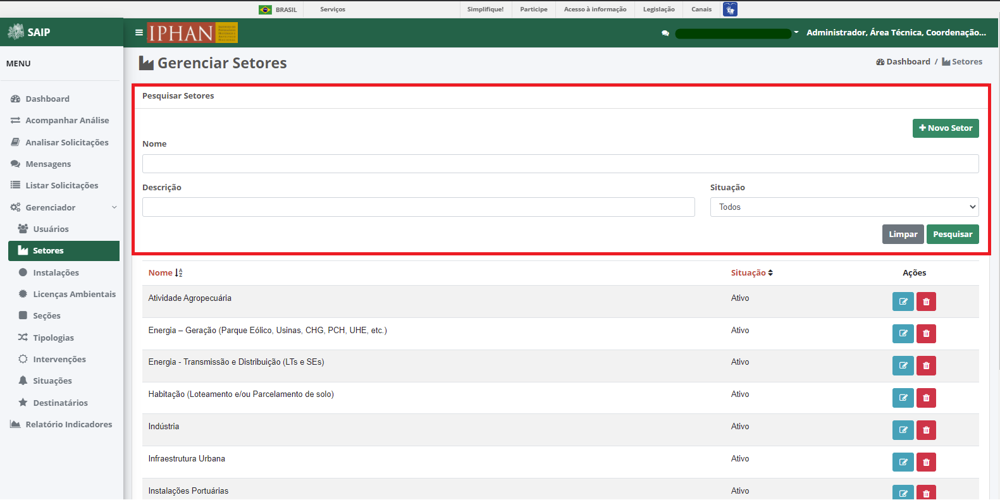

.. note::
 Sempre que preencher os filtros clique no botão **Pesquisar**, para que a ação seja executada. Acionando **Limpar** os filtros são removidos.

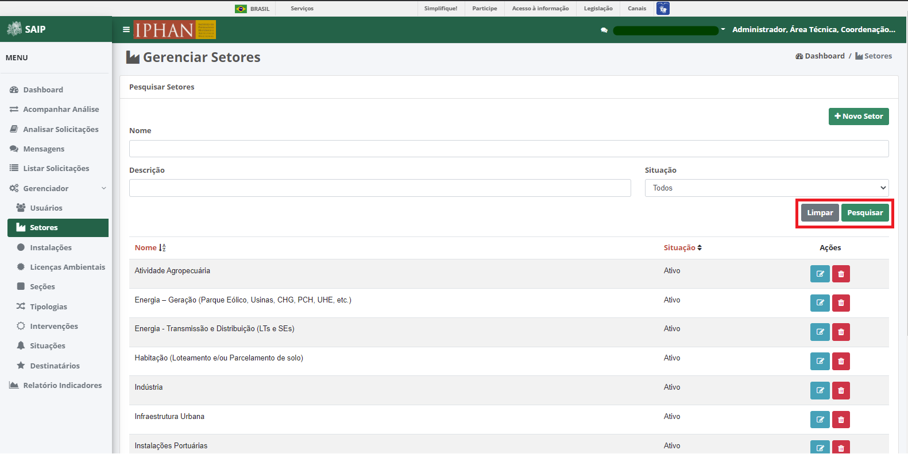

Em **Pesquisar Setores** na parte inferior, encontram-se os registros totais de Setores ou o resultado da pesquisa realizada com os filtros. As colunas apresentadas são Nome, Situação e Ações.
                      
.. image:: ../images/SAIP_Interno_Gerenciador_Setores_Pesquisar_Setores_Pesquisar_Resultado.png
          :alt: SAIP Interno Gerenciador Usuários Resultado

.. note::
     O sistema permite que você ordene as colunas por ordem crescente ou decrescente conforme se clica nos títulos de cada coluna.
                    
.. image:: ../images/SAIP_Interno_Gerenciador_Setores_Pesquisar_Setores_Pesquisar_Ordenar.png
          :alt: SAIP Interno Gerenciador Setores Ordenar

.. note::
     Na lista de setores, o sistema apresenta a paginação a cada 10 registros. É possível selecionar a página desejada e nas extremidades há a opção de selecionar os ícones de página anterior e próxima página.
                    
.. image:: ../images/SAIP_Interno_Gerenciador_Setores_Paginacao.png
     :alt: SAIP Interno Gerenciador Setores Paginação

Na lista, há as ações de Editar Setor e Excluir Setor, respectivamente.

.. image:: ../images/SAIP_Interno_Gerenciador_Setores_Acoes.png
     :alt: SAIP Interno Gerenciador Setores Ações

Editar Setor
--------------

Ao acionar o botão **Editar Setor**, o sistema apresenta é apresentado a tela de **Alterar Setor**, com os botões **Cancelar**, onde retorna para a tela de **Gerenciar Setores**, sem alterações, e **Alterar** onde salva as alterações realizadas e retorna para a tela de **Gerenciar Setores**.

.. note::
   Tem-se o campo **Situação**, onde se tem a opção de ativar ou inativar o setor cadastradao. 

.. image:: ../images/SAIP_Interno_Gerenciador_SetoresAcoes_Editar_Setor.png 
     :alt: SAIP Interno Gerenciador Editar Setor

Excluir Setor
-------------- 

Ao acionar o botão **Excluir Setor**, o sistema apresenta uma janela de **Exclusão de Setor**, com os botões **Cancelar**, onde a operação de exclusão é cancelada e **OK**, onde é confirmada a exclusão do usuário.

.. image:: ../images/SAIP_Interno_Gerenciador_Setores_Acoes_Excluir_Setor.png
     :alt: SAIP Interno Gerenciador Excluir usuário

Novo Setor
-------------

Ao acionar o botão **Novo Setor**, é apresentado a tela para inclusão de um novo Setor, contendo os campos, Nome e Descrição.

.. image:: ../images/SAIP_Interno_Gerenciador_Setores_Cadastrar_Setor.png 
     :alt: SAIP Interno Gerenciador Setores Cadastrar Setor

.. note:: 
   Após inserir os dados do novo Setor, é necessário acionar o botão **Salvar** para que seja cadastrado. O botão **Cancelar** retorna para a tela de gereciamento de Setores.

Instalações
=============
      
Para acessar o gerenciador de Instalações Secundárias, selecionar a opção **Instalações** no submenu lateral esquerdo, onde irá permitir gerenciar os Instalações cadastradas.

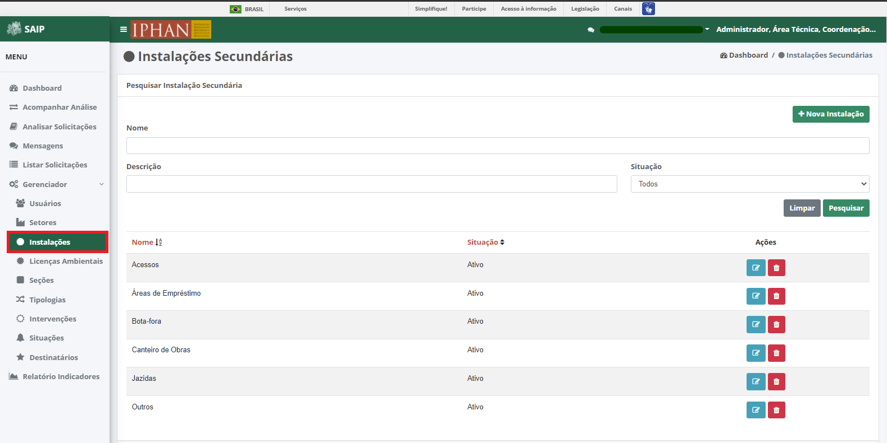

Em **Pesquisar Instalação Secundária**, na parte superior se encontram os filtros de pesquisa como Nome, Descrição e Situação. E o botão **Nova Instalação**, para cadastro de novas instalações.

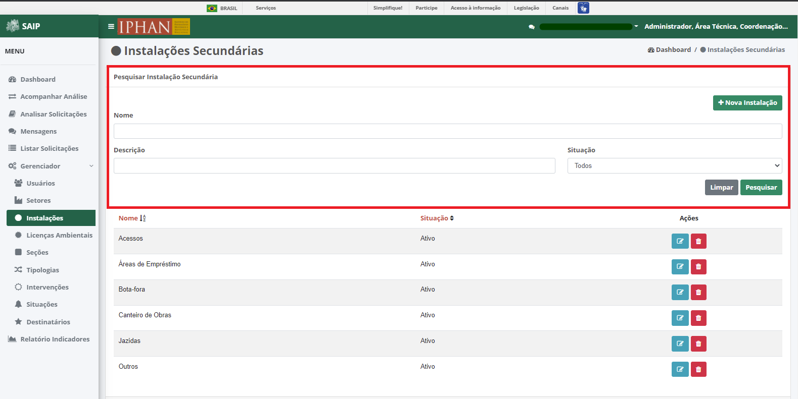
.. note::
     Sempre que preencher os filtros clique no botão **Pesquisar**, para que a ação seja executada. Acionando **Limpar** os filtros são removidos.

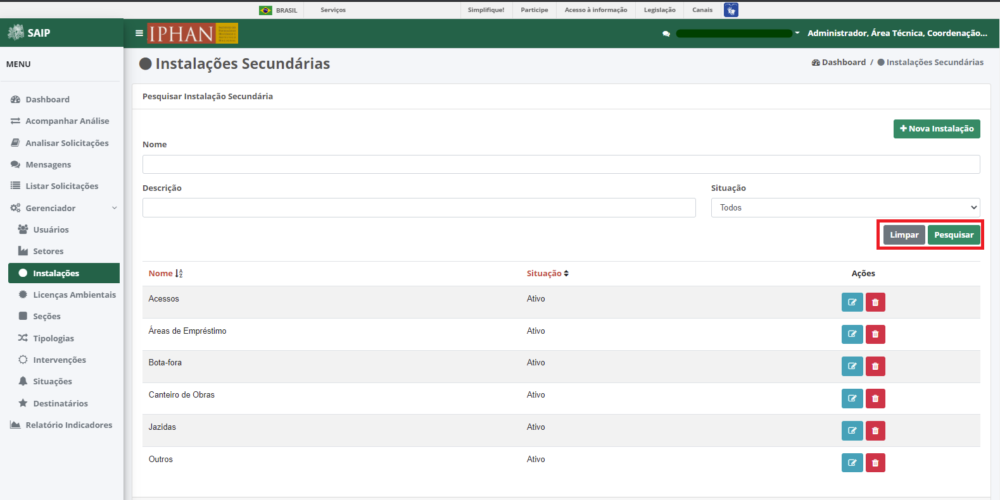

Em **Pesquisar Instalação Secundária** na parte inferior, encontram-se os registros totais de Setores ou o resultado da pesquisa realizada com os filtros. As colunas apresentadas são Nome, Situação e Ações.
                      
.. image:: ../images/SAIP_Interno_Gerenciador_instalacoes_Pesquisar_instalacoes_Resultado.png
     :alt: SAIP Interno Gerenciador instalacoes Resultado

.. note::
     O sistema permite que você ordene as colunas por ordem crescente ou decrescente conforme se clica nos títulos de cada coluna.
                    
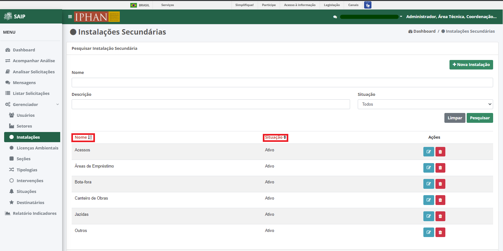

Na lista, há as ações de **Editar instalação** e **Excluir instalação** , respectivamente.

.. image:: ../images/SAIP_Interno_Gerenciador_Setores_Acoes.png
     :alt: SAIP Interno Gerenciador instalação Ações

Editar instalação
------------------

Ao acionar o botão **Editar instalação**, o sistema apresenta é apresentado a tela de **Alterar Instalação Secundária**, com os botões **Cancelar**, onde retorna para a tela de **Instalações Secundárias**, sem alterações, e **Alterar** onde salva as alterações realizadas e retorna para a tela de **Instalações Secundárias**.

.. note::
   Tem-se o campo **Situação**, onde se tem a opção de ativar ou inativar o setor cadastradao. 

.. image:: ../images/SAIP_Interno_Gerenciador_instalacoes_Acoes_Editar_instalacao.png
     :alt: SAIP Interno Gerenciador Editar instalacao

Excluir instalação
-----------------------  

Ao acionar o botão **Excluir instalação**, o sistema apresenta uma janela de **Exclusão de instalação secundária**, com os botões **Cancelar**, onde a operação de exclusão é cancelada e **OK**, onde é confirmada a exclusão da instalação.

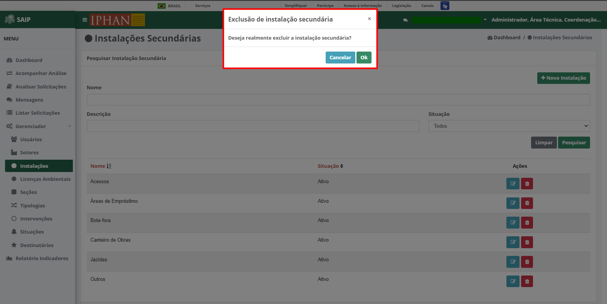

Nova instalação
----------------

Ao acionar o botão **Novo Instalação**, é apresentado a tela para Incluir uma nova Instalação Secundária, contendo os campos, Nome e Descrição.

.. note:: 
     Após inserir os dados do novo Setor, é necessário acionar o botão **Salvar** para que seja cadastrado. O botão **Cancelar** retorna para a tela de Instalações Secundárias.

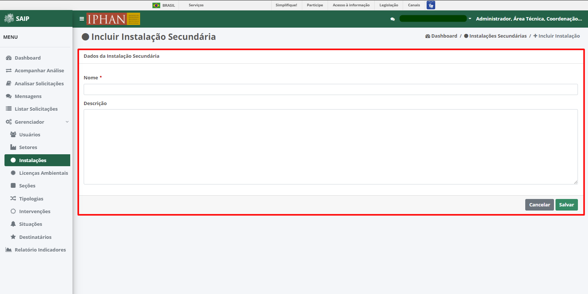

Licenças Ambientais
=====================

Para acessar o gerenciador de Licenças Ambientais, selecionar a opção **Licenças Ambientais** no submenu lateral esquerdo, onde irá permitir gerenciar os Licenças Ambientais cadastradas.

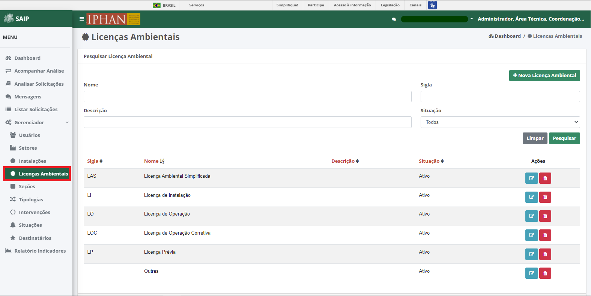

Em **Pesquisar Licenças Ambientais**, na parte superior se encontram os filtros de pesquisa como Nome, Sigla, Descrição e Situação. E o botão **Nova Licença Ambientais**, para cadastro de novas Licenças Ambientais.

.. image:: ../images/SAIP_Interno_Gerenciador_Licencas_Pesquisar_Licencas.png
     :alt: SAIP Interno Gerenciador Pesquisar Licenças Ambientais

.. note::
     Sempre que preencher os filtros clique no botão **Pesquisar**, para que a ação seja executada. Acionando **Limpar** os filtros são removidos.

.. image:: ../images/SAIP_Interno_Gerenciador_Licencas_Pesquisar_Licencas_Pesquisar_Limpar.png
     :alt: SAIP Interno Gerenciador Licencas Pesquisar

Em **Pesquisar Licença Ambiental** na parte inferior, encontram-se os registros totais de Licenças ou o resultado da pesquisa realizada com os filtros. As colunas apresentadas são Sigla, Nome, Descrição, Situação e Ações.
                      
.. image:: ../images/SAIP_Interno_Gerenciador_Licencas_Pesquisar_Licencas_Resultado.png
     :alt: SAIP Interno Gerenciador Licencas Resultado

.. note::
     O sistema permite que você ordene as colunas por ordem crescente ou decrescente conforme se clica nos títulos de cada coluna.
                    
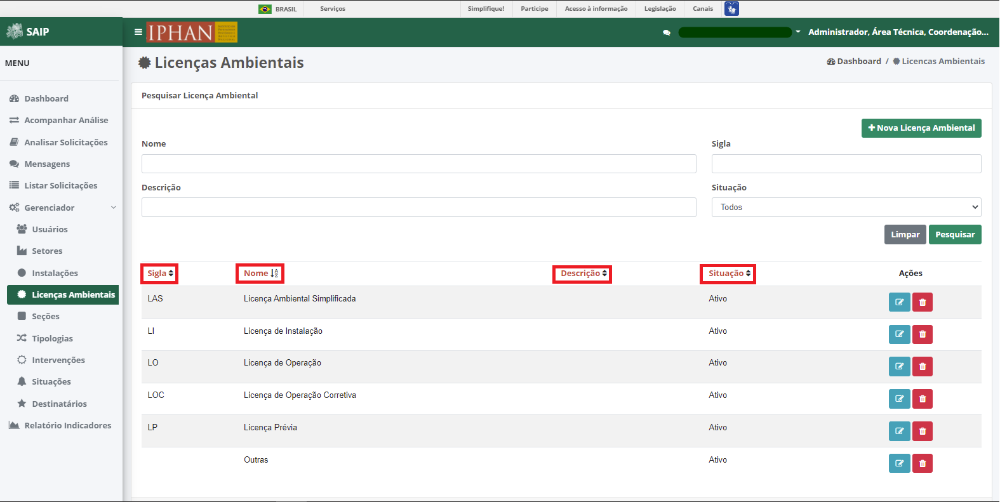

Na lista, há as ações de Editar Licença Ambiental e Excluir Licença Ambiental, respectivamente.

.. image:: ../images/SAIP_Interno_Gerenciador_Licenca_Acoes.png
     :alt: SAIP Interno Gerenciador Licencas Ações

Editar Licença Ambiental
-------------------------

Ao acionar o botão **Editar Licença Ambiental**, o sistema apresenta é apresentado a tela de **Alterar Licença Ambiental**, com os campos, Sigla, Nome e Descrição e os botões **Cancelar**, onde retorna para a tela de **Licenças Ambientais**, sem alterações, e **Alterar** onde salva as alterações realizadas e retorna para a tela de **Licenças Ambientais**.

.. note::
   Tem-se o campo **Situação**, onde se tem a opção de ativar ou inativar a Licença Ambiental cadastrada. 

.. image:: ../images/SAIP_Interno_Gerenciador_Licenca_Acoes_Editar_Licenca.png
    :alt: SAIP Interno Gerenciador Editar Licenças

Excluir Licença Ambiental
---------------------------

Ao acionar o botão **Excluir instalação**, o sistema apresenta uma janela de **Exclusão de licença ambiental**, com os botões **Cancelar**, onde a operação de exclusão é cancelada e **OK**, onde é confirmada a exclusão da instalação.

.. image:: ../images/SAIP_Interno_Gerenciador_Licenca_Acoes_Excluir_Licenca.png
     :alt: SAIP Interno Gerenciador Excluir Licenças                

Nova Licença Ambiental
------------------------

Ao acionar o botão **Nova Licença Ambiental**, é apresentado a tela para Incluir Licença Ambiental, contendo os campos, Sigla, Nome e Descrição.

..note:: 
     Após inserir os dados da Nova Licença Ambiental, é necessário acionar o botão **Salvar** para que seja cadastrado. O botão **Cancelar** retorna para a tela de Instalações Secundárias.

.. image:: ../images/SAIP_Interno_Gerenciador_Licenca_Cadastrar_Licenca.png
     :alt: SAIP Interno Gerenciador Licença Cadastrar Licença

Seções
=======

Para acessar o gerenciador de Seções, selecionar a opção **Seções** no submenu lateral esquerdo, onde irá permitir gerenciar as Seções cadastradas.

.. image:: ../images/SAIP_Interno_Gerenciador_Secoes.png 
     :alt: SAIP Interno Gereciador Secoes

Em **Pesquisar Seções**, na parte superior se encontram os filtros de pesquisa como Nome e Situação. E o botão **Nova Seção**, para cadastro de novas Seções.

.. image:: ../images/SAIP_Interno_Gerenciador_Secoes_Pesquisar_Secoes.png
     :alt: SAIP Interno Gerenciador Pesquisar Seções

.. note::
     Sempre que preencher os filtros clique no botão **Pesquisar**, para que a ação seja executada. Acionando **Limpar** os filtros são removidos.

.. image:: ../images/SAIP_Interno_Gerenciador_Secoes_Pesquisar_Limpar.png
     :alt: SAIP Interno Gerenciador Seções Pesquisar

Em **Pesquisar Seções** na parte inferior, encontram-se os registros totais de Licenças ou o resultado da pesquisa realizada com os filtros. As colunas apresentadas são Nome, Situação e Ações.
                      
.. image:: ../images/SAIP_Interno_Gerenciador_Secoes_Pesquisar_Secoes_Resultado.png
     :alt: SAIP Interno Gerenciador Seções Resultado

.. note::
     O sistema permite que você ordene as colunas por ordem crescente ou decrescente conforme se clica nos títulos de cada coluna.
                    
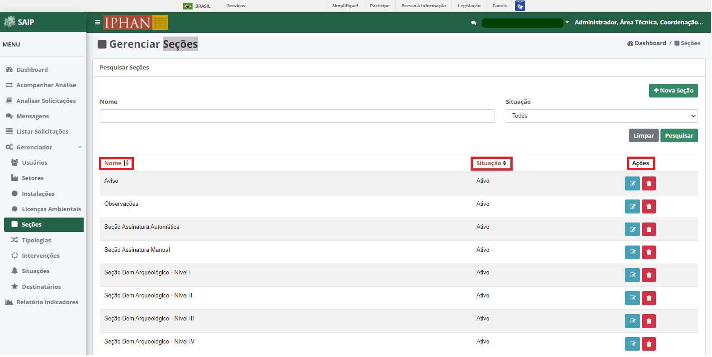

.. note::
     Na lista de Seções, o sistema apresenta a paginação a cada 10 registros. É possível selecionar a página desejada e nas extremidades há a opção de selecionar os ícones de página anterior e próxima página.
                    
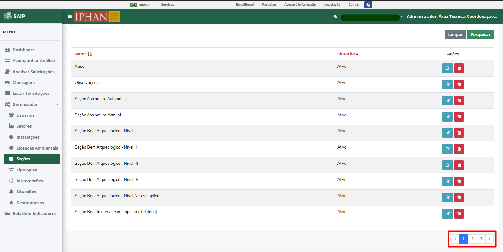

Na lista, há as ações de Editar Seção e Excluir Seção, respectivamente.

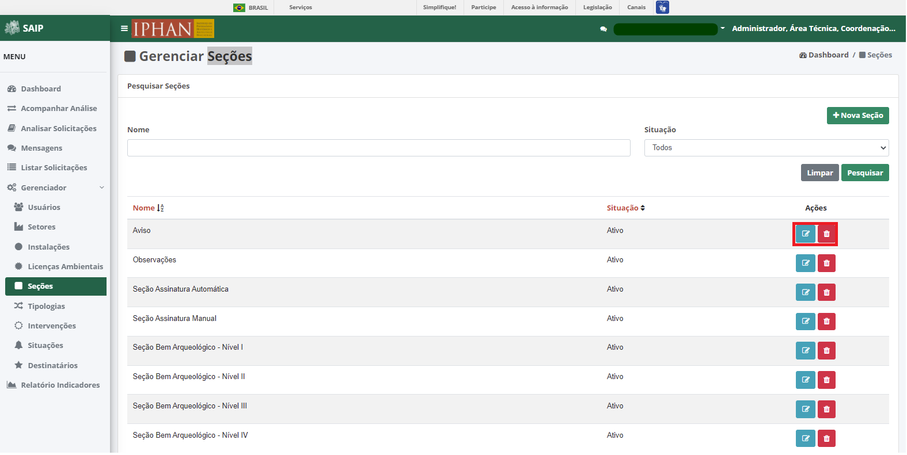

Editar Seção
--------------

Ao acionar o botão **Editar Secoes**, o sistema apresenta é apresentado a tela de **Alterar Seção**, com os campos, Nome e texto, e os botões **Cancelar**, onde retorna para a tela de **Gerenciar Seções**, sem alterações, e **Salvar** onde salva as alterações realizadas e retorna para a tela de **Gerenciar Seções**.

.. note::
   Tem-se o campo **Situação**, onde se tem a opção de ativar ou inativar a Seção cadastrada. 

.. image:: ../images/SAIP_Interno_Gerenciador_Secoes_Acoes_Editar_Secoes.png
     :alt: SAIP Interno Gerenciador Editar Seção

Excluir Seção
---------------

Ao acionar o botão **Excluir Seçãoo**, o sistema apresenta uma janela de **Exclusão de seção**, com os botões **Cancelar**, onde a operação de exclusão é cancelada e **OK**, onde é confirmada a exclusão da instalação.

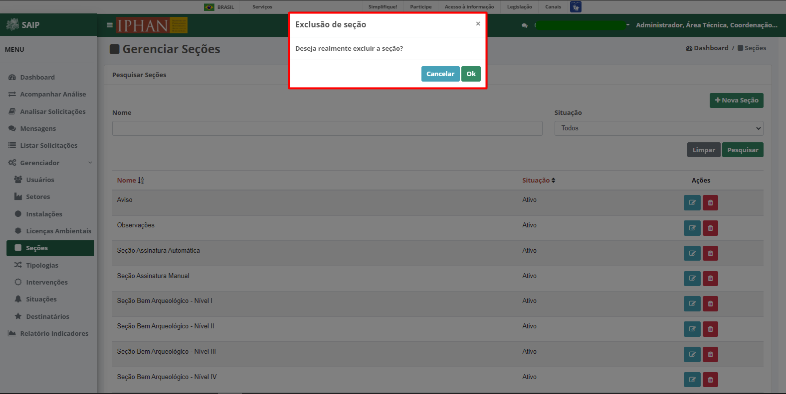

Nova Seção
------------------------

Ao acionar o botão **Nova Seção**, é apresentado a tela para Incluir Seção, contendo os campos Nome e Texto.

.. note:: 
   Após inserir os dados da Nova Nova Seção, é necessário acionar o botão **Salvar** para que seja cadastrado. O botão **Cancelar** retorna para a tela de Gerenciar Seções.

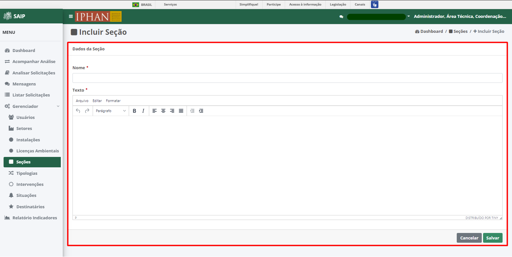

Tipologias
===========
     
Para acessar o gerenciador de Tipologias, selecionar a opção **Tipologias** no submenu lateral esquerdo, onde irá permitir gerenciar as Tipologias cadastradas.
     
.. image:: ../images/SAIP_Interno_Gerenciador_Tipologias.png
           :alt: SAIP Interno Gereciador Tipologias
     
Em **Pesquisar Tipologias**, na parte superior se encontram os filtros de pesquisa como Código, Empreendimento, Detalhamento, Sub-Detalhamento e Nível. E o botão **Nova Tipologia**, para cadastro de novas Tipologias.
     
.. image:: ../images/SAIP_Interno_Gerenciador_Tipologias_Pesquisar_Tipologia.png
                                :alt: SAIP Interno Gerenciador Pesquisar Tipologia
.. note::
     Sempre que preencher os filtros clique no botão **Pesquisar**, para que a ação seja executada. Acionando **Limpar** os filtros são removidos.
     
.. image:: ../images/SAIP_Interno_Gerenciador_Tipologia_Pesquisar_Limpar.png
                                :alt: SAIP Interno Gerenciador Tipologia Pesquisar
     
Em **Pesquisar Tipologias** na parte inferior, encontram-se os registros totais de Licenças ou o resultado da pesquisa realizada com os filtros. As colunas apresentadas são Código, Empreendimento, Detalhamento, Sub-Detalhamento, Nível e Ações.
                           
.. image:: ../images/SAIP_Interno_Gerenciador_Tipologias_Tipologia_Resultado.png
          :alt: SAIP Interno Gerenciador Tipologia Resultado
     
.. note::
      O sistema permite que você ordene as colunas por ordem crescente ou decrescente conforme se clica nos títulos de cada coluna.
                         
 .. image:: ../images/SAIP_Interno_Gerenciador_Tipologias_Pesquisar_Ordenar.png
     :alt: SAIP Interno Gerenciador Tipologia Ordenar
     
.. note::
     Na lista de Tipologias, o sistema apresenta a paginação a cada 10 registros. É possível selecionar a página desejada e nas extremidades há a opção de selecionar os ícones de página anterior e próxima página.
                         
.. image:: ../images/SAIP_Interno_Gerenciador_Tipologia_Paginacao.png
     :alt: SAIP Interno Gerenciador Tipologia Paginação
     
     
Na lista, há as ações de Editar Tipologia e Excluir Tipologia, respectivamente.
     
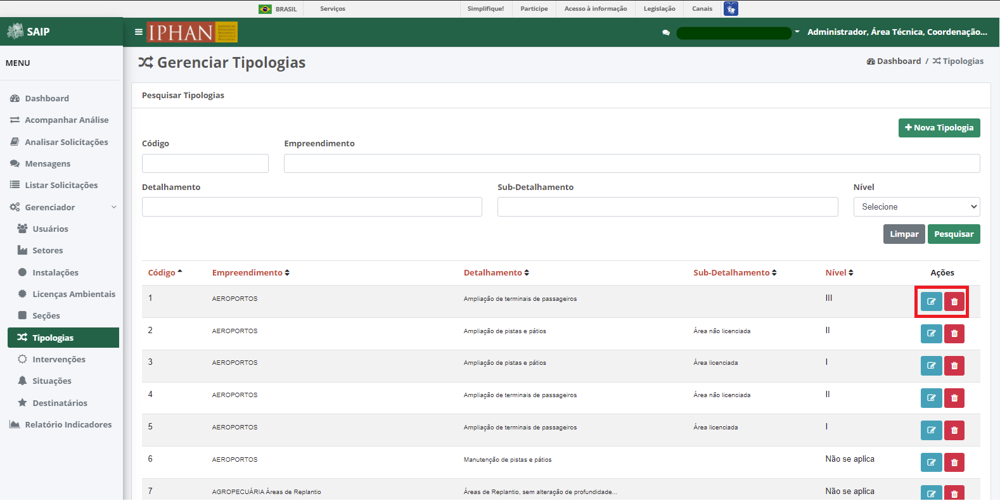
     
Editar Tipologia
-----------------
     
Ao acionar o botão **Editar Tipologia**, é apresentado a tela de **Editar Tipologia**, com os campos, Tipo de Empreendimento, com o botão **Novo**, Detalhamento com o botão **novo** ao lado, Sub-detalhamento, Nível, Código e os botões **Cancelar**, onde retorna para a tela de **Gerenciar Tipologias**, sem alterações, e **Salvar** onde salva as alterações realizadas e retorna para a tela de **Gerenciar Tipologias**.
     
.. image:: ../images/SAIP_Interno_Gerenciador_Tipologia_Empreendimento_Editar.png
     :alt: SAIP Interno Gerenciador Editar Tipologia
     
     
.. note::
     Tem-se o botão **novo**, ao lado do campo Empreendimento, ao ser acionado é apresentado uma janela **Novo Tipo de Empreendimento** com o campo, Nome, para criar um novo tipo de Empreendimento. 
     
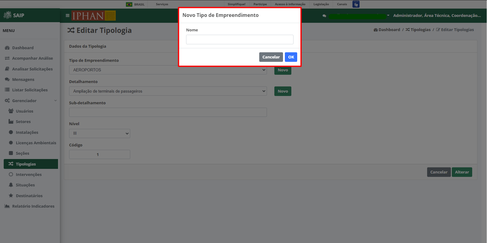
     
     
.. note::
     Tem-se o botão **novo** ao lado do campo Detalhamento, ao ser acionado é apresentado uma janela **Novo Tipo de Detalhamento** com o campo, Nome para criar um novo tipo de Detalhamento. 
     
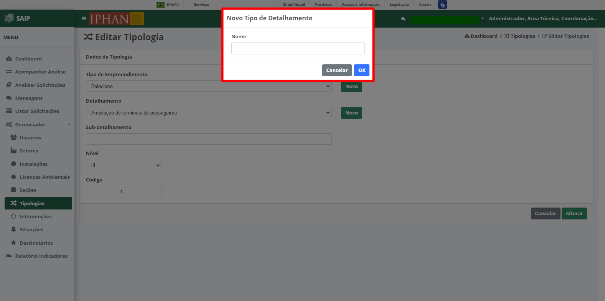
     
Excluir Tipologia
--------------------------
     
Ao acionar o botão **Excluir Tipologia**, o sistema apresenta uma janela de **Exclusão de Tipologia**, com os botões **Cancelar**, onde a operação de exclusão é cancelada e **OK**, onde é confirmada a exclusão da Tipologia.
     
     
.. image:: ../images/SAIP_Interno_Gerenciador_Tipologias_Acoes_Excluir_Tipologia.png
     :alt: SAIP Interno Gerenciador Excluir Tipologia              
     
Nova Tipologia
------------------------
     
Ao acionar o botão **Nova Tipologia**, é apresentado a tela para Incluir Tipologia, contendo os campos, Tipo de Empreendimento, com o botão **Novo**, Detalhamento com o botão **novo** ao lado, Sub-detalhamento, Nível, Código.
     
.. image:: ../images/SAIP_Interno_Gerenciador_Tipologia_Incluir_Tipologia.png
                                :alt: SAIP Interno Gerenciador Nova Tipologia
     
.. note::
     Tem-se o botão **novo** ao lado do campo empreendimento,ao ser acionado é apresentado uma janela **Novo Tipo de Empreendimento** com o campo, Nome, para criar um novo tipo de empreendimento. 
     
.. image:: ../images/SAIP_Interno_Gerenciador_Tipologia_Empreendimento_Incluir_Botao_Novo.png
     :alt: SAIP Interno Gerenciador Nova Tipologia Botão novo Empreendimento
     
     
.. note::
        Tem-se o botão **novo** ao lado do campo Detalhamento,ao ser acionado é apresentado uma janela **Novo Tipo de Detalhamento** com o campo, Nome, para criar um novo tipo de Detalhamento. 
     
.. image:: ../images/SAIP_Interno_Gerenciador_Tipologia_Detalhamento_Incluir_Botao_Novo.png
     :alt: SAIP Interno Gerenciador Nova Tipologia Botão novo Detalhamento
     
.. note:: 
   Após inserir os dados da Nova Tipologia, é necessário acionar o botão **Salvar** para que seja cadastrado. O botão **Cancelar** retorna para a tela de Gerenciar Tipologias.
     
     
.. image:: ../images/SAIP_Interno_Gerenciador_Tipologias_Cadastrar_Tipologia.png 
     :alt: SAIP Interno Gerenciador Tipologias Cadastrar Tipologia

Intervenções
===============
     
Para acessar o gerenciador de Tipos de Intervenções, selecionar a opção **Intervenções** no submenu lateral esquerdo, onde irá permitir gerenciar os tipos de Intervenções.
     
.. image:: ../images/SAIP_Interno_Gerenciador_Tipos_Intervencoes.png
             :alt: SAIP Interno Gereciador Tipos Intervencoes
     
Em **Pesquisar Tipos de Intervenções**, na parte superior se encontram os filtros de pesquisa como Nome, Descrição e Situação. E o botão **Novo Tipo de Intervenção**, para cadastro de novas Intervenções.
     
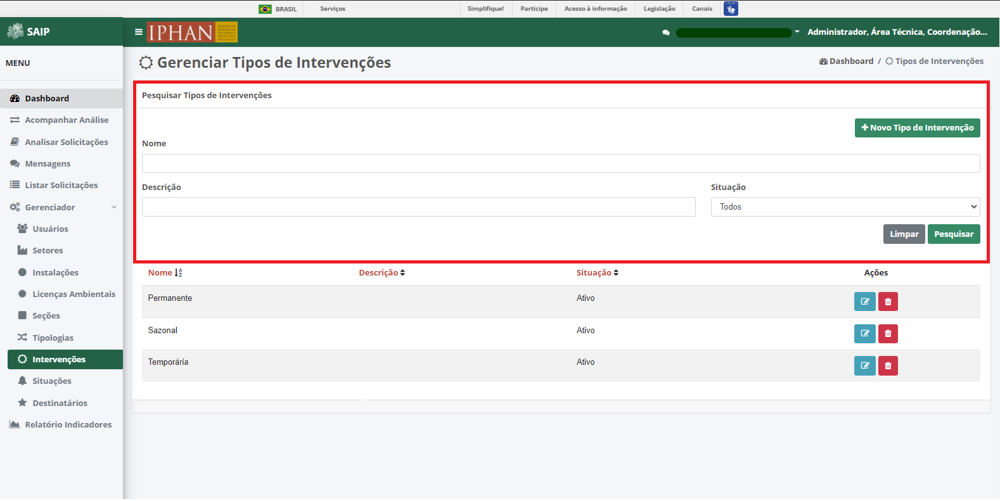

     .. note::
          Sempre que preencher os filtros clique no botão **Pesquisar**, para que a ação seja executada. Acionando **Limpar** os filtros são removidos.
     
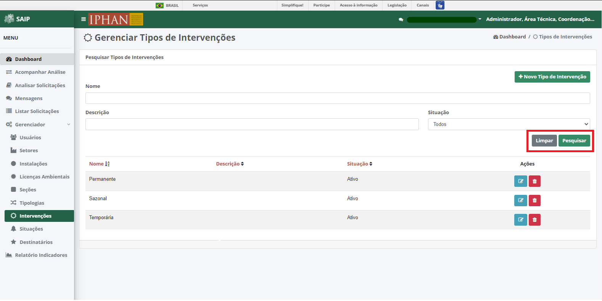
     
Em **Pesquisar Tipos de Intervenções** na parte inferior, encontram-se os registros totais de Licenças ou o resultado da pesquisa realizada com os filtros. As colunas apresentadas são Nome, Descrição, Situação e Ações.
                           
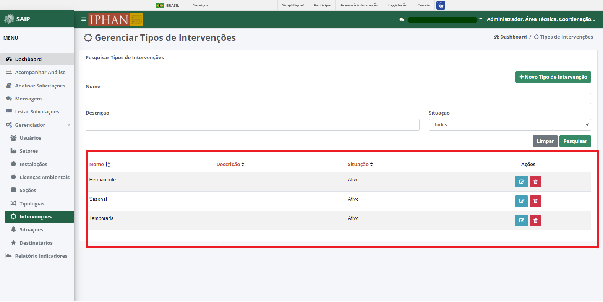
     
.. note::
      O sistema permite que você ordene as colunas por ordem crescente ou decrescente conforme se clica nos títulos de cada coluna.
                         
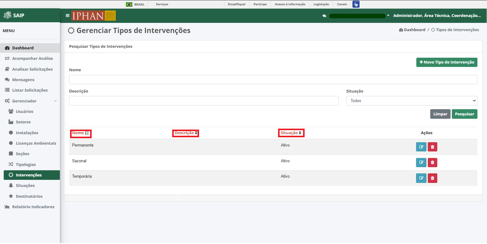
     
     
Na lista, há as ações de **Editar Tipo de Intervenção** e Excluir **Tipo de Intervenção**, respectivamente.
     
.. image:: ../images/SAIP_Interno_Gerenciador_Intervencoes_Acoes.png
     :alt: SAIP Interno Gerenciador Intervenções Ações
     
Editar Tipo de Intervenção
---------------------------
     
Ao acionar o botão **Editar Tipo de Intervenção**, o sistema apresenta é apresentado a tela de **Alterar Tipo de Intervenção**, com os campos, Nome e Descrição, e os botões **Cancelar**, onde retorna para a tela de **Gerenciar Tipos de Intervenções**, sem alterações, e **Alterar**, onde salva as alterações realizadas e retorna para a tela de **Gerenciar Tipos de Intervenções**.
     
.. note::
        Tem-se o campo **Situação**, onde se tem a opção de ativar ou inativar a Intervenção cadastrada. 
     
.. image:: ../images/SAIP_Interno_Gerenciador_Intervencoes_Acoes_Editar_Intervencao.png
     :alt: SAIP Interno Gerenciador Editar Intervenções
     
Excluir Tipo de Intervenção
----------------------------
     
Ao acionar o botão **Excluir Tipo de Intervenção**, o sistema apresenta uma janela de **Exclusão de Tipo de Intervenção**, com os botões **Cancelar**, onde a operação de exclusão é cancelada e **OK**, onde é confirmada a exclusão da Intervenção.
     
     
.. image:: ../images/SAIP_Interno_Gerenciador_Intervencoes_Acoes_Excluir_Intervencao.png
        :alt: SAIP Interno Gerenciador Excluir Intervenção               
     
Novo Tipo de Intervenção
--------------------------
     
Ao acionar o botão **Novo Tipo de Intervenção**, é apresentado a tela para Incluir Tipo de Intervenção, contendo os campos, Nome e Descrição.
     
.. note:: 
     Após inserir os dados da Intervenção, é necessário acionar o botão **Salvar** para que seja cadastrado. O botão **Cancelar** retorna para a tela de Gerenciar Tipos de Intervenções.
     
     
.. image:: ../images/SAIP_Interno_Gerenciador_ntervencoes_Cadastrar_Intervencao.png
           :alt: SAIP Interno Gerenciador Intervenções Cadastrar Intervenção

Situações
===========
           
Para acessar o gerenciador de Situações, selecionar a opção **Situações** no submenu lateral esquerdo, onde irá permitir gerenciar os tipos de Intervenções.
           
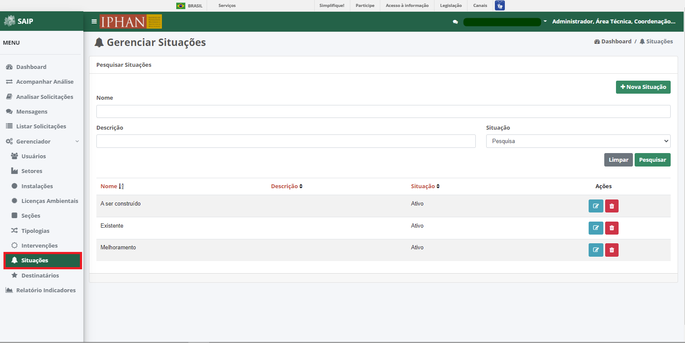
           
Em **Pesquisar Situações**, na parte superior se encontram os filtros de pesquisa como Nome, Descrição e Situação. E o botão **Nova Situação**, para cadastro de novas Situações.
           
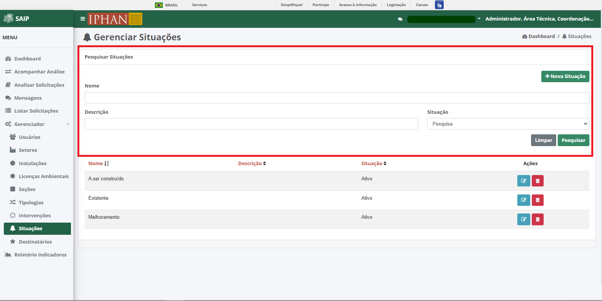
          
.. note::
   Sempre que preencher os filtros clique no botão **Pesquisar**, para que a ação seja executada. Acionando **Limpar** os filtros são removidos.
           
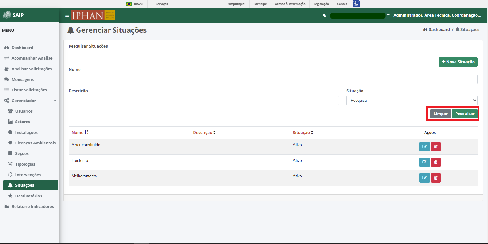
           
Em **Pesquisar Situações** na parte inferior, encontram-se os registros totais de Licenças ou o resultado da pesquisa realizada com os filtros. As colunas apresentadas são Nome, Descrição, Situação e Ações.
                                 
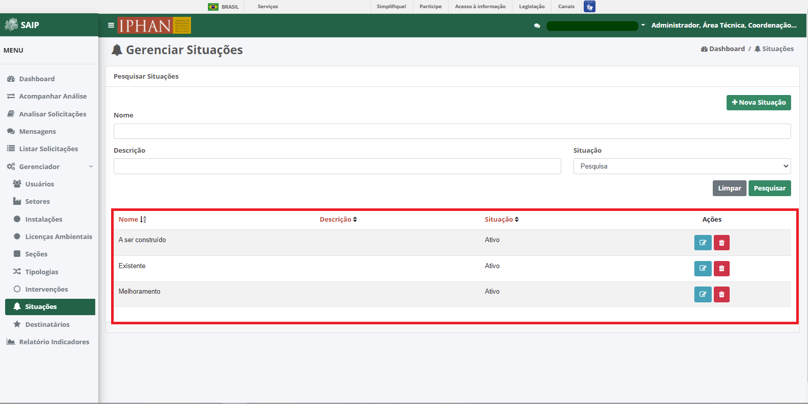
           
.. note::
     O sistema permite que você ordene as colunas por ordem crescente ou decrescente conforme se clica nos títulos de cada coluna.
                               
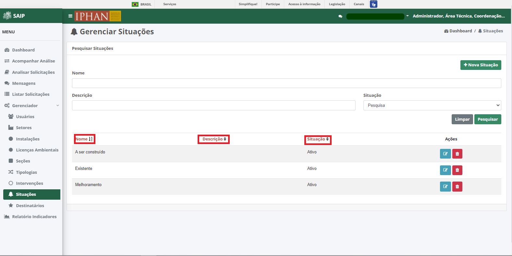
           
           
Na lista, há as ações de **Editar Situação** e  **Excluir Situação**, respectivamente.
           
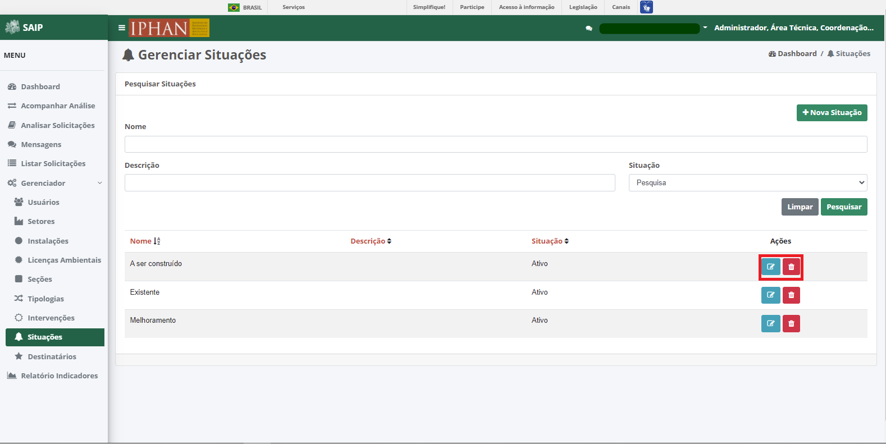
                  
Editar Situação
-------------------

Ao acionar o botão **Editar Situação**, o sistema apresenta é apresentado a tela de **Alterar Situação**, com os campos, Nome e Descrição, e os botões **Cancelar**, onde retorna para a tela de **Gerenciar Situações**, sem alterações, e **Salvar**, onde salva as alterações realizadas e retorna para a tela de **Gerenciar Situações**.
           
.. note::
     Tem-se o campo **Situação**, onde se tem a opção de ativar ou inativar a Intervenção cadastrada. 
           
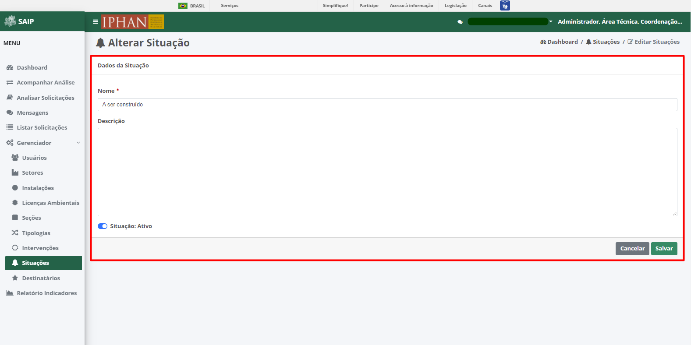

Excluir Situação
-------------------
           
Ao acionar o botão **Excluir Tipo de Intervenção**, o sistema apresenta uma janela de **Exclusão de Tipo de Intervenção**, com os botões **Cancelar**, onde a operação de exclusão é cancelada e **OK**, onde é confirmada a exclusão da Intervenção.
                    
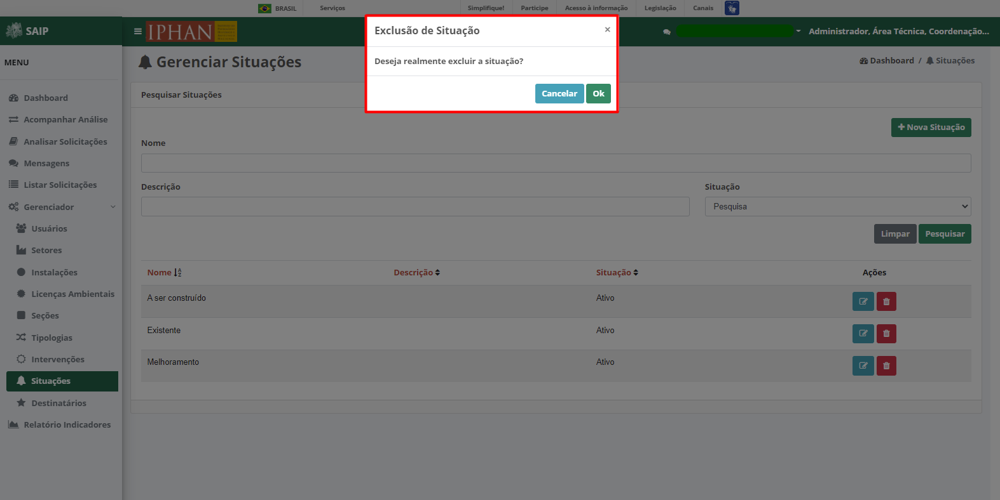
           
Nova Situação
-----------------
           
Ao acionar o botão **Novo Situação**, é apresentado a tela para Incluir Situação, contendo os campos, Nome e Descrição.
           
.. note:: 
   Após inserir os dados da Situação, é necessário acionar o botão **Salvar** para que seja cadastrado. O botão **Cancelar** retorna para a tela de Gerenciar Situações.
           
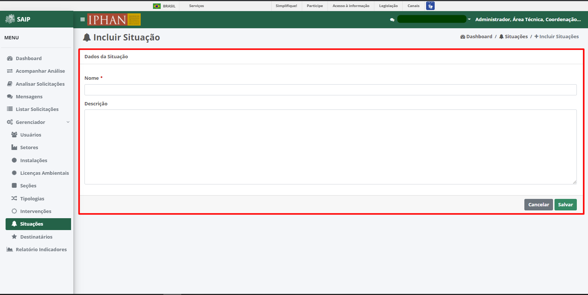

Destinatários
==============
     
Para acessar o gerenciador de Órgãos Ambientais Destinatários, selecionar a opção **Destinatários** no submenu lateral esquerdo, onde irá permitir gerenciar os Órgãos Ambientais Destinatários.
     
.. image:: ../images/SAIP_Interno_Gerenciador_Destinatario.png
        :alt: SAIP Interno Gereciador Destinatários
     
Em **Pesquisar Órgãos Ambientais Destinatários**, na parte superior se encontram os filtros de pesquisa como Unidade, Esfera do Licenciamento Ambiental, Situação, Descrição do Destinatário e E-mail. E o botão **Novo Órgão Ambiental Destinatário**, para cadastro de novos Destinatários.
     
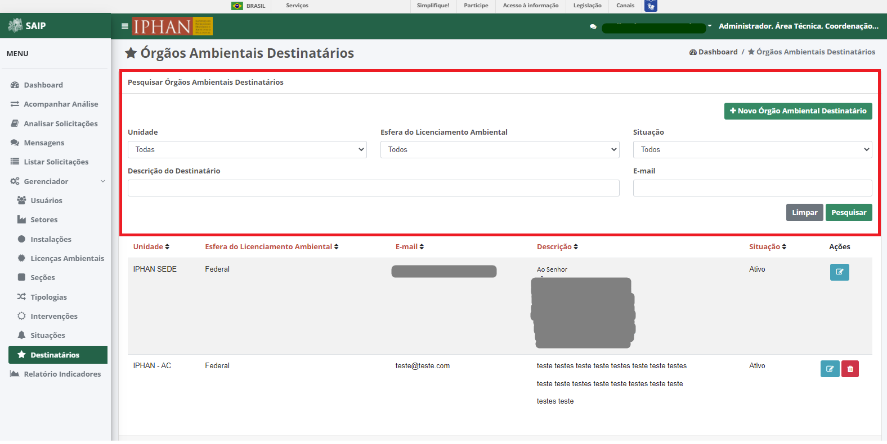
.. note::
     Sempre que preencher os filtros clique no botão **Pesquisar**, para que a ação seja executada. Acionando **Limpar** os filtros são removidos.
     
.. image:: ../images/SAIP_Interno_Gerenciador_Destinatario_Pesquisar_Limpar.png
     :alt: SAIP Interno Gerenciador Destinatários Pesquisar
     
Em **Pesquisar Órgãos Ambientais Destinatários** na parte inferior, encontram-se os registros totais de Destinatários ou o resultado da pesquisa realizada com os filtros. As colunas apresentadas, são, Unidade, Esfera do Licenciamento Ambiental, E-mail, Descrição, Situação e Ações.
                           
.. image:: ../images/SAIP_Interno_Gerenciador_Destinatarios_Pesquisar_Resultado.png
     :alt: SAIP Interno Gerenciador Destinatários Resultado
     
.. note::
     O sistema permite que você ordene as colunas por ordem crescente ou decrescente conforme se clica nos títulos de cada coluna.
                         
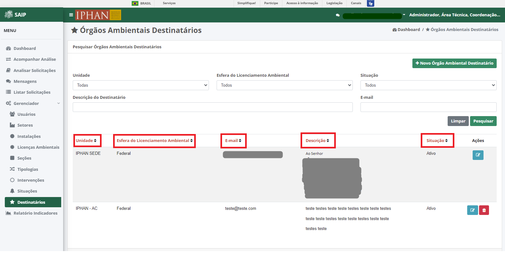
     
     
Na lista, há as ações de **Alterar Órgão Ambiental Destinatário** e  **Excluir Órgão Ambiental Destinatário**, respectivamente.
     
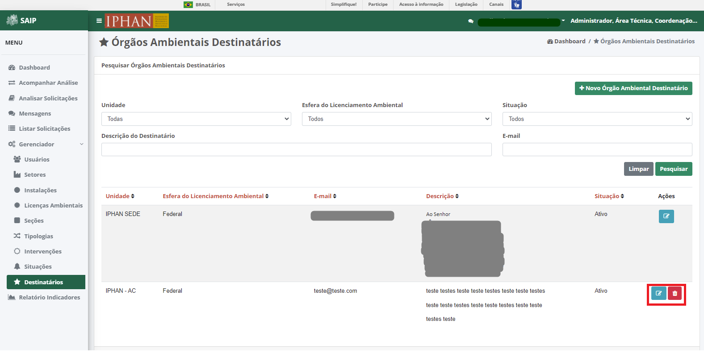
     
Alterar Órgão Ambiental Destinatário
-------------------------------------
     
Ao acionar o botão **Editar Situação**, o sistema apresenta é apresentado a tela de **Alterar Situação**, com os campos, Nome e Descrição, e os botões **Cancelar**, onde retorna para a tela de **Órgãos Ambientais Destinatários**, sem alterações, e **Salvar**, onde salva as alterações realizadas e retorna para a tela de **Órgãos Ambientais Destinatários**.
     
.. note::
        Tem-se o campo **Situação**, onde se tem a opção de ativar ou inativar o Destinatário cadastrado. 
     
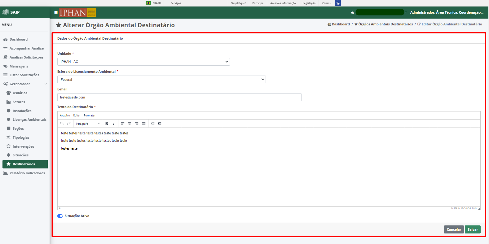
     
Excluir Órgão Ambiental Destinatário
------------------------------------
     
Ao acionar o botão **Excluir Tipo de Intervenção**, o sistema apresenta uma janela de **Exclusão de Tipo de Intervenção**, com os botões **Cancelar**, onde a operação de exclusão é cancelada e **OK**, onde é confirmada a exclusão da Intervenção.
     
     
.. image:: ../images/SAIP_Interno_Gerenciador_Destinatarios_Acoes_Excluir_Destinatario.png
     :alt: SAIP Interno Gerenciador Excluir Destinatário  
     
     
Novo Órgão Ambiental Destinatário
-----------------------------------
     
Ao acionar o botão **Novo Órgão Ambiental Destinatário**, é apresentado a tela para Incluir Órgão Ambiental Destinatário, contendo os campos, Unidade eEsfera do Licenciamento Ambiental, E-mail e Texto do Destinatário.
     
.. note:: 
     Após inserir os dados do Órgão Ambiental Destinatário, é necessário acionar o botão **Salvar** para que seja cadastrado. O botão **Cancelar** retorna para a tela de Órgãos Ambientais Destinatários.
      
.. image:: ../images/SAIP_Interno_Gerenciador_Destinatarios_Cadastrar_Destinatario.png
     :alt: SAIP Interno Gerenciador Destinatários Cadastrar Destinatário