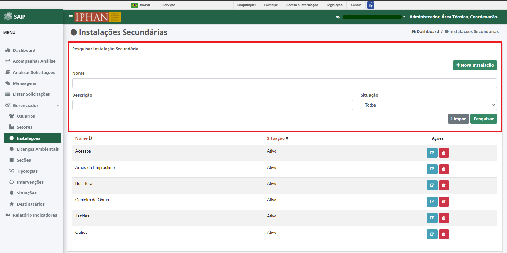
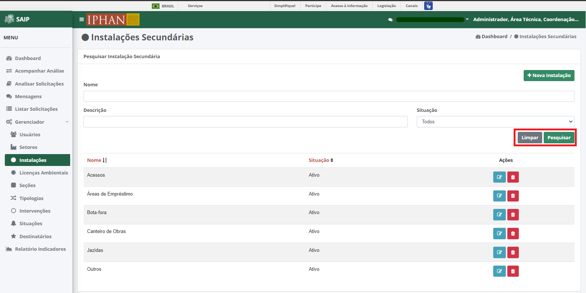
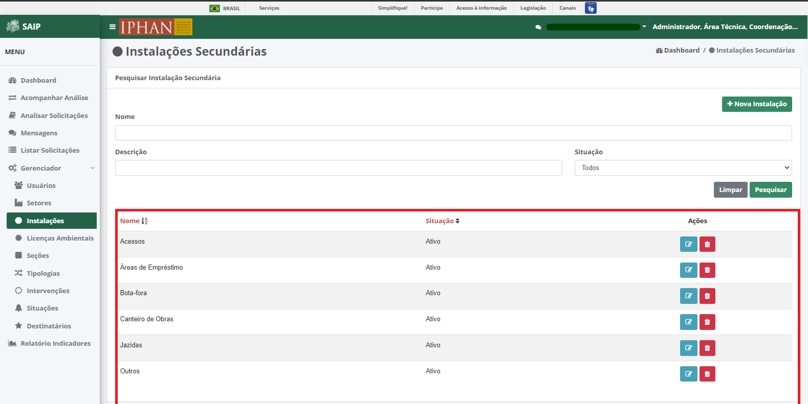
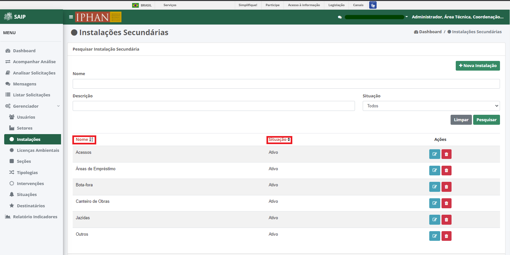
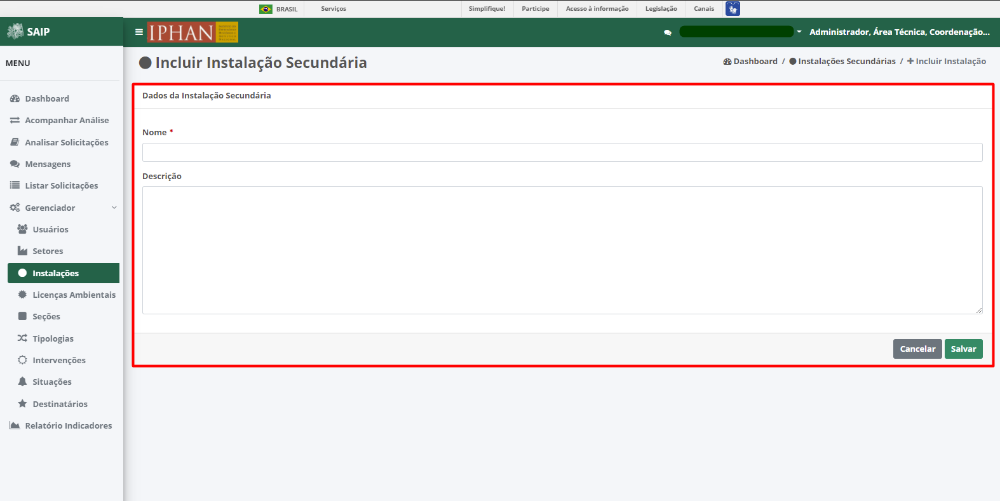
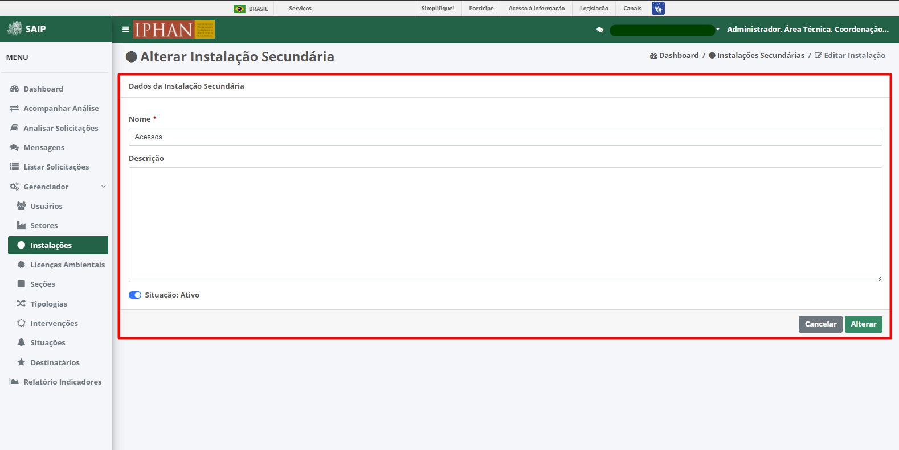
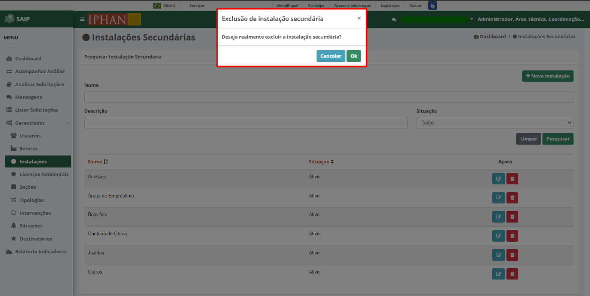

Instalações
=============================

.. meta::
   :description: Apresentação do Gerenciador - Instalações.
      
Para acessar o **Gerenciador de Instalações Secundárias** no sistema, o sistema disponibiliza a opção **Gerenciador**, no menu lateral esquerdo, e a opção **Instalações**, no submenu.

.. image:: ../images/SAIP_Interno_Gerenciador_Instalacoes.png
     :alt: SAIP Interno Gereciador Setores

Na parte superior do **Pesquisar Instalação Secundária** são disponibilizados os filtros de pesquisa: **Nome**, **Descrição** e **Situação**, e ainda as opções de ação: **Nova Instalação**, **Limpar** e **Pesquisar**.

.. note::
     Para que a ação de pesquisa seja executada, faz-se necessário que se preencha os filtros disponíveis e acione o botão **Pesquisar**; para que os fitros sejam removidos faz-se necessário que se acione o botão **Limpar**.

Como resultado do **Pesquisar Instalação Secundária** são apresentadas as colunas: **Nome**, **Situação** e **Ações**, e a quantidade total de registros.
                      

.. note::
     O sistema permite que haja a ordenação das colunas na forma crescente ou decrescente conforme se clica nos títulos de cada coluna.
                    

Como ações disponíveis na lista de resultado do **Pesquisar Instalação Secundária**, tem-se: **Editar Instalação** e **Excluir Instalação**.

.. image:: ../images/SAIP_Interno_Gerenciador_Setores_Acoes.png
     :alt: SAIP Interno Gerenciador instalação Ações

Nova instalação
----------------

Ao acionar o botão **Nova Instalação**, o sistema apresenta uma tela para a inclusão dos dados de uma nova instalação secundária.

.. note:: 
     Os botões **Cancelar** e **Salvar** são disponibilizados, permitindo o cancelamento ou a gravação da inclusão, respectivamente.

Editar instalação
------------------

Ao acionar o botão **Editar Instalação**, o sistema apresenta uma tela para a alteração dos dados da instalação secundária. Os botões **Cancelar** e **Alterar** são disponibilizados, permitindo o cancelamento ou a gravação da alteração, respectivamente.

.. note::
     No campo **Situação**, é permitido ativar ou inativar uma instalação secundária já cadastrada. 

Excluir instalação
-----------------------  

Ao acionar o botão **Excluir Instalação**, o sistema apresenta uma tela para a confirmação da exclusão. Os botões **Cancelar** e **Ok** são disponibilizados, permitindo o cancelamento ou a confirmação da exclusão, respectivamente.

