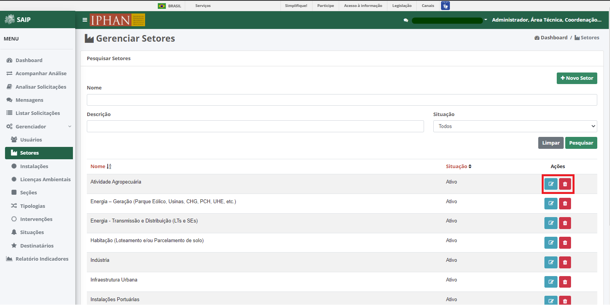

Instalações
=============================

.. meta::
   :description: Apresentação do Gerenciador - Instalações.
      
Para acessar o **Gerenciador de Instalações Secundárias** do sistema, clique no menu **Gerenciador** no menu lateral esquerdo e então selecione a opção **Instalações** no submenu lateral esquerdo, onde irá permitir gerenciar as Instalações Secundárias cadastradas.

.. image:: ../images/SAIP_Interno_Gerenciador_Instalacoes.png
     :alt: SAIP Interno Gereciador Setores

Em **Pesquisar Instalação Secundária**, na parte superior se encontram os filtros de pesquisa como Nome, Descrição e Situação. E o botão **Nova Instalação**, para cadastro de novas instalações.

.. image:: ../images/SAIP_Interno_Gerenciador_instalacoes_Pesquisar_instalacao.png
     :alt: SAIP Interno Gerenciador Pesquisar instalações
.. note::
     Sempre que preencher os filtros clique no botão **Pesquisar**, para que a ação seja executada. Acionando **Limpar** os filtros são removidos.

.. image:: ../images/SAIP_Interno_Gerenciador_instalacoes_Pesquisar_instalacoes_Pesquisar_Limpar.png
     :alt: SAIP Interno Gerenciador instalacoes Pesquisar

Em **Pesquisar Instalação Secundária** na parte inferior, encontram-se os registros totais de Setores ou o resultado da pesquisa conforme os filtros informados. As colunas apresentadas são Nome, Situação e Ações.
                      
.. image:: ../images/SAIP_Interno_Gerenciador_instalacoes_Pesquisar_instalacoes_Resultado.png
     :alt: SAIP Interno Gerenciador instalacoes Resultado

.. note::
     O sistema permite que você ordene as colunas por ordem crescente ou decrescente conforme se clica nos títulos de cada coluna.
                    
.. image:: ../images/SAIP_Interno_Gerenciador_instalacoes_Pesquisar_Ordenar.png
     :alt: SAIP Interno Gerenciador instalacoes Ordenar

No resultado da pesquisa, há as ações de **Editar instalação** e **Excluir instalação** , respectivamente.

Nova instalação
----------------

Ao acionar o botão **Novo Instalação**, é apresentado a tela para incluir uma nova Instalação Secundária, contendo os campos, Nome e Descrição.

.. note:: 
     Após inserir os dados da nova Instalação, é necessário acionar o botão **Salvar** para que seja cadastrado. O botão **Cancelar** retorna para a tela de gerenciamento das Instalações Secundárias.

.. image:: ../images/SAIP_Interno_Gerenciador_Instalacoes_Cadastrar_instalacao.png
     :alt: SAIP Interno Gerenciador Instalacoes Cadastrar instalação

Editar instalação
------------------

Ao acionar o botão **Editar Instalação**, o sistema apresenta é apresentado a tela de **Alterar Instalação Secundária**, com os botões **Cancelar**, onde retorna para a tela de **Instalações Secundárias**, sem alterações, e **Alterar** onde salva as alterações realizadas e retorna para a tela de **Instalações Secundárias**.

.. note::
   Tem-se o campo **Situação**, onde se tem a opção de ativar ou inativar a Instalação Secundária cadastrada. 

.. image:: ../images/SAIP_Interno_Gerenciador_instalacoes_Acoes_Editar_instalacao.png
     :alt: SAIP Interno Gerenciador Editar instalacao

Excluir instalação
-----------------------  

Ao acionar o botão **Excluir Instalação**, o sistema apresenta uma janela de **Exclusão de Instalação Secundária**, com os botões **Cancelar**, onde a operação de exclusão é cancelada e **OK**, onde é confirmada a exclusão da instalação.

.. image:: ../images/SAIP_Interno_Gerenciador_Instalacoes_Acoes_Excluir_instalacao.png 
     :alt: SAIP Interno Gerenciador Excluir instalação
