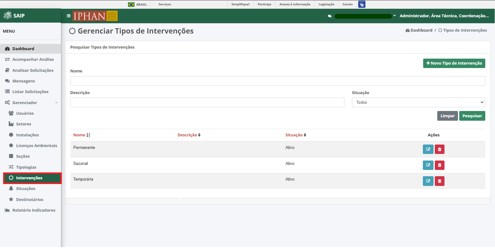
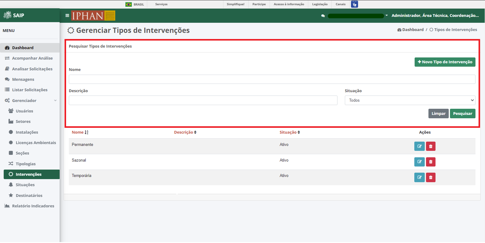
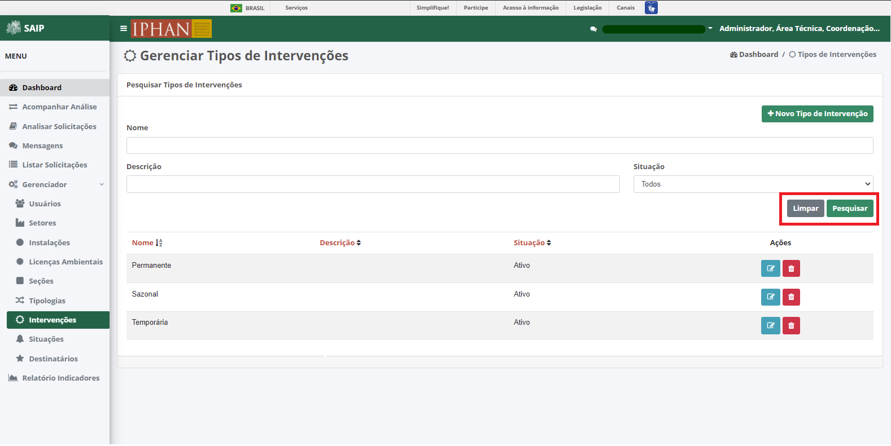
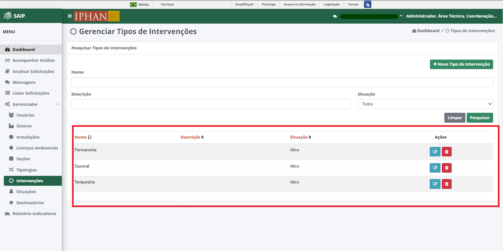
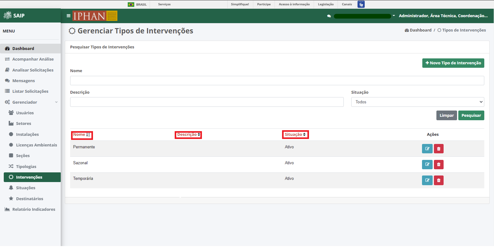
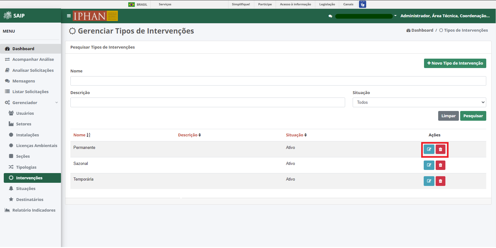
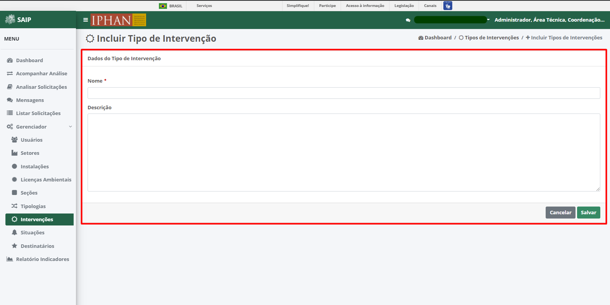
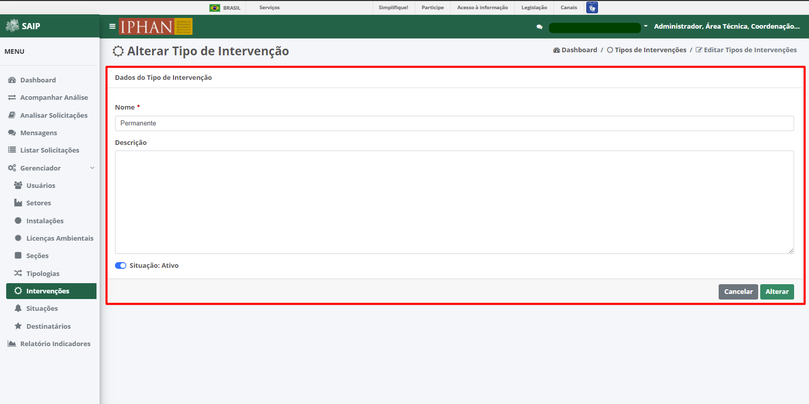
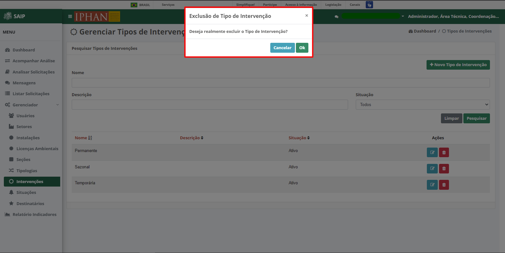

Intervenções
=============================

.. meta::
   :description: Apresentação do Gerenciador - Intervenções.
       
Para acessar o **Gerenciador de Tipos de Intervenções** do sistema, clique no menu **Gerenciador** no menu lateral esquerdo e então selecione a opção **Intervenções** no submenu lateral esquerdo, onde irá permitir gerenciar as Intervenções cadastradas.
     

     
Em **Pesquisar Tipos de Intervenções**, na parte superior se encontram os filtros de pesquisa como Nome, Descrição e Situação. E o botão **Novo Tipo de Intervenção**, para cadastro de novas Intervenções.
     

.. note::
     Sempre que preencher os filtros clique no botão **Pesquisar**, para que a ação seja executada. Acionando **Limpar** os filtros são removidos.
     

     
Em **Pesquisar Tipos de Intervenções** na parte inferior, encontram-se os registros totais de Licenças ou o resultado da pesquisa realizada com os filtros. As colunas apresentadas são Nome, Descrição, Situação e Ações.
                           

     
.. note::
      O sistema permite que você ordene as colunas por ordem crescente ou decrescente conforme se clica nos títulos de cada coluna.
                         

     
     
Na lista, há as ações de **Editar Tipo de Intervenção** e Excluir **Tipo de Intervenção**, respectivamente.
     

Novo Tipo de Intervenção
--------------------------
     
Ao acionar o botão **Novo Tipo de Intervenção**, é apresentado a tela para incluir um novo Tipo de Intervenção, contendo os campos, Nome e Descrição.
     
.. note:: 
     Após inserir os dados da Intervenção, é necessário acionar o botão **Salvar** para que seja cadastrado. O botão **Cancelar** retorna para a tela de Gerenciar Tipos de Intervenções.
     

     
Editar Tipo de Intervenção
---------------------------
     
Ao acionar o botão **Editar Tipo de Intervenção**, é apresentado a tela para alterar os dados de um Tipo de Intervenção, com os campos Nome e Descrição, e os botões **Cancelar**, onde retorna para a tela de **Gerenciar Tipos de Intervenções**, sem alterações, e **Alterar**, onde salva as alterações realizadas e retorna para a tela de **Gerenciar Tipos de Intervenções**.
     
.. note::
        Tem-se o campo **Situação**, onde se tem a opção de ativar ou inativar a Intervenção cadastrada. 
     

     
Excluir Tipo de Intervenção
----------------------------
     
Ao acionar o botão **Excluir Tipo de Intervenção**, o sistema apresenta uma janela de **Exclusão de Tipo de Intervenção**, com os botões **Cancelar**, onde a operação de exclusão é cancelada e **OK**, onde é confirmada a exclusão da Intervenção.
     
     

