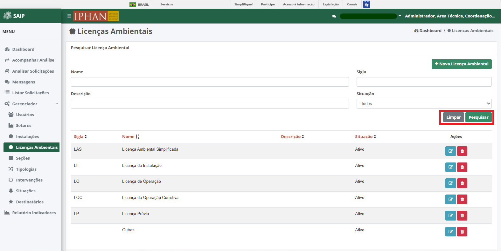

Licenças Ambientais
=============================

.. meta::
   :description: Apresentação do  Gerenciador - Licença Ambiental.

Para acessar o **Gerenciador de Licenças Ambientais** do sistema, clique no menu **Gerenciador** no menu lateral esquerdo e então selecione a opção **Licenças Ambientais** no submenu lateral esquerdo, onde irá permitir gerenciar as Licenças Ambientais cadastradas.
 
.. image:: ../images/SAIP_Interno_Gerenciador_Licencas.png 
     :alt: SAIP Interno Gereciador Licencas

Em **Pesquisar Licenças Ambientais**, na parte superior se encontram os filtros de pesquisa como Nome, Sigla, Descrição e Situação. E o botão **Nova Licença Ambientais**, para cadastro de novas Licenças Ambientais.

.. image:: ../images/SAIP_Interno_Gerenciador_Licencas_Pesquisar_Licencas.png
     :alt: SAIP Interno Gerenciador Pesquisar Licenças Ambientais

.. note::
     Sempre que preencher os filtros clique no botão **Pesquisar**, para que a ação seja executada. Acionando **Limpar** os filtros são removidos.

Em **Pesquisar Licença Ambiental** na parte inferior, encontram-se os registros totais de Licenças ou o resultado da pesquisa conforme os filtros informados. As colunas apresentadas são Sigla, Nome, Descrição, Situação e Ações.
                      
.. image:: ../images/SAIP_Interno_Gerenciador_Licencas_Pesquisar_Licencas_Resultado.png
     :alt: SAIP Interno Gerenciador Licencas Resultado

.. note::
     O sistema permite que você ordene as colunas por ordem crescente ou decrescente conforme se clica nos títulos de cada coluna.
                    
.. image:: ../images/SAIP_Interno_Gerenciador_Licenca_Pesquisar_Ordenar.png
     :alt: SAIP Interno Gerenciador Licencas Ordenar

No resultado da pesquisa, há as ações de **Editar Licença Ambiental** e **Excluir Licença Ambiental**, respectivamente.

Nova Licença Ambiental
------------------------

Ao acionar o botão **Nova Licença Ambiental**, é apresentado a tela para incluir uma nova Licença Ambiental, contendo os campos, Sigla, Nome e Descrição.

..note:: 
     Após inserir os dados da Nova Licença Ambiental, é necessário acionar o botão **Salvar** para que seja cadastrado. O botão **Cancelar** retorna para a tela de Instalações Secundárias.

.. image:: ../images/SAIP_Interno_Gerenciador_Licenca_Cadastrar_Licenca.png
     :alt: SAIP Interno Gerenciador Licença Cadastrar Licença

Editar Licença Ambiental
-------------------------

Ao acionar o botão **Editar Licença Ambiental**, é apresentado a tela para alterar os dados de uma Licença Ambiental, com os campos, Sigla, Nome e Descrição e os botões **Cancelar**, onde retorna para a tela de **Licenças Ambientais**, sem alterações, e **Alterar** onde salva as alterações realizadas e retorna para a tela de **Licenças Ambientais**.

.. note::
   Tem-se o campo **Situação**, onde se tem a opção de ativar ou inativar a Licença Ambiental cadastrada. 

Excluir Licença Ambiental
---------------------------

Ao acionar o botão **Excluir Licença Ambiental**, o sistema apresenta uma janela de **Exclusão de Licença Ambiental**, com os botões **Cancelar**, onde a operação de exclusão é cancelada e **OK**, onde é confirmada a exclusão da instalação.

