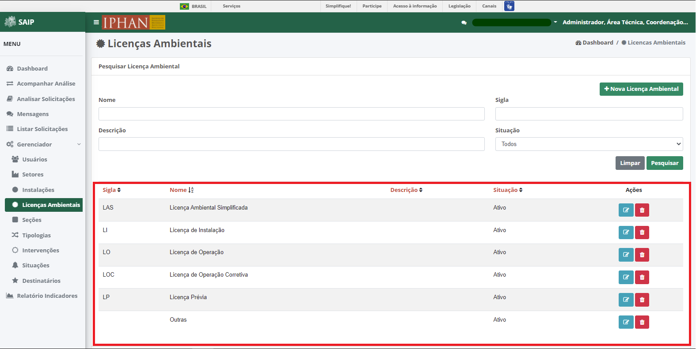

Licenças Ambientais
=============================

.. meta::
   :description: Apresentação do  Gerenciador - Licença Ambiental.

Para acessar o **Gerenciador de Licenças Ambientais** no sistema, o sistema disponibiliza a opção **Gerenciador**, no menu lateral esquerdo, e a opção **Licenças Ambientais**, no submenu.
 
.. image:: ../images/SAIP_Interno_Gerenciador_Licencas.png 
     :alt: SAIP Interno Gereciador Licencas

Na parte superior do **Pesquisar Licenças Ambientais** são disponibilizados os filtros de pesquisa: **Nome**, **Sigla**, **Descrição** e **Situação**, e ainda as opções de ação: **Nova Licença Ambiental**, **Limpar** e **Pesquisar**.

.. note::
     Para que a ação de pesquisa seja executada, faz-se necessário que se preencha os filtros disponíveis e acione o botão **Pesquisar**; para que os fitros sejam removidos faz-se necessário que se acione o botão **Limpar**.

.. image:: ../images/SAIP_Interno_Gerenciador_Licencas_Pesquisar_Licencas_Pesquisar_Limpar.png
     :alt: SAIP Interno Gerenciador Licencas Pesquisar

Como resultado do **Pesquisar Licença Ambiental** são apresentadas as colunas: **Sigla**, **Nome**, **Descrição**, **Situação** e **Ações**, e a quantidade total de registros.
                      

.. note::
     O sistema permite que haja a ordenação das colunas na forma crescente ou decrescente conforme se clica nos títulos de cada coluna.
                    
.. image:: ../images/SAIP_Interno_Gerenciador_Licenca_Pesquisar_Ordenar.png
     :alt: SAIP Interno Gerenciador Licencas Ordenar

Como ações disponíveis na lista de resultado do **Pesquisar Licença Ambiental**, tem-se: **Editar Licença Ambiental** e **Excluir Licença Ambiental**. 

.. image:: ../images/SAIP_Interno_Gerenciador_Licenca_Acoes.png
     :alt: SAIP Interno Gerenciador Licencas Ações

Nova Licença Ambiental
------------------------

Ao acionar o botão **Nova Licença Ambiental**, o sistema apresenta uma tela para a inclusão dos dados de uma nova licença ambiental.

..note:: 
     Os botões **Cancelar** e **Salvar** são disponibilizados, permitindo o cancelamento ou a gravação da inclusão, respectivamente.

.. image:: ../images/SAIP_Interno_Gerenciador_Licenca_Cadastrar_Licenca.png
     :alt: SAIP Interno Gerenciador Licença Cadastrar Licença

Editar Licença Ambiental
-------------------------

Ao acionar o botão **Editar Licença Ambiental**, o sistema apresenta uma tela para a alteração dos dados da licença ambiental. Os botões **Cancelar** e **Alterar** são disponibilizados, permitindo o cancelamento ou a gravação da alteração, respectivamente.

.. note::
     No campo **Situação**, é permitido ativar ou inativar uma licença ambiental já cadastrada. 

.. image:: ../images/SAIP_Interno_Gerenciador_Licenca_Acoes_Editar_Licenca.png
    :alt: SAIP Interno Gerenciador Editar Licenças

Excluir Licença Ambiental
---------------------------

Ao acionar o botão **Excluir Licença Ambiental**, o sistema apresenta uma tela para a confirmação da exclusão. Os botões **Cancelar** e **Ok** são disponibilizados, permitindo o cancelamento ou a confirmação da exclusão, respectivamente.

.. image:: ../images/SAIP_Interno_Gerenciador_Licenca_Acoes_Excluir_Licenca.png
     :alt: SAIP Interno Gerenciador Excluir Licenças                
