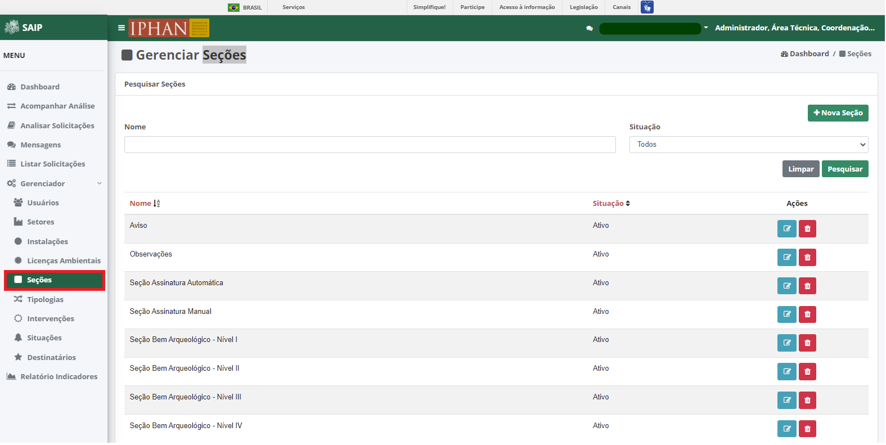
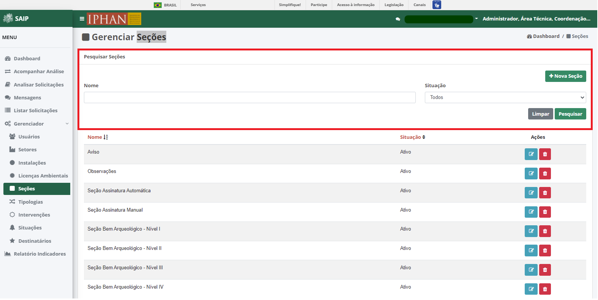
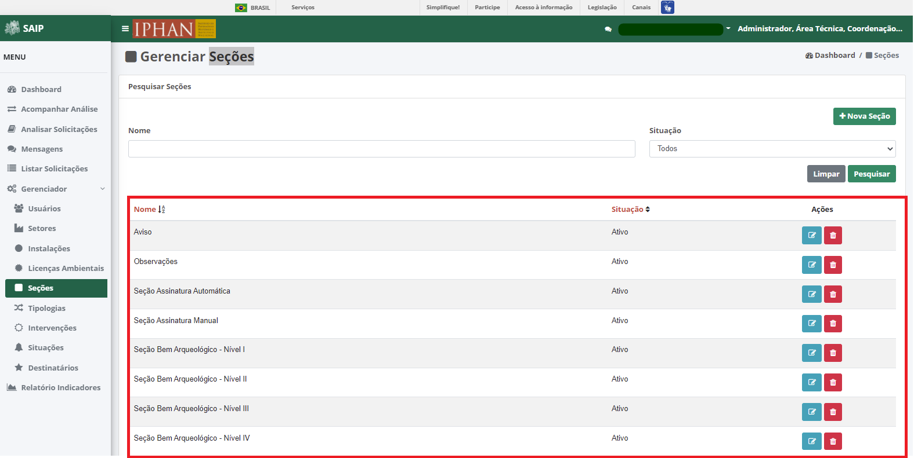
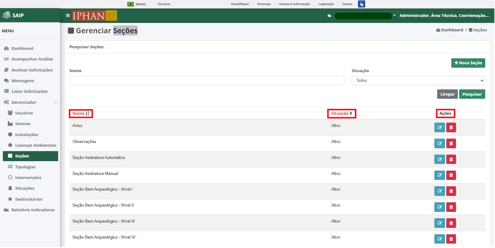
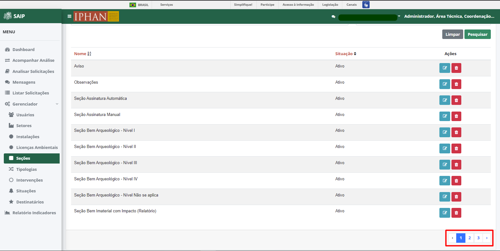
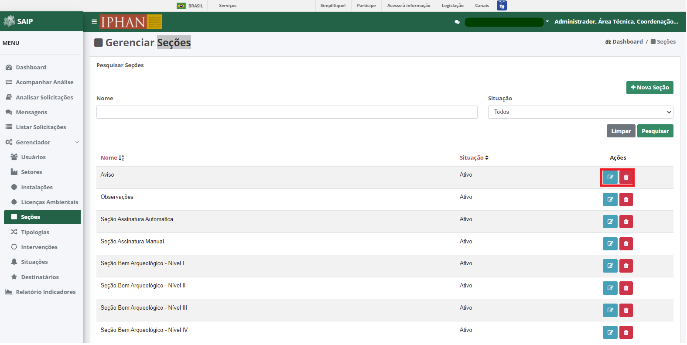
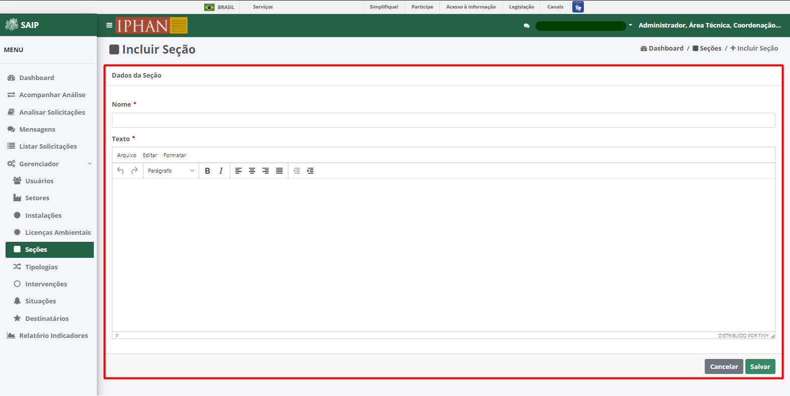
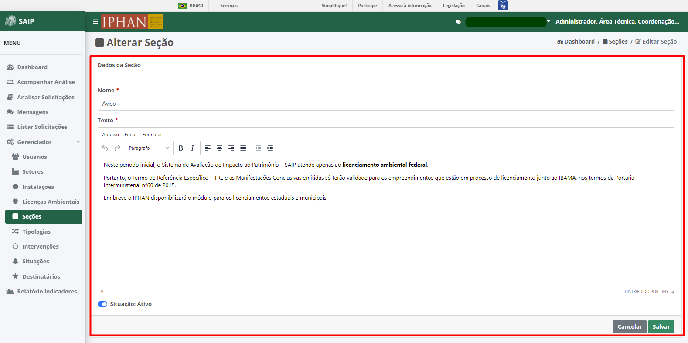
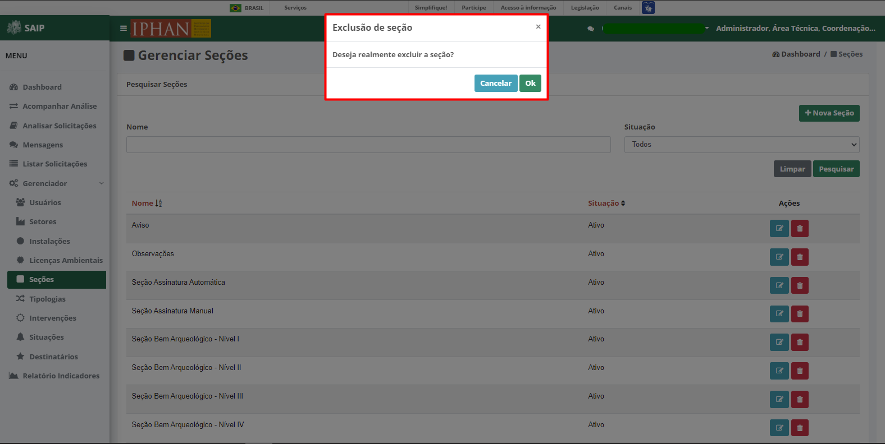

Seções
=============================

.. meta::
   :description: Apresentação do Gerenciador - Seções.

Para acessar o **Gerenciador de Seções** no sistema, o sistema disponibiliza a opção **Gerenciador**, no menu lateral esquerdo, e a opção Seções, no submenu.

Na parte superior do **Pesquisar Seções** são disponibilizados os filtros de pesquisa: **Nome** e **Situação**, e ainda as opções de ação: **Nova Seção**, **Limpar** e **Pesquisar**.

.. note::
     Para que a ação de pesquisa seja executada, faz-se necessário que se preencha os filtros disponíveis e acione o botão **Pesquisar**; para que os fitros sejam removidos faz-se necessário que se acione o botão **Limpar**.

.. image:: ../images/SAIP_Interno_Gerenciador_Secoes_Pesquisar_Limpar.png
     :alt: SAIP Interno Gerenciador Seções Pesquisar

Como resultado do **Pesquisar Seções** são apresentadas as colunas: **Nome**, **Situação** e **Ações**, e a quantidade total de registros.
                      

.. note::
     O sistema permite que haja a ordenação das colunas na forma crescente ou decrescente conforme se clica nos títulos de cada coluna.
                    

.. note::
     A lista de resultado do **Pesquisar Seções** apresenta paginação de 10 em 10 registros, as páginas por meio das quais o usuário pode navegar entre elas, e as opções de navegação para as próxima página e página anterior.
                    

Como ações disponíveis na lista de resultado do **Pesquisar Seções**, tem-se: **Editar Seção** e **Excluir Seção**.

Nova Seção
--------------

Ao acionar o botão **Nova Seção**, o sistema apresenta uma tela para a inclusão dos dados de uma nova seção.

.. note:: 
     Os botões **Cancelar** e **Salvar** são disponibilizados, permitindo o cancelamento ou a gravação da inclusão, respectivamente.

Editar Seção
--------------

Ao acionar o botão **Editar Seção**, o sistema apresenta uma tela para a alteração dos dados da seção. Os botões **Cancelar** e **Alterar** são disponibilizados, permitindo o cancelamento ou a gravação da alteração, respectivamente.

.. note::
     No campo **Situação**, é permitido ativar ou inativar uma seção já cadastrada. 

Excluir Seção
---------------

Ao acionar o botão **Excluir Seção**, o sistema apresenta uma tela para a confirmação da exclusão. Os botões **Cancelar** e **Ok** são disponibilizados, permitindo o cancelamento ou a confirmação da exclusão, respectivamente.

