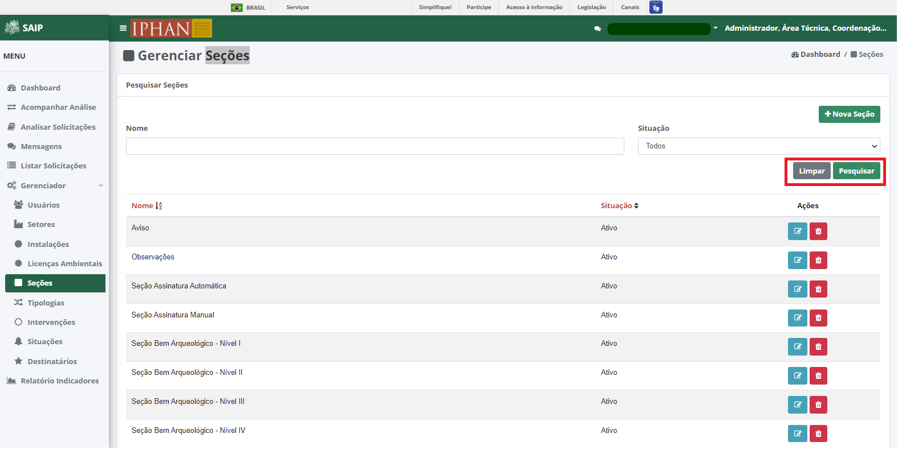

Seções
=============================

.. meta::
   :description: Apresentação do Gerenciador - Seções.

Para acessar o **Gerenciador de Seções** do sistema, clique no menu **Gerenciador** no menu lateral esquerdo e então selecione a opção **Seções** no submenu lateral esquerdo, onde irá permitir gerenciar as Seções cadastradas.

Em **Pesquisar Seções**, na parte superior se encontram os filtros de pesquisa como Nome e Situação. E o botão **Nova Seção**, para cadastro de novas Seções.

.. note::
     Sempre que preencher os filtros clique no botão **Pesquisar**, para que a ação seja executada. Acionando **Limpar** os filtros são removidos.

Em **Pesquisar Seções** na parte inferior, encontram-se os registros totais de Licenças ou o resultado da pesquisa realizada com os filtros. As colunas apresentadas são Nome, Situação e Ações.
                      

.. note::
     O sistema permite que você ordene as colunas por ordem crescente ou decrescente conforme se clica nos títulos de cada coluna.
                    
.. image:: ../images/SAIP_Interno_Gerenciador_Secoes_Pesquisar_Ordenar.png
     :alt: SAIP Interno Gerenciador Seções Ordenar

.. note::
     No resultado da pesquisa, o sistema apresenta a paginação a cada 10 registros. É possível selecionar a página desejada e nas extremidades há a opção de selecionar os ícones de página anterior e próxima página.
                    
.. image:: ../images/SAIP_Interno_Gerenciador_Secoes_Paginacao.png
     :alt: SAIP Interno Gerenciador Seções Paginação

No resultado da pesquisa, há as ações de **Editar Seção** e **Excluir Seção**, respectivamente.

.. image:: ../images/SAIP_Interno_Gerenciador_Secoes_Acoes.png
     :alt: SAIP Interno Gerenciador Seções Ações

Nova Seção
--------------

Ao acionar o botão **Nova Seção**, é apresentado a tela para incluir uma nova Seção, contendo os campos Nome e Texto.

.. note:: 
     Após inserir os dados da nova Seção, é necessário acionar o botão **Salvar** para que seja cadastrado. O botão **Cancelar** retorna para a tela de Gerenciar Seções.

.. image:: ../images/SAIP_Interno_Gerenciador_Secao_Cadastrar_Secao.png
     :alt: SAIP Interno Gerenciador Seções Cadastrar Seção

Editar Seção
--------------

Ao acionar o botão **Editar Seção**, é apresentado a tela para alterar os dados de uma Seção, com os campos, Nome e texto, e os botões **Cancelar**, onde retorna para a tela de **Gerenciar Seções**, sem alterações, e **Salvar** onde salva as alterações realizadas e retorna para a tela de **Gerenciar Seções**.

.. note::
   Tem-se o campo **Situação**, onde se tem a opção de ativar ou inativar a Seção cadastrada. 

.. image:: ../images/SAIP_Interno_Gerenciador_Secoes_Acoes_Editar_Secoes.png
     :alt: SAIP Interno Gerenciador Editar Seção

Excluir Seção
---------------

Ao acionar o botão **Excluir Seção**, o sistema apresenta uma janela de **Exclusão de Seção**, com os botões **Cancelar**, onde a operação de exclusão é cancelada e **OK**, onde é confirmada a exclusão da Seção.

.. image:: ../images/SAIP_Interno_Gerenciador_Secoes_Acoes_Excluir_Secoes.png
     :alt: SAIP Interno Gerenciador Excluir Seção               
