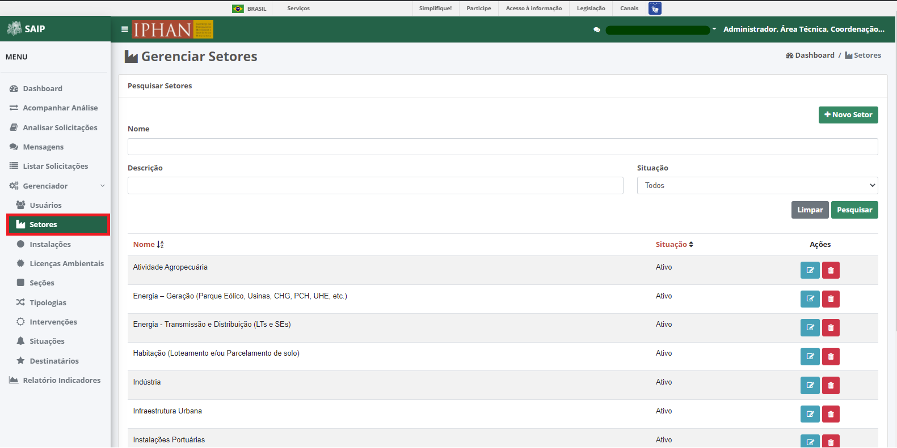
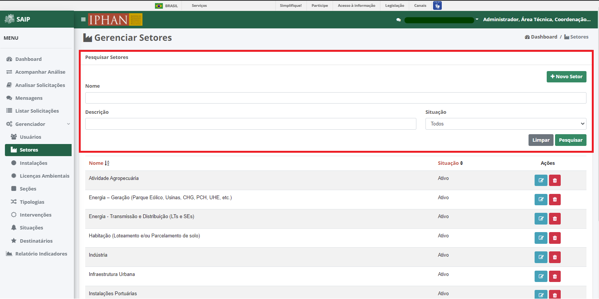
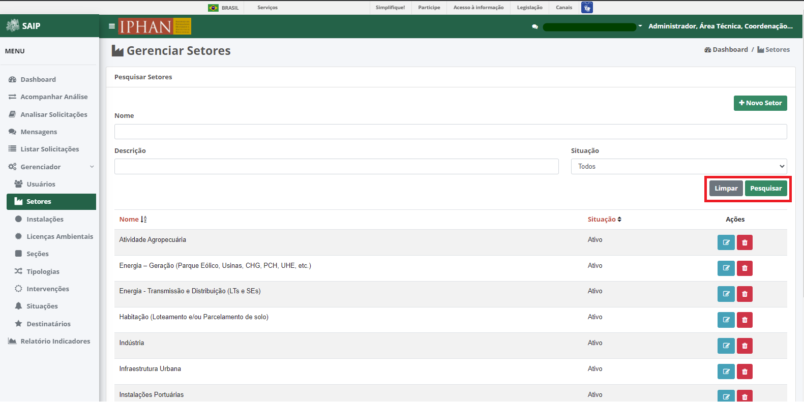
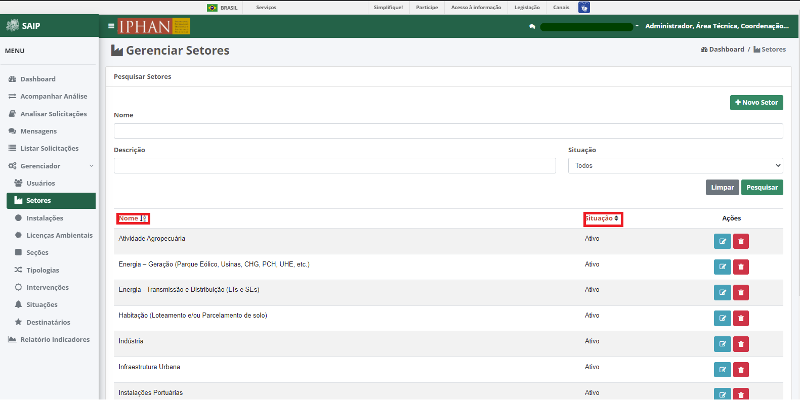
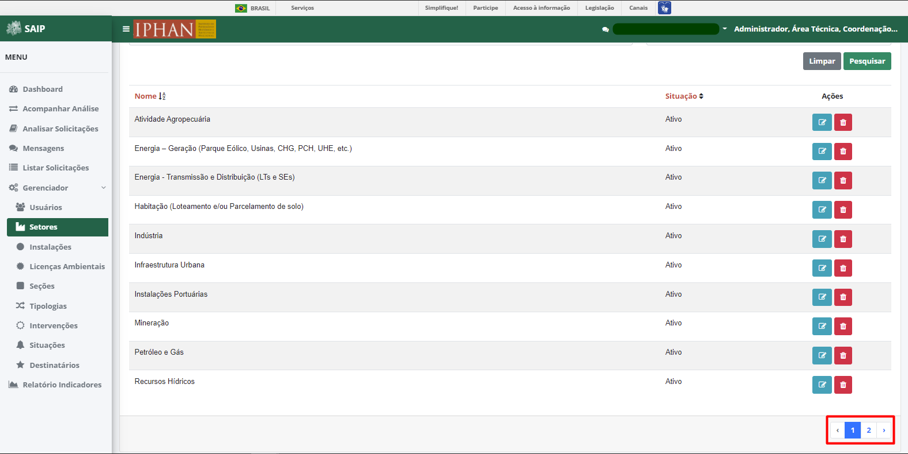
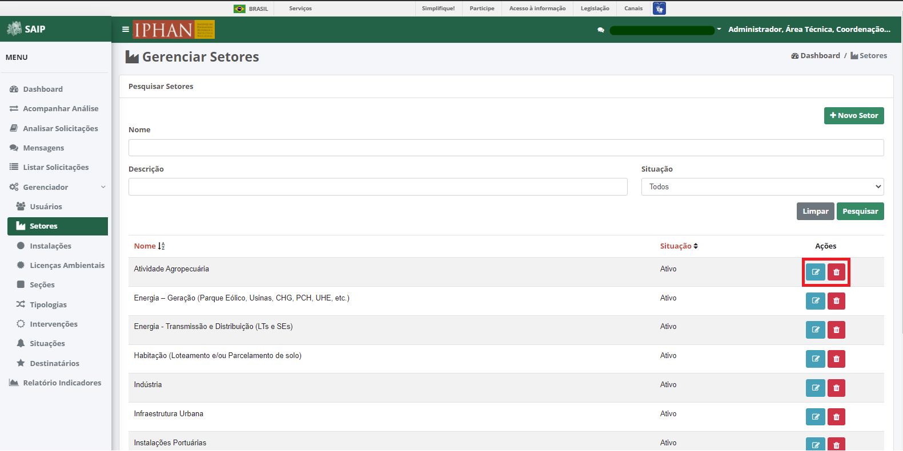
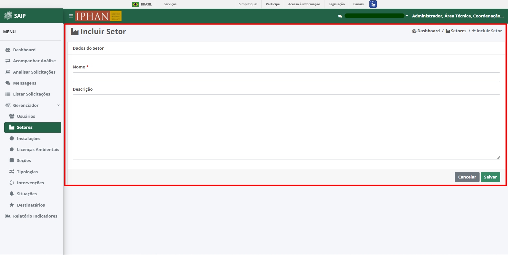
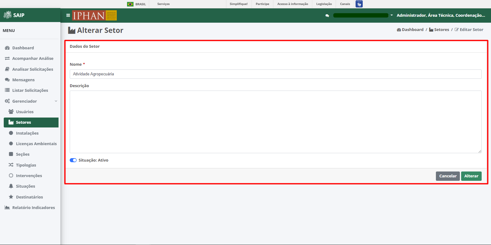
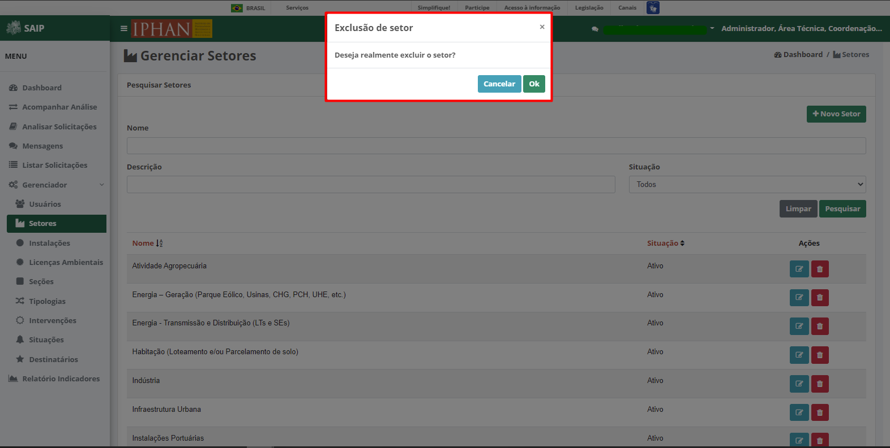

Setores
=============================

.. meta::
   :description: Apresentação do Gerenciador - Setores.
    
Para acessar o **Gerenciador de Setores** do sistema, clique no menu **Gerenciador** no menu lateral esquerdo e então selecione a opção **Setores** no submenu lateral esquerdo, onde irá permitir gerenciar os Setores cadastrados.

Em **Pesquisar Setores**, na parte superior se encontram os filtros de pesquisa como Nome, Descrição e Situação. E o botão **Novo Setor**, para cadastro de novos Setores.

.. note::
 Sempre que preencher os filtros clique no botão **Pesquisar**, para que a ação seja executada. Acionando **Limpar** os filtros são removidos.

Em **Pesquisar Setores** na parte inferior, encontram-se os registros totais de Setores ou o resultado da pesquisa conforme os filtros informados. As colunas apresentadas são Nome, Situação e Ações.
                      
.. image:: ../images/SAIP_Interno_Gerenciador_Setores_Pesquisar_Setores_Pesquisar_Resultado.png
          :alt: SAIP Interno Gerenciador Usuários Resultado

.. note::
     O sistema permite que você ordene as colunas por ordem crescente ou decrescente conforme se clica nos títulos de cada coluna.
                    

.. note::
     No resultado da pesquisa, o sistema apresenta a paginação a cada 10 registros. É possível selecionar a página desejada e nas extremidades há a opção de selecionar os ícones de página anterior e próxima página.
                    

No resultado da pesquisa, há as ações de **Editar Setor** e **Excluir Setor**, respectivamente.

Novo Setor
-------------

Ao acionar o botão **Novo Setor**, é apresentado a tela para inclusão de um novo Setor, contendo os campos, Nome e Descrição.

.. note:: 
     Após inserir os dados do novo Setor, é necessário acionar o botão **Salvar** para que seja cadastrado. O botão **Cancelar** retorna para a tela de gereciamento de Setores.

Editar Setor
--------------

Ao acionar o botão **Editar Setor**, é apresentado a tela para alteração dos dados de um Setor, com os botões **Cancelar**, onde retorna para a tela de **Gerenciar Setores**, sem alterações, e **Alterar** onde salva as alterações realizadas e retorna para a tela de **Gerenciar Setores**.

.. note::
   Tem-se o campo **Situação**, onde se tem a opção de ativar ou inativar o setor cadastradao. 

Excluir Setor
-------------- 

Ao acionar o botão **Excluir Setor**, o sistema apresenta uma janela de **Exclusão de Setor**, com os botões **Cancelar**, onde a operação de exclusão é cancelada e **OK**, onde é confirmada a exclusão do usuário.

