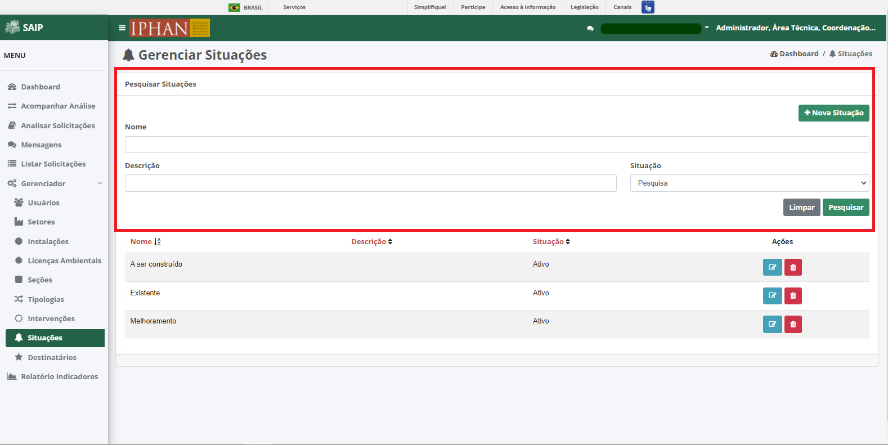
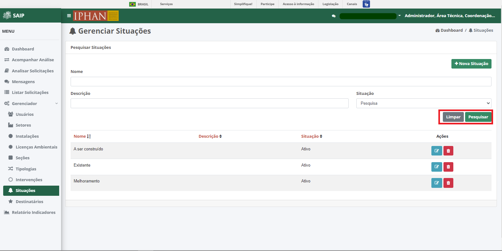
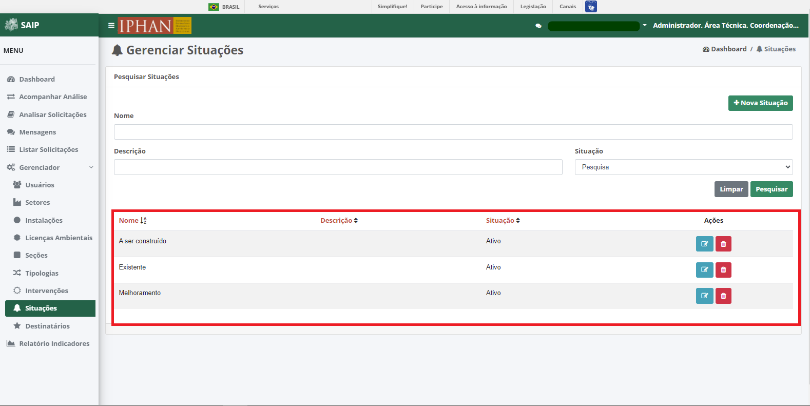
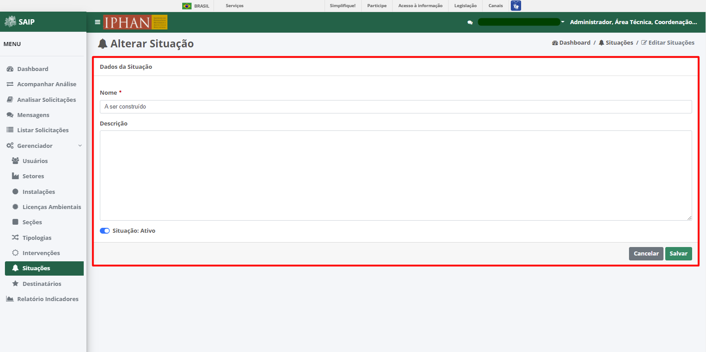
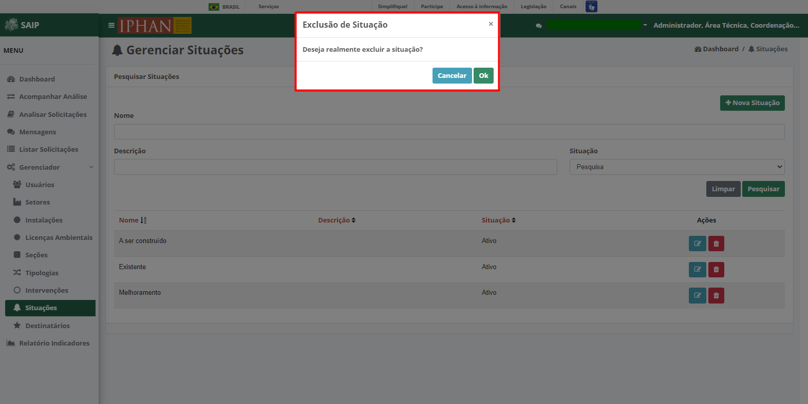

Situações
=============================

.. meta::
   :description: Apresentação do  Gerenciador - Situações.

Para acessar o **Gerenciador de Situações** do sistema, clique no menu **Gerenciador** no menu lateral esquerdo e então selecione a opção **Situações** no submenu lateral esquerdo, onde irá permitir gerenciar as Situações cadastradas.
           
.. image:: ../images/SAIP_Interno_Gerenciador_Situacao.png
    :alt: SAIP Interno Gereciador Situações
           
Em **Pesquisar Situações**, na parte superior se encontram os filtros de pesquisa como Nome, Descrição e Situação. E o botão **Nova Situação**, para cadastro de novas Situações.
           

          
.. note::
   Sempre que preencher os filtros clique no botão **Pesquisar**, para que a ação seja executada. Acionando **Limpar** os filtros são removidos.
           

           
Em **Pesquisar Situações** na parte inferior, encontram-se os registros totais de Licenças ou o resultado da pesquisa conforme os filtros informados. As colunas apresentadas são Nome, Descrição, Situação e Ações.
                                 

           
.. note::
     O sistema permite que você ordene as colunas por ordem crescente ou decrescente conforme se clica nos títulos de cada coluna.
                               
.. image:: ../images/SAIP_Interno_Gerenciador_Situacoes_Pesquisar_Ordenar.png
     :alt: SAIP Interno Gerenciador Situações Ordenar
           
           
No resultado da pesquisa, há as ações de **Editar Situação** e  **Excluir Situação**, respectivamente.
           
.. image:: ../images/SAIP_Interno_Gerenciador_Situacoes_Acoes.png
     :alt: SAIP Interno Gerenciador Situações Ações
 
Nova Situação
-----------------
          
Ao acionar o botão **Novo Situação**, é apresentado a tela para incluir uma nova Situação, contendo os campos, Nome e Descrição.
          
.. note:: 
     Após inserir os dados da Situação, é necessário acionar o botão **Salvar** para que seja cadastrado. O botão **Cancelar** retorna para a tela de Gerenciar Situações.
          
.. image:: ../images/SAIP_Interno_Gerenciador_Situacoes_Cadastrar_Situacao.png
     :alt: SAIP Interno Gerenciador Situações Cadastrar Situação
                 
Editar Situação
-------------------

Ao acionar o botão **Editar Situação**, é apresentado a tela para alterar dados de uma Situação, com os campos, Nome e Descrição, e os botões **Cancelar**, onde retorna para a tela de **Gerenciar Situações**, sem alterações, e **Salvar**, onde salva as alterações realizadas e retorna para a tela de **Gerenciar Situações**.
           
.. note::
     Tem-se o campo **Situação**, onde se tem a opção de ativar ou inativar a Situação cadastrada. 
           

Excluir Situação
-------------------
           
Ao acionar o botão **Excluir Situação**, o sistema apresenta uma janela de **Exclusão de Situação**, com os botões **Cancelar**, onde a operação de exclusão é cancelada e **OK**, onde é confirmada a exclusão da Situação.
                    

