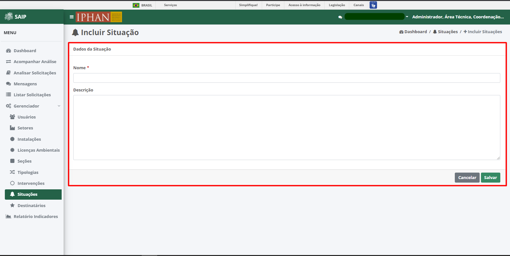

Situações
=============================

.. meta::
   :description: Apresentação do  Gerenciador - Situações.

Para acessar o **Gerenciador de Situações**, o sistema disponibiliza a opção **Gerenciador**, no menu lateral esquerdo, e a opção **Situações**, no submenu.
           
.. image:: ../images/SAIP_Interno_Gerenciador_Situacao.png
    :alt: SAIP Interno Gereciador Situações
           
Na parte superior do **Pesquisar Situações** são disponibilizados os filtros de pesquisa: **Nome**, **Descrição** e **Situação**, e ainda as opções de ação: **Nova Situação**, **Limpar** e **Pesquisar**.
           
.. image:: ../images/SAIP_Interno_Gerenciador_Situacoes_Pesquisar_Situacao.png
     :alt: SAIP Interno Gerenciador Situação
          
.. note::
     Para que a ação de pesquisa seja executada, faz-se necessário que se preencha os filtros disponíveis e acione o botão **Pesquisar**; para que os fitros sejam removidos faz-se necessário que se acione o botão **Limpar**.
           
.. image:: ../images/SAIP_Interno_Gerenciador_Situacao_Pesquisar_Limpar.png
    :alt: SAIP Interno Gerenciador Situações Pesquisar
           
Como resultado do **Pesquisar Situações** são apresentadas as colunas: **Nome**, **Descrição**, **Situação** e **Ações**, e a quantidade total de registros.
                                 
.. image:: ../images/SAIP_Interno_Gerenciador_Situacoes_Pesquisar_Resultado.png
     :alt: SAIP Interno Gerenciador Situações Resultado
           
.. note::
     O sistema permite que haja ordenação das colunas na forma crescente ou decrescente conforme se clica nos títulos de cada coluna.
                               
.. image:: ../images/SAIP_Interno_Gerenciador_Situacoes_Pesquisar_Ordenar.png
     :alt: SAIP Interno Gerenciador Situações Ordenar
           
Como ações disponíveis na lista de resultado do **Pesquisar Situações**, tem-se: **Editar Situação** e **Excluir Situação**.
           
.. image:: ../images/SAIP_Interno_Gerenciador_Situacoes_Acoes.png
     :alt: SAIP Interno Gerenciador Situações Ações
 
Nova Situação
-----------------
          
Ao acionar o botão **Nova Situação**, o sistema apresenta uma tela para a inclusão dos dados de uma nova situação.
          
.. note:: 
     Os botões **Cancelar** e **Salvar** são disponibilizados, permitindo o cancelamento ou a gravação da inclusão, respectivamente.
          

                 
Editar Situação
-------------------

Ao acionar o botão **Editar Situação**, o sistema apresenta uma tela para a alteração dos dados da situação. Os botões **Cancelar** e **Alterar** são disponibilizados, permitindo o cancelamento ou a gravação da alteração, respectivamente.
           
.. note::
     No campo **Situação**, é permitido ativar ou inativar uma Situação já cadastrada. 
           
.. image:: ../images/SAIP_Interno_Gerenciador_Situacoe_Acoes_Editar_Situacao.png 
      :alt: SAIP Interno Gerenciador Editar Situação        

Excluir Situação
-------------------
           
Ao acionar o botão** Excluir Situação**, o sistema apresenta uma tela para a confirmação da exclusão. Os botões **Cancelar** e **Ok** são disponibilizados, permitindo o cancelamento ou a confirmação da exclusão, respectivamente.
                    
.. image:: ../images/SAIP_Interno_Gerenciador_Situacoes_Acoes_Excluir_Situacao.png
     :alt: SAIP Interno Gerenciador Excluir Situação               
