Tipologias
=============================

.. meta::
   :description: Apresentação do  Gerenciador - Tipologias.
  
Para acessar o **Gerenciador de Tipologias** do sistema, clique no menu **Gerenciador** no menu lateral esquerdo e então selecione a opção **Tipologias** no submenu lateral esquerdo, onde irá permitir gerenciar as Tipologias cadastradas.   
     
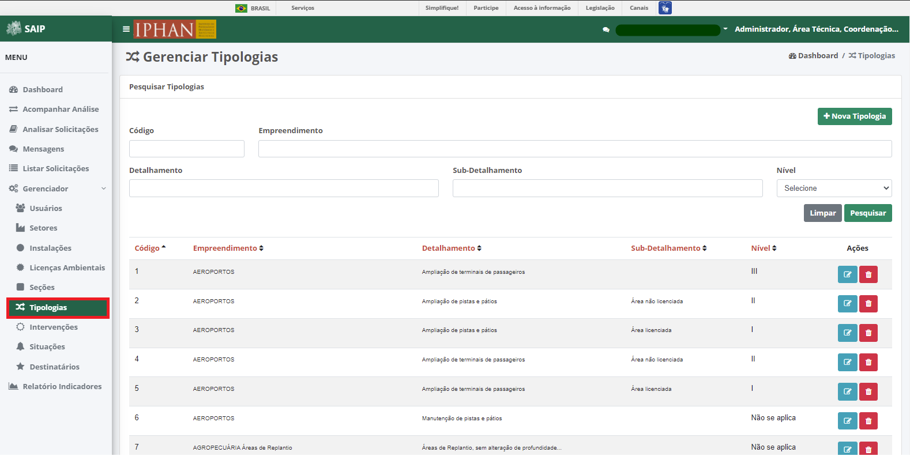
     
Em **Pesquisar Tipologias**, na parte superior se encontram os filtros de pesquisa como Código, Empreendimento, Detalhamento, Sub-Detalhamento e Nível. E o botão **Nova Tipologia**, para cadastro de novas Tipologias.
     
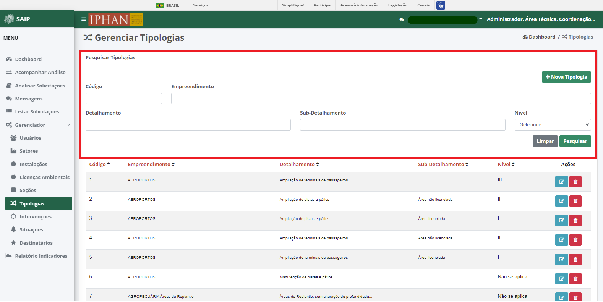
.. note::
     Sempre que preencher os filtros clique no botão **Pesquisar**, para que a ação seja executada. Acionando **Limpar** os filtros são removidos.
     
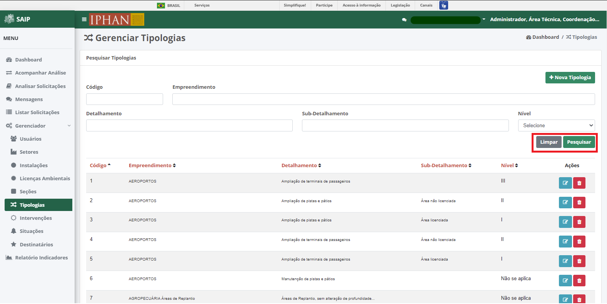
     
Em **Pesquisar Tipologias** na parte inferior, encontram-se os registros totais de Licenças ou o resultado da pesquisa conforme os filtros informados. As colunas apresentadas são Código, Empreendimento, Detalhamento, Sub-Detalhamento, Nível e Ações.
                           
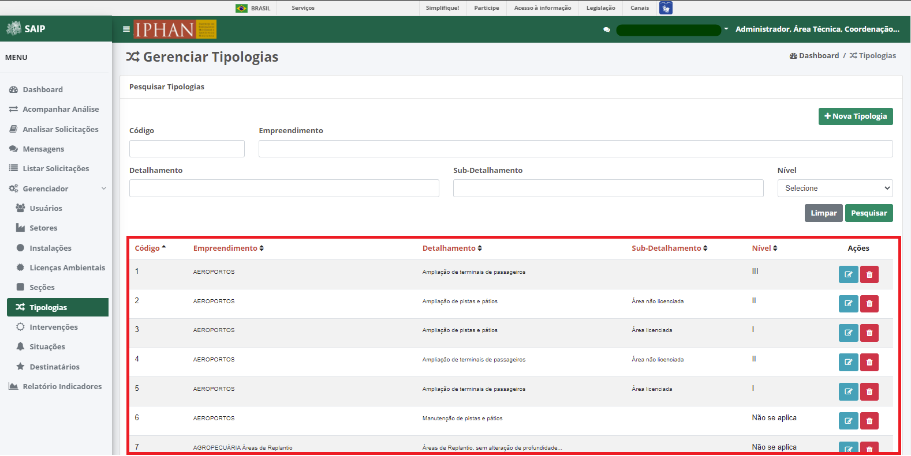
     
.. note::
      O sistema permite que você ordene as colunas por ordem crescente ou decrescente conforme se clica nos títulos de cada coluna.
                         
 .. image:: ../images/SAIP_Interno_Gerenciador_Tipologias_Pesquisar_Ordenar.png
     :alt: SAIP Interno Gerenciador Tipologia Ordenar
     
.. note::
     No resultado da pesquisa, o sistema apresenta a paginação a cada 10 registros. É possível selecionar a página desejada e nas extremidades há a opção de selecionar os ícones de página anterior e próxima página.
                         
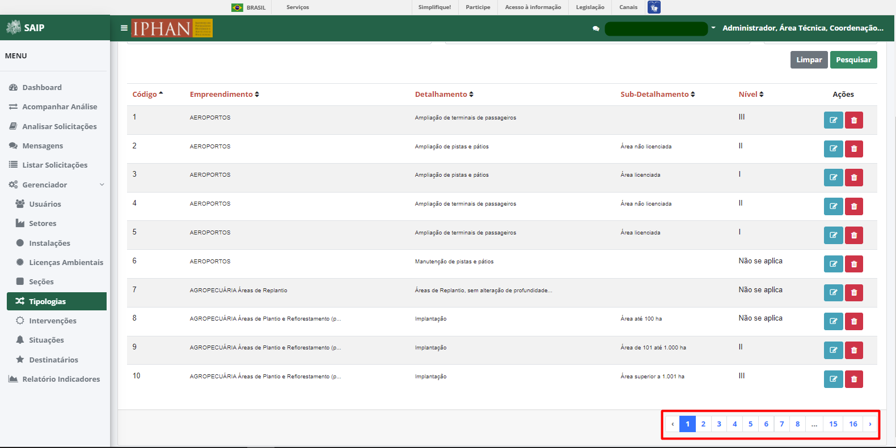
     
     
No resultado da pesquisa, há as ações de **Editar Tipologia** e **Excluir Tipologia**, respectivamente.
     
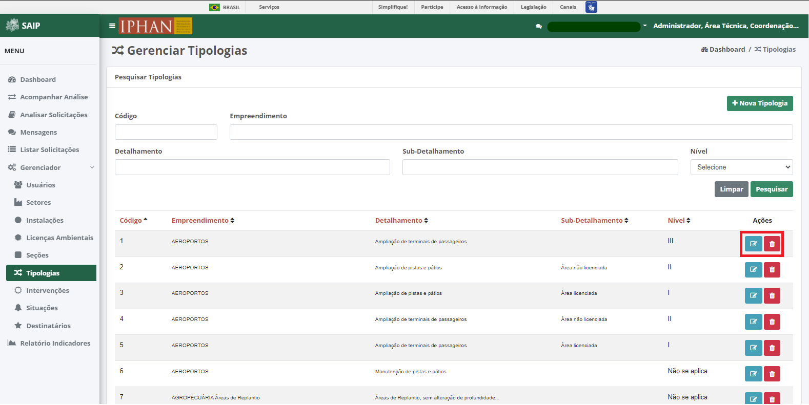
     
Nova Tipologia
------------------------
     
Ao acionar o botão **Nova Tipologia**, é apresentado a tela para incluir uma nova Tipologia, contendo os campos, Tipo de Empreendimento, com o botão **Novo**, Detalhamento com o botão **Novo** ao lado, Sub-detalhamento, Nível, Código.
     
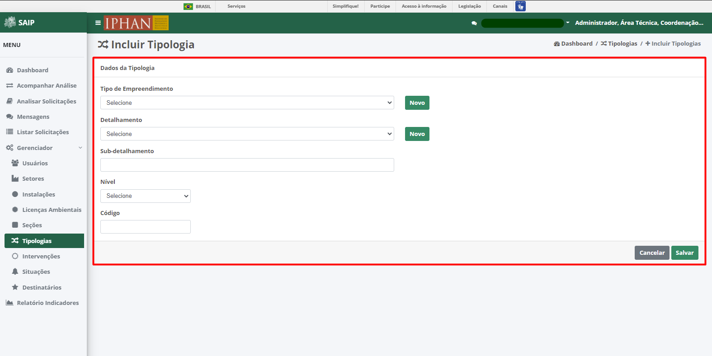
     
.. note::
     Tem-se o botão **Novo** ao lado do campo empreendimento, e ao ser acionado é apresentado uma janela **Novo Tipo de Empreendimento** com o campo Nome, para criar um novo tipo de empreendimento. 
     
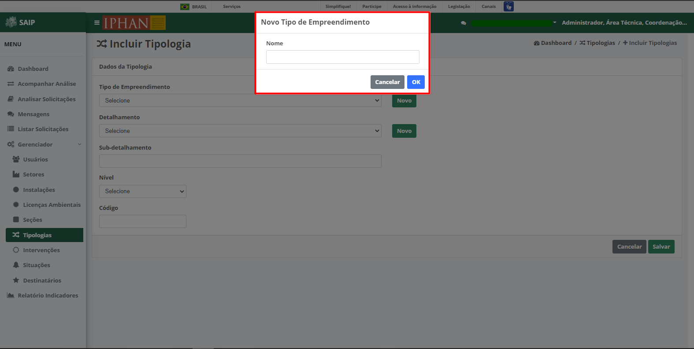
     
.. note::
     Tem-se o botão **Novo** ao lado do campo Detalhamento, e ao ser acionado é apresentado uma janela **Novo Tipo de Detalhamento** com o campo Nome, para criar um novo tipo de Detalhamento. 
     

     
.. note:: 
     Após inserir os dados da nova Tipologia, é necessário acionar o botão **Salvar** para que seja cadastrado. O botão **Cancelar** retorna para a tela de Gerenciar Tipologias.
     
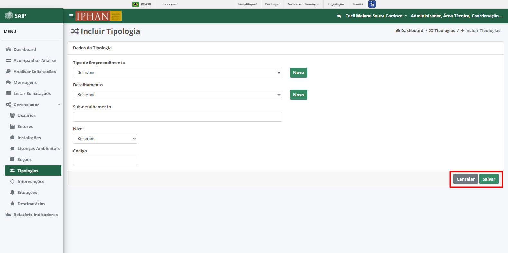

Editar Tipologia
-----------------
     
Ao acionar o botão **Editar Tipologia**, é apresentado a tela para alterar os dados de uma Tipologia, com os campos, Tipo de Empreendimento, com o botão **Novo**, Detalhamento com o botão **Novo** ao lado, Sub-detalhamento, Nível, Código e os botões **Cancelar**, onde retorna para a tela de **Gerenciar Tipologias**, sem alterações, e **Salvar** onde salva as alterações realizadas e retorna para a tela de **Gerenciar Tipologias**.
     
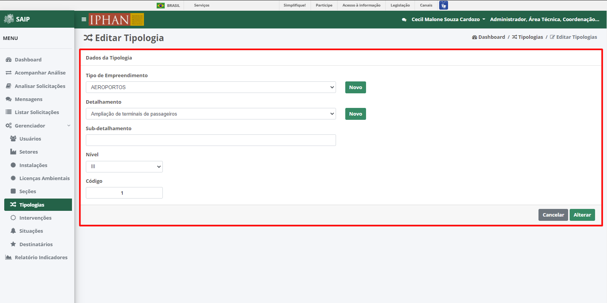
     
.. note::
     Tem-se o botão **Novo**, ao lado do campo Empreendimento, ao ser acionado é apresentado uma janela **Novo Tipo de Empreendimento** com o campo, Nome, para criar um novo tipo de Empreendimento. 
     

     
.. note::
     Tem-se o botão **Novo** ao lado do campo Detalhamento, ao ser acionado é apresentado uma janela **Novo Tipo de Detalhamento** com o campo, Nome para criar um novo tipo de Detalhamento. 
     
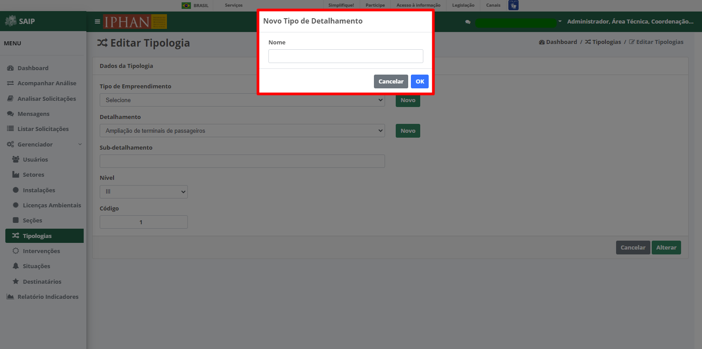
     
Excluir Tipologia
--------------------------
     
Ao acionar o botão **Excluir Tipologia**, o sistema apresenta uma janela de **Exclusão de Tipologia**, com os botões **Cancelar**, onde a operação de exclusão é cancelada e **OK**, onde é confirmada a exclusão da Tipologia.

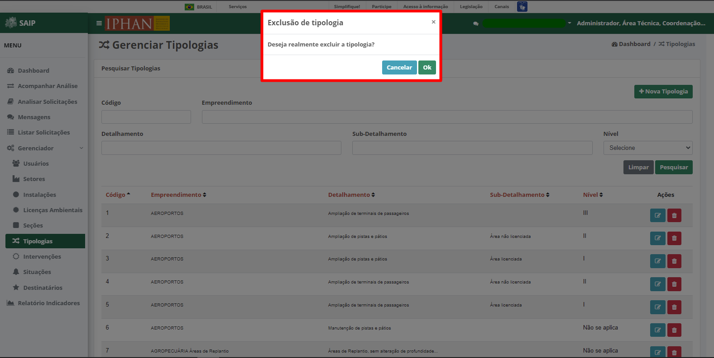
