Usuários
=============================

.. meta::
   :description: Apresentação do Gerenciador - Usuários.
  
Para acessar o **Gerenciador de Usuários** do sistema, clique no menu **Gerenciador** no menu lateral esquerdo e então selecione a opção **Usuários** no submenu lateral esquerdo, onde irá permitir gerenciar os Usuários cadastrados.

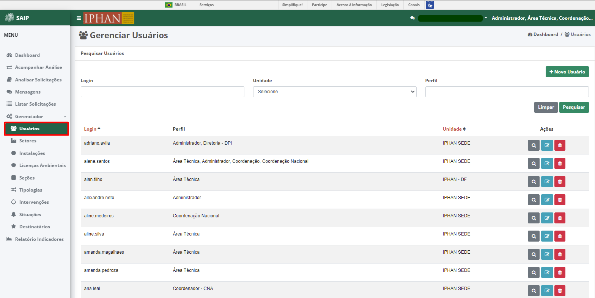

Em **Pesquisar Usuários**, na parte superior se encontram os filtros de pesquisa como Login, Unidade e Perfil. E o botão **Novo Usuário**, que permite o cadastro de novos usuários.

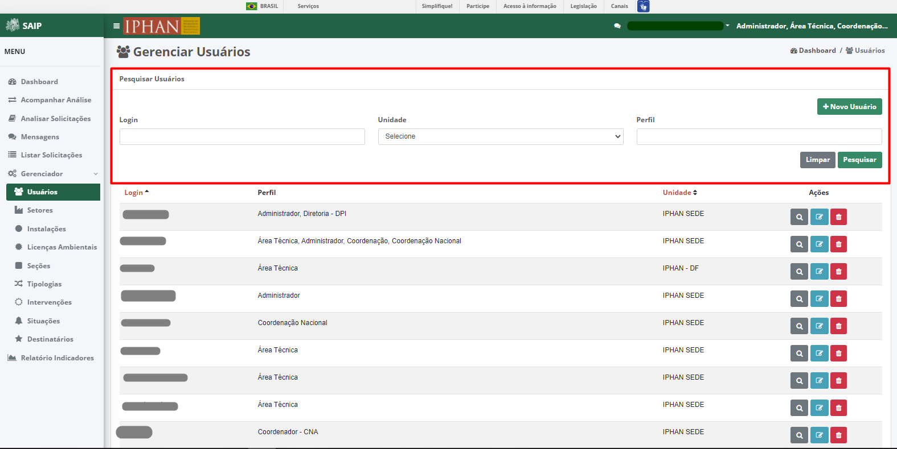

.. note::
   Sempre que preencher os filtros clique no botão **Pesquisar**, para que a ação seja executada. Acionando **Limpar** os filtros são removidos.

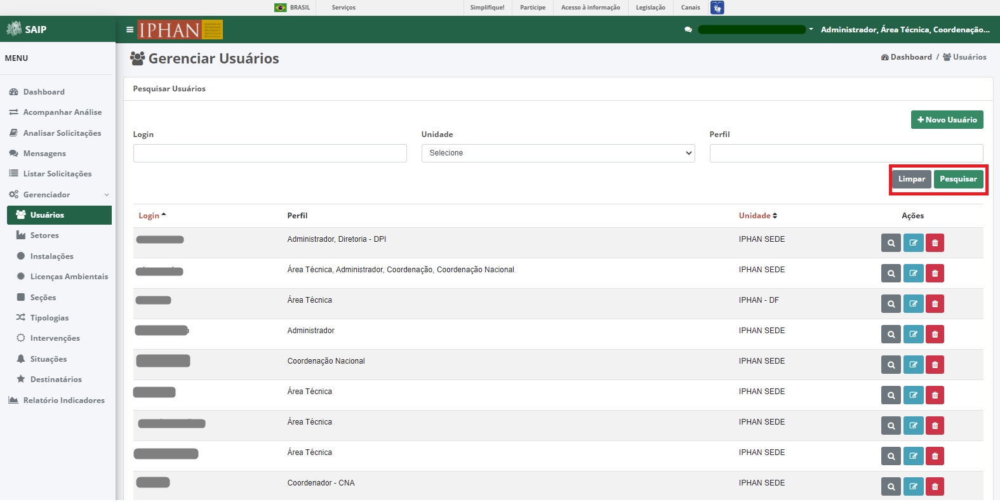

Em **Pesquisar Usuários** na parte inferior, encontram-se os registros totais de usuários ou o resultado da pesquisa conforme os filtros informados. As colunas apresentadas são Login, Perfil, Unidade e Ações.

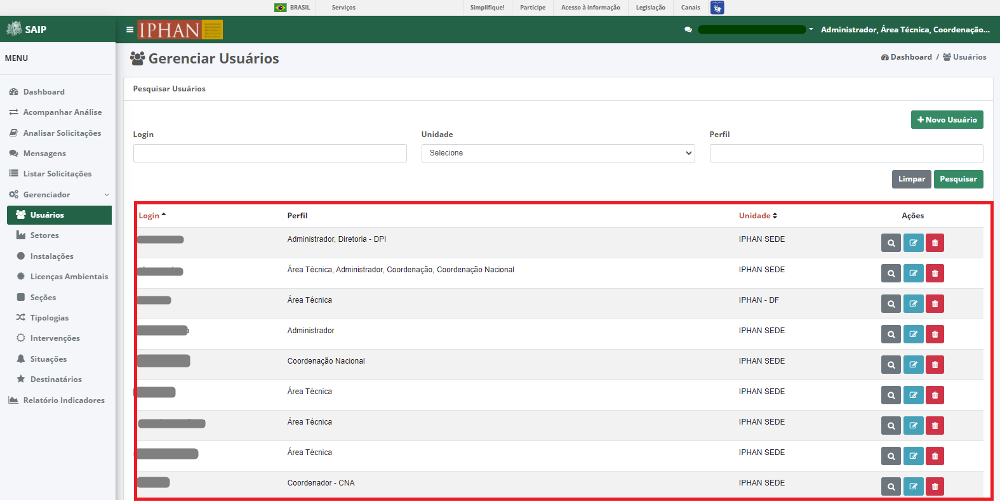

.. note::
  O sistema permite que você ordene as colunas por ordem crescente ou decrescente conforme se clica nos títulos de cada coluna.

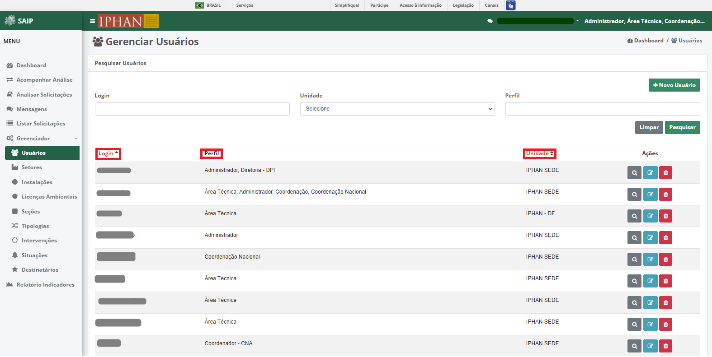

.. note::
     No resultado da pesquisa, o sistema apresenta a paginação a cada 10 registros. É possível selecionar a página desejada e nas extremidades há a opção de selecionar os ícones de página anterior e próxima página.

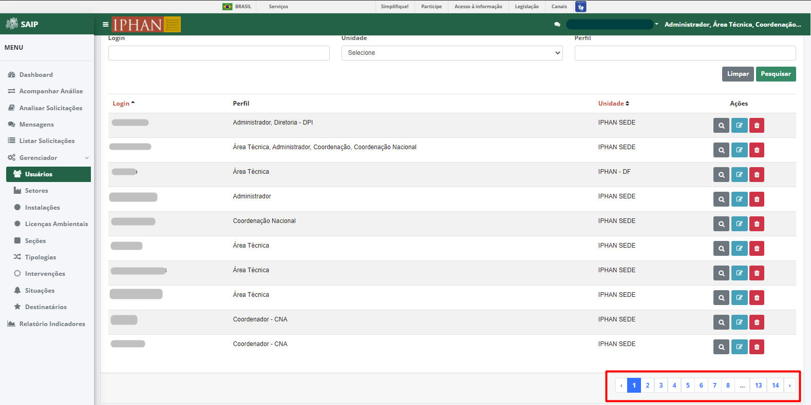

No resultado da pesquisa, há as ações de **Visualizar Usuários**, **Editar Usuário** e **Excluir Usuário**, respectivamente.

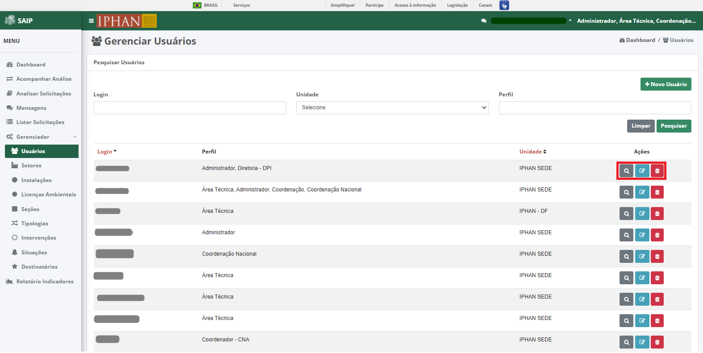

Novo Usuário
-------------

Ao acionar o botão **Novo Usuário**, é apresentado a tela para inclusão de um novo usuário, contendo os campos, Pesquisar Usuário, Login, Nome , E-mail , Unidade e Perfil.

.. note:: 
     Após inserir os dados do novo usuário, é necessário acionar o botão **Salvar** para que seja cadastrado. O botão **Cancelar** retorna para a tela de gerenciamento de usuários.

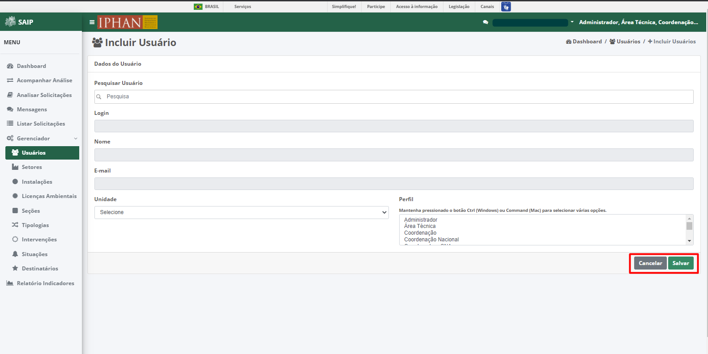

Editar Usuário
--------------------  

Ao acionar o botão **Editar Usuário**, é apresentado a tela de para alterar os dados do usuário, com os botões **Cancelar**, onde retorna para a tela de **Gerenciar Usuários**, sem alterações, e **Alterar** onde salva as alterações realizadas e retorna para a tela de **Gerenciar Usuários**.

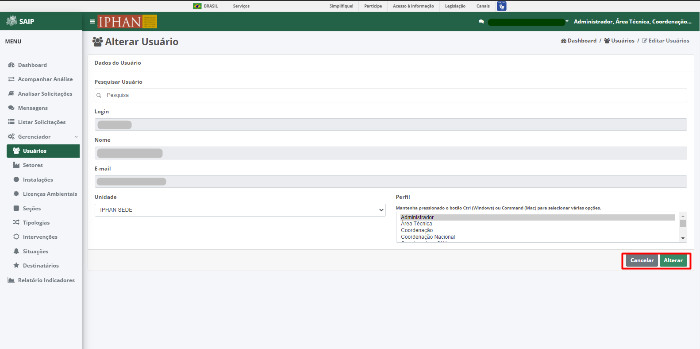

Visualizar Usuário
-------------------- 

Ao acionar o botão **Visualizar Usuário**, o sistema apresenta uma janela com os dados do usuário. Caso deseje fechar a janela, clique no botão **Fechar**.

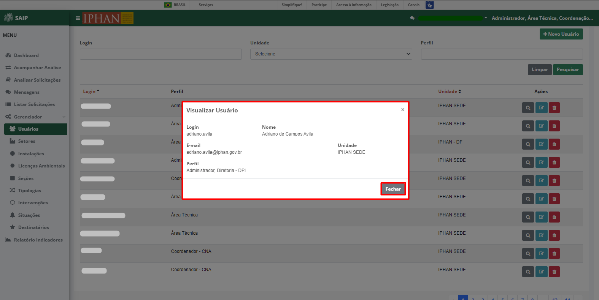

Excluir Usuário
----------------- 

Ao acionar o botão **Excluir Usuário**, o sistema apresenta uma janela de **Exclusão de Usuário**, com os botões **Cancelar**, onde a operação de exclusão é cancelada e **OK**, onde é confirmada a exclusão do usuário.

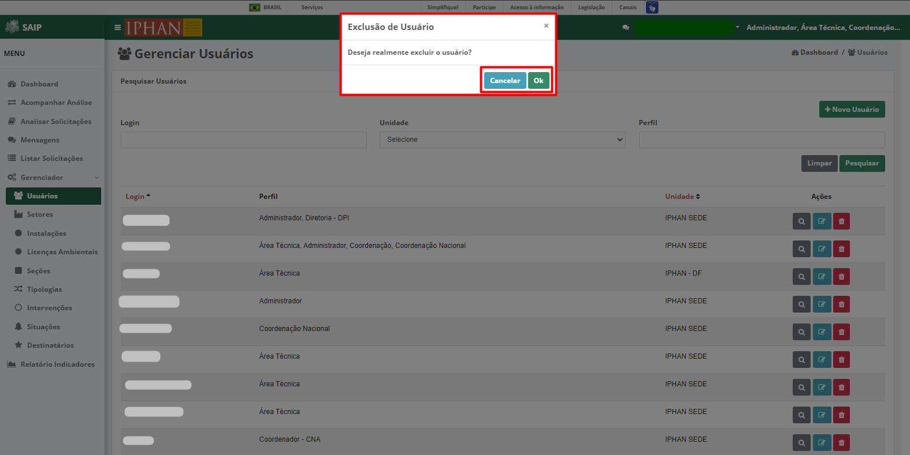
