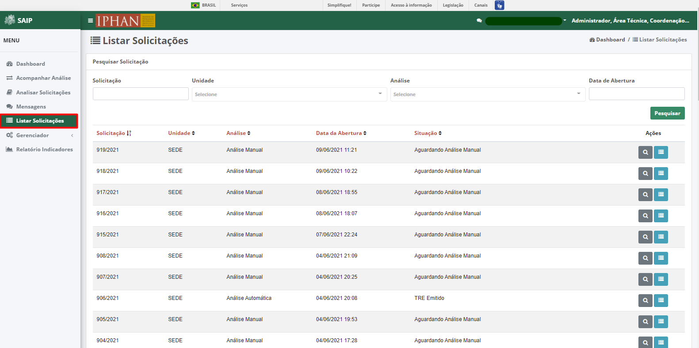
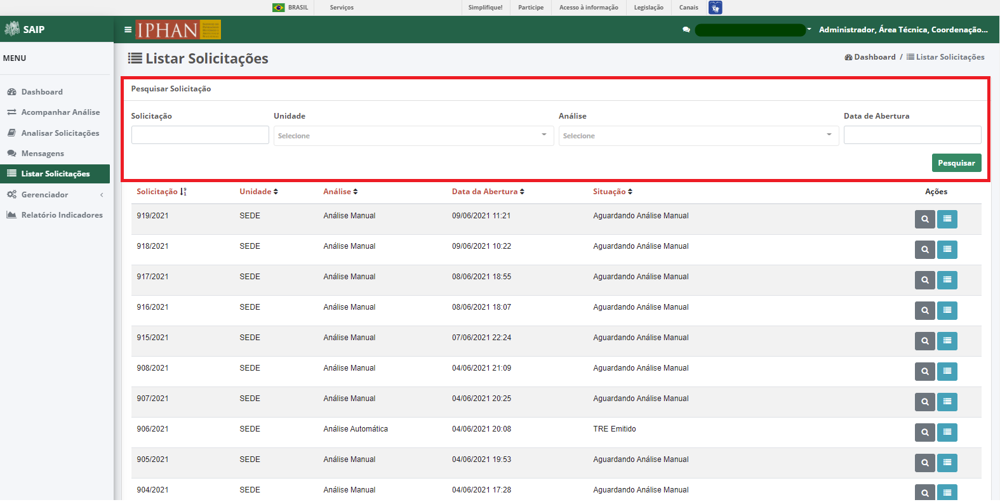
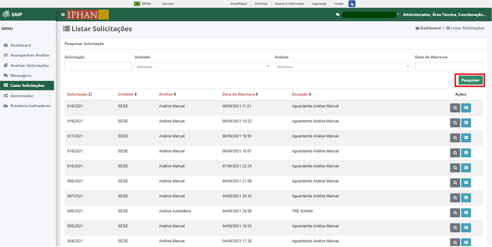
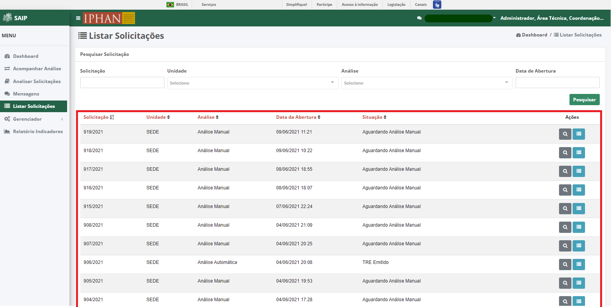
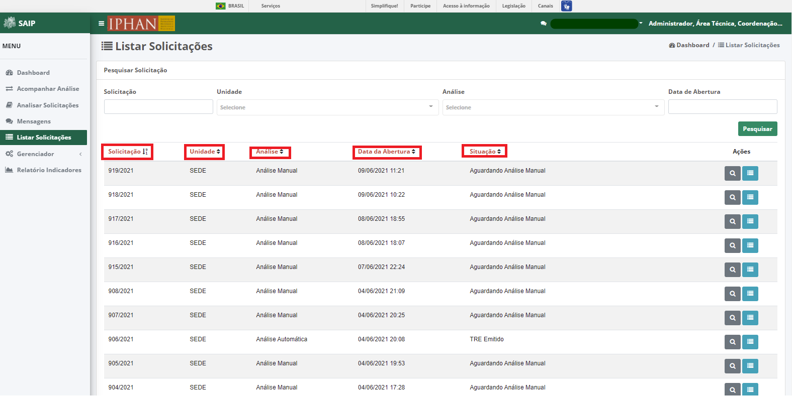
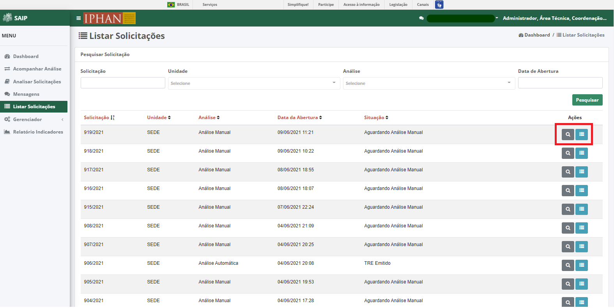
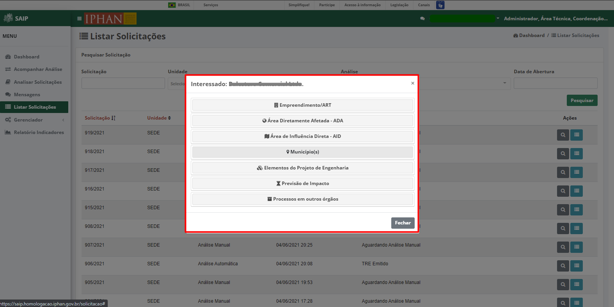
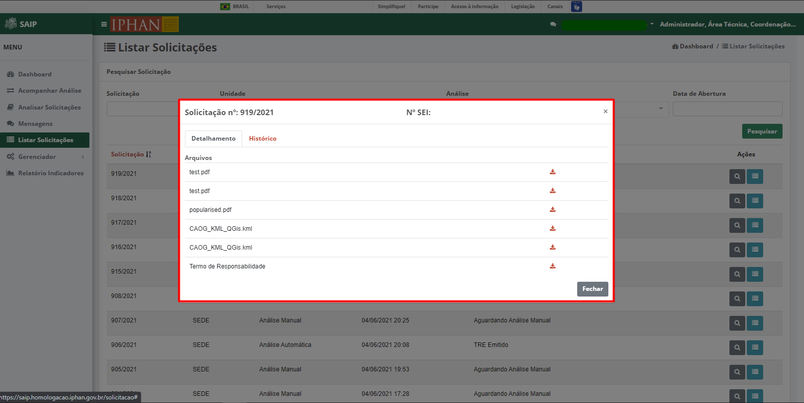
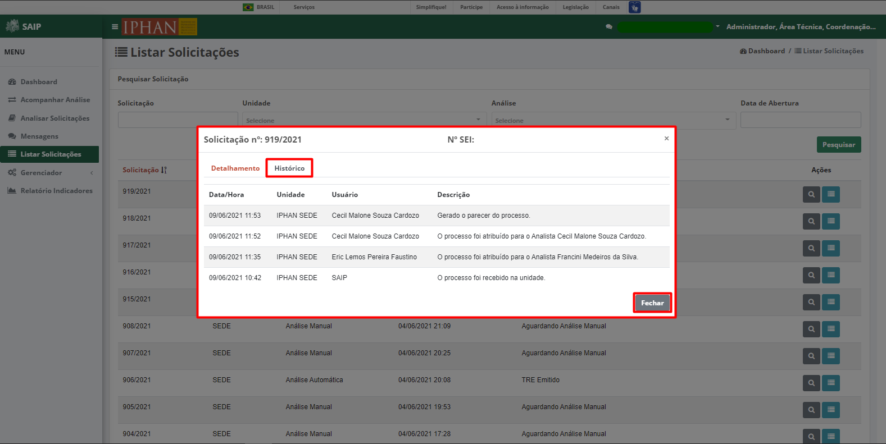

Listar Solicitações
=============================

.. meta::
 :description: Apresentação do Listar Solicitações.
  
Para acessar, as solicitações já realizadas no sistema clicar na opção **Listar Solicitações** no menu lateral esquerdo.

Pesquisar Solicitação
----------------------

Em **Pesquisar Solicitação**, na parte superior se encontram os filtros de pesquisa como Solicitação, Unidade, Análise e Data de Abertura.

.. note::
   Sempre que preencher os filtros, clique no botão Pesquisar, para que a ação de filtrar seja executada.

Em **Pesquisar Solicitação**, na parte inferior encontram-se os registros totais de solicitações ou conforme os filtros realizados. As colunas apresentadas no resultado são: Solicitação, Unidade, Análise, Data da Abertura, Situação e Ações.

.. note::
    O sistema permite que você ordene as colunas por ordem crescente ou decrescente, conforme o clique nos títulos de cada coluna.

.. note::
    Na lista de solicitações, o sistema apresenta a paginação. É possível selecionar a página desejada e nas extremidades, há a opção de selecionar os ícones de página anterior e próxima página.

.. image:: ../images/SAIP_Interno_Listar_Solicitacoes_Resultado_Paginacao.png
     :alt: SAIP Interno Listar Solicitações Paginação

No resultado da pesquisa, há as ações de **Visualizar Solicitação** e **Detalhar Solicitação**, respectivamente.

Visualizar Solicitação
----------------------- 

Ao acionar o botão **Visualizar Solicitação**, o sistema apresenta uma janela com os dados da solicitação. Caso deseje fechar a janela, clique no botão Fechar.

Detalhar Solicitação
---------------------  

Ao acionar o botão **Detalhar Solicitação**, o sistema apresenta uma janela com o número da solicitação, número do SEI, a aba **Detalhamento** onde se encontra os arquivos anexados ou gerados pelo sistema para a solicitação, a aba **Histórico**, onde fica registrado todo o processo da solicitação e o botão **Fechar**, respectivamente.

.. note::
   Ao acionar aba **Histórico**, é apresentado todo o processo da solicitação. O botão **Fechar**, faz com que a janela com as informações seja fechada.

