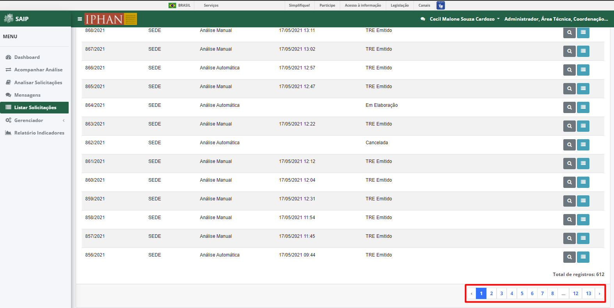

Listar Solicitações
=============================

.. meta::
 :description: Apresentação do Listar Solicitações.
  
Para acessar as solicitações já realizadas no sistema, o sistema disponibiliza a opção **Listar Solicitações**, no menu lateral esquerdo.

Pesquisar Solicitação
----------------------

Na parte superior do **Pesquisar Solicitação** são disponibilizados os filtros de pesquisa: **Solicitação**, **Unidade**, **Análise** e **Data de Abertura**, e ainda a opção de ação: **Pesquisar**.

.. note::
     Para que a ação de pesquisa seja executada, faz-se necessário que se preencha os filtros disponíveis e acione o botão **Pesquisar**.

.. image:: ../images/SAIP_Interno_Listar_Solicitacoes_Filtros_Pesquisar.png
     :alt: SAIP Interno Listar Solicitações Pesquisar

Como resultado do **Pesquisar Solicitação** são apresentadas as colunas: Solicitação, **Unidade**, **Análise**, **Data de Abertura**, **Situação** e **Ações**, e a quantidade total de registros.

.. note::
    O sistema permite que haja a ordenação das colunas na forma crescente ou decrescente, conforme o clique nos títulos de cada coluna.

.. image:: ../images/SAIP_Interno_Listar_Solicitacoes_Resultado_Ordenar.png
     :alt: SAIP Interno Listar Solicitações Ordenar

.. note::
     A lista de resultado do **Pesquisar Solicitação** apresenta paginação de 10 em 10 registros, as páginas por meio das quais o usuário pode navegar entre elas, e as opções de navegação para as próxima página e página anterior.

Como ações disponíveis na lista de resultado do **Pesquisar Solicitação**, tem-se: **Visualizar Solicitação** e **Detalhar Solicitação**.

.. image:: ../images/SAIP_Interno_Listar_Solicitacoes_Resultado_Acoes.png
     :alt: SAIP Interno Listar Solicitações Açoes

Visualizar Solicitação
----------------------- 

Ao acionar o botão **Visualizar Solicitação**, o sistema apresenta uma tela contendo os dados da solicitação. O botão **Fechar** é disponibilizado, permitindo o fechamento da tela de visualização.

.. image:: ../images/SAIP_Interno_Listar_Solicitacoes_Resultado_Acoes_Visualizar.png
     :alt: SAIP Interno Listar Solicitações Visualizar

Detalhar Solicitação
---------------------  

Ao acionar o botão **Detalhar Solicitação**, o sistema apresenta uma tela contendo o número da solicitação, número do SEI, a aba **Detalhamento** onde constam os arquivos anexados ou gerados pelo sistema para a solicitação, e a aba **Histórico**. O botão **Fechar** é disponibilizado, permitindo o fechamento da tela de detalhamento.

.. note::
     Ao acionar o botão **Histórico**, o sistema apresenta uma tela contendo todo o processo da solicitação. O botão **Fechar** é disponibilizado, permitindo o fechamento da tela de histórico.

.. image:: ../images/SAIP_Interno_Listar_Solicitacoes_Resultado_Acoes_Detalhar_Aba.png
    :alt: SAIP Interno Listar Solicitações Aba
