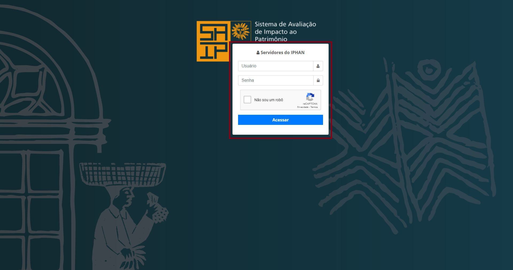

Acesso
===========================

.. meta::
   :description: Primeiros passos para acessar o SAIP Interno

Para acessar o sistema SAIP de forma interna, digite a seguinte URL no navegador: https://saip.homologacao.iphan.gov.br/interno

Após ser apresentada a tela de login, digite as suas credenciais de rede do IPHAN, marque o captcha e clique na opção **Acessar**.

