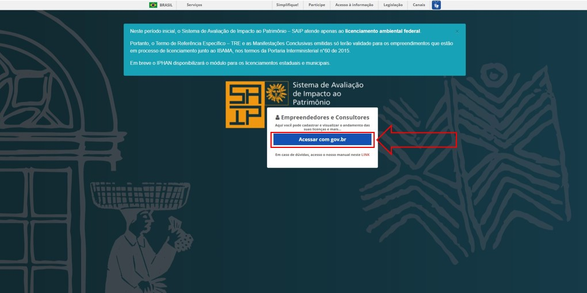
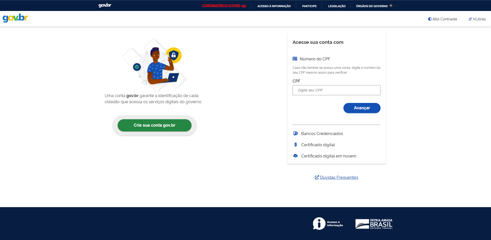
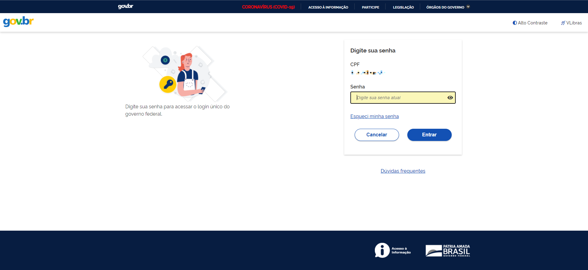
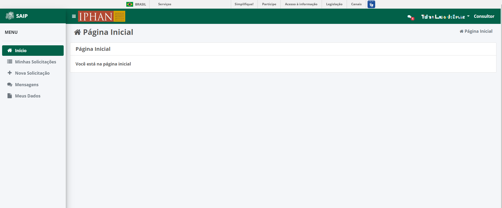

Login
===========================

.. meta::
   :description: Como realizar login no SAIP.

Para acessar o sistema SAIP, digite a seguinte URL no navegador: https://www.saip.iphan.gov.br

Após ser apresentada a tela de login, clique na opção **Acessar com gov.br**. Em seguida, realize o login na plataforma **gov.br** para redirecionamento para a tela inicial do SAIP.

