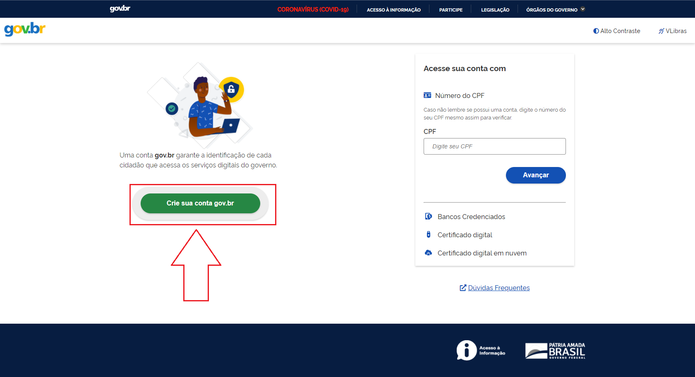
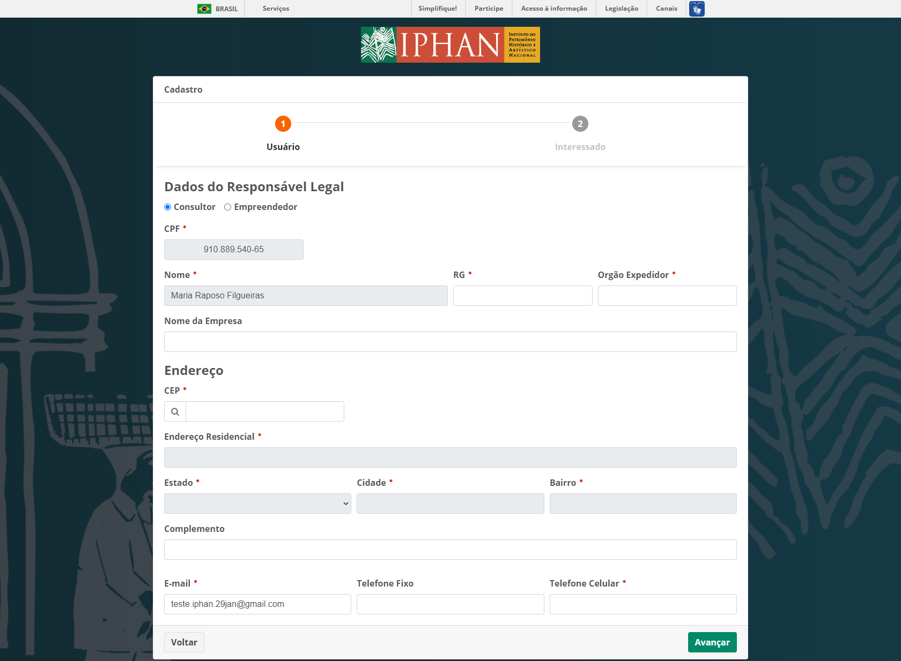
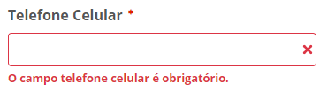
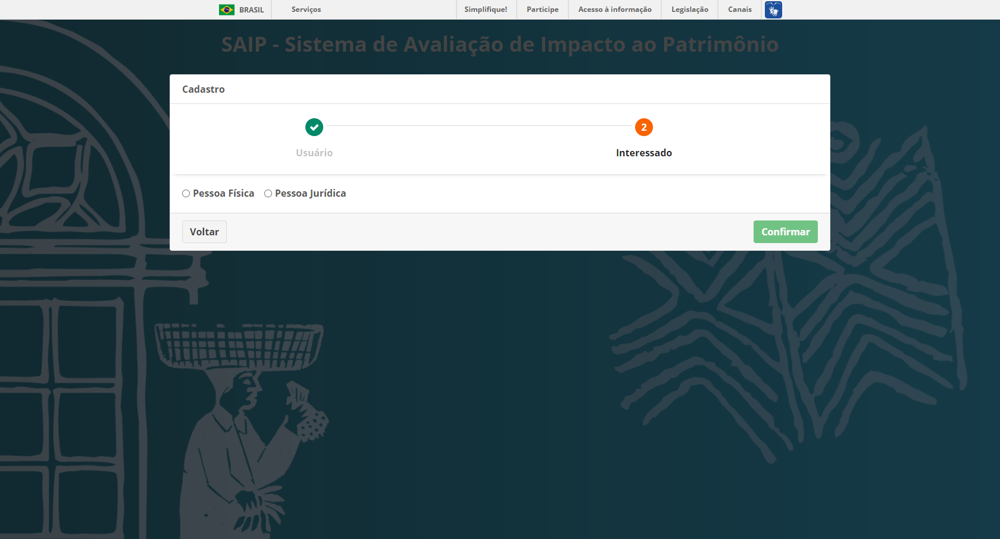
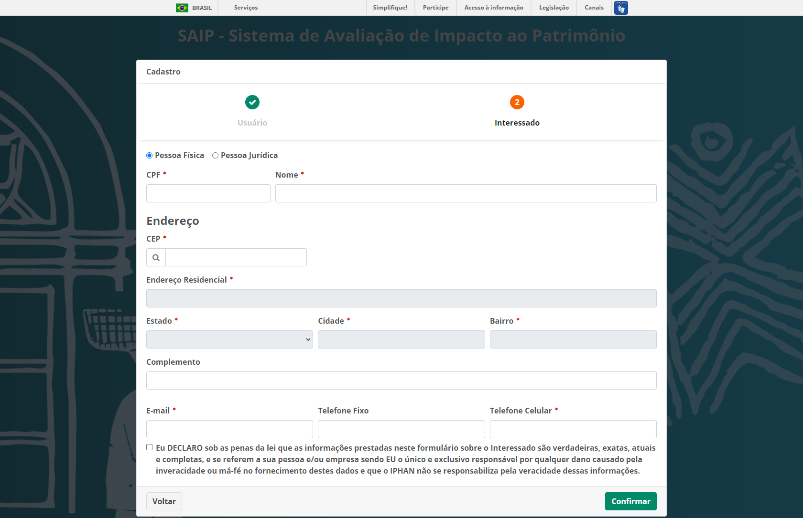
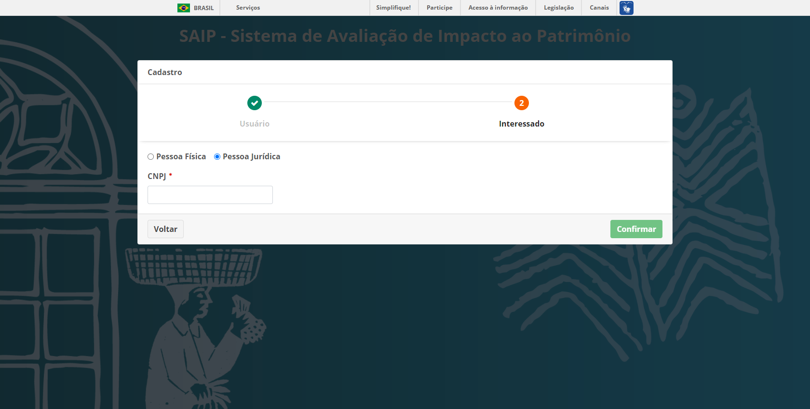
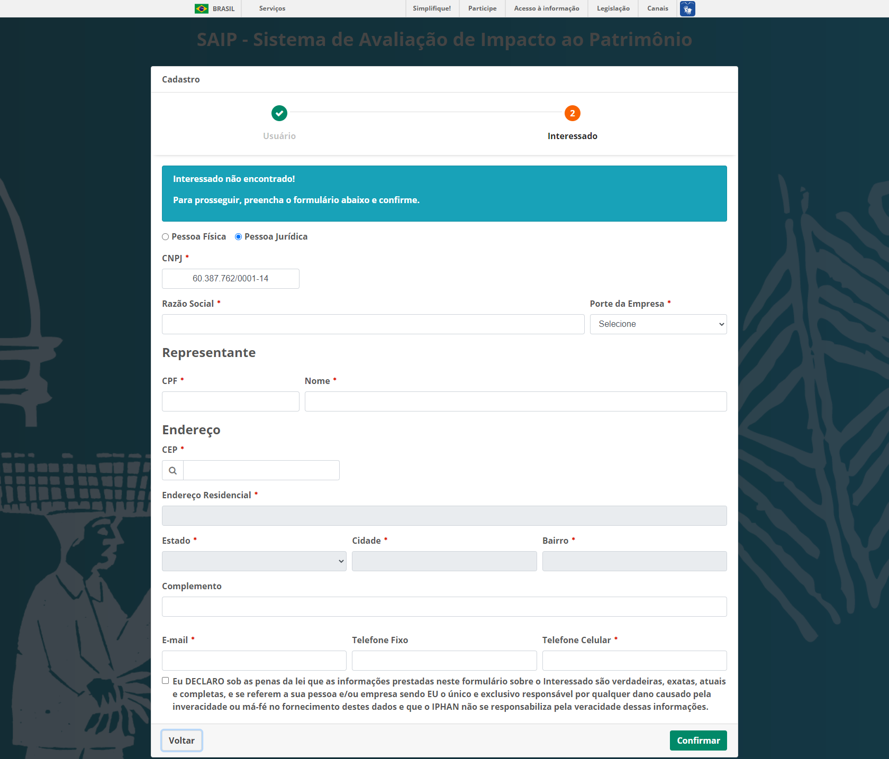

Primeiro Acesso
===========================

.. meta::
   :description: Primeiros passos para acessar o SAIP

Para acessar o sistema SAIP, digite a seguinte URL no navegador: https://www.saip.iphan.gov.br

Após ser apresentada a tela de login, clique na opção **Acessar com gov.br**.

.. image:: ../images/saip_login.jpg
   :alt: SAIP Login

.. note::

    Caso não possua cadastro no gov.br, clique em **Crie sua conta gov.br**.

Informar Dados Complementares
--------------------------------

Após o seu login, utilizando a plataforma **gov.br** por se tratar do primeiro acesso ao SAIP, deverão ser complementadas algumas informações importantes para o sistema em dois passos.

Usuário
^^^^^^^^^^^^^^^^^^^^^^^^^^^^

No passo 1 - chamado Usuário: Informar os seus dados como usuário do sistema, Consultor ou empreendedor. E alguns dados pessoais deverão ser informados, como por exemplo:  endereço, e-mail e telefone. Para finalização do cadastro. 

Clique no botão **Avançar**, ao terminar o formulário. 

.. note:: 

   O sistema vai carregar o seu Nome, CPF e e-mail da plataforma **gov.br**. Permitindo alterar somente o e-mail, caso necessário.

.. note:: 

   Para pesquisar o seu endereço, insira o CEP correspondente e clique na lupa ao lado esquerdo do campo ou aperte a tecla **Tab** no seu teclado, que o sistema automaticamente vai pesquisar o endereço conforme o CEP informado. Caso o sistema não encontre os dados para o respectivo CEP é permitido que seja inserido o endereço de forma manual.

Os campos que possuem um asterisco em vermelho (:red:`*`) ao lado, são de preenchimento obrigatório. E caso os campos não sejam preenchidos, o sistema vai apresentar uma mensagem informando da obrigatoriedade do preenchimento das informações, conforme exemplo abaixo:

Interessado
^^^^^^^^^^^^^^^^^^^^^^^^^^^^

No passo 2 - chamado Interessado: Preencher as informações da Empresa ou Pessoa Física interessada em solicitar o Licenciamento Ambiental do IPHAN.
 

Escolher se o interessado é Pessoa Física ou Pessoa Jurídica, o sistema gera um formulário especifico.

Pessoa Física
~~~~~~~~~~~~~~~~~~~~~~~~~~~

Ao selecionar Pessoa Física, deverão ser preenchidas as seguintes informações CPF, Nome, CEP, Complemento, E- mail e Telefone. Ao final, concordar com a auto declaração e clicar no botão **Confirmar**.

.. note:: 

   O preenchimento automático acontece se houver o registro na base, ao inserir o CPF.

.. note:: 

   Para pesquisar o seu endereço, insira o CEP correspondente e clique na lupa ao lado esquerdo do campo ou aperte a tecla **Tab** no seu teclado, o sistema vai pesquisar o endereço conforme o CEP informado. Caso o sistema não encontre os dados para o respectivo CEP, é permitido que seja inserido o endereço de forma manual.
   

Os campos que possuem um asterisco em vermelho (:red:`*`) ao lado, são de preenchimento obrigatório. Caso os campos não sejam preenchidos, o sistema apresenta uma mensagem informando da obrigatoriedade do preenchimento das informações, conforme exemplo abaixo:

Pessoa Jurídica
~~~~~~~~~~~~~~~~~~~~~~~~~~~

Pessoa Jurídica, preencher o CNPJ para ser consultado na base de dados.

Após informar o CNPJ, o sistema apresenta o formulário. Este, deverá ser preenchido a Razão Social, porte da empresa, representante, Endereço, e-mail e Telefone. A auto declaração será apresentada no final, clique no botão concordar e então no botão **Confirmar**. 

.. note:: 

   Caso o CNPJ esteja cadastrado na base de dados, o preenchimento da razão social será automático. 

.. note:: 

   Para pesquisar o seu endereço, insira o CEP correspondente e clique na lupa ao lado esquerdo do campo ou aperte a tecla **Tab** no seu teclado, que o sistema pesquisa o endereço, conforme o CEP informado. Caso o sistema, não encontre os dados para o respectivo CEP é permitido que seja inserido o endereço de forma manual.

Os campos que possuem um asterisco em vermelho (:red:`*`) ao lado, são de preenchimento obrigatório. E caso os campos não sejam preenchidos, o sistema apresenta uma mensagem informando da obrigatoriedade do preenchimento das informações, conforme exemplo abaixo: 

