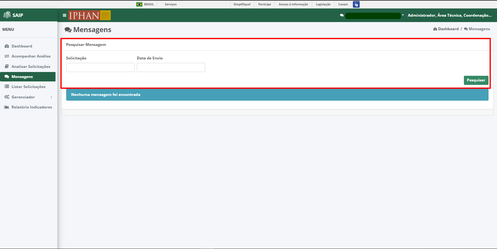
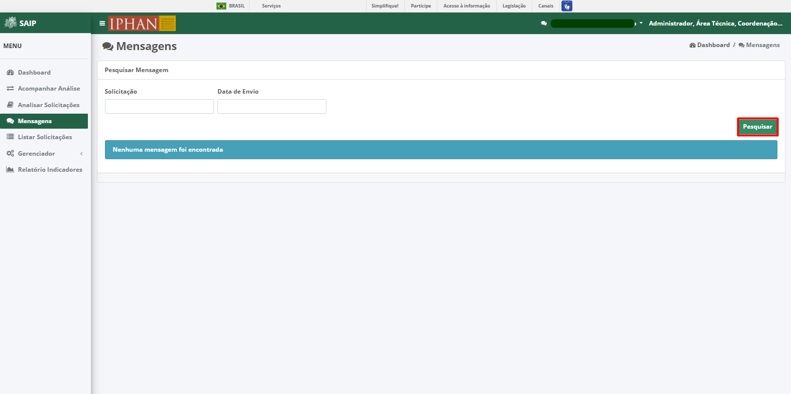

Mensagens
=============================

.. meta::
 :description: Apresentação do  Mensagens.
  
Para acessar as mensagens encaminhadas pelo sistema, clicar na opção **Mensagens** no menu lateral esquerdo.

 .. image:: ../images/SAIP_Interno_Mensagens.png
     :alt: SAIP Interno Mensagens

Em **Pesquisar Mensagem**, na parte superior se encontram os filtros de pesquisa como Solicitação e Data de Envio.

..note::
Sempre que preencher os filtros clique no botão Pesquisar, para que a ação seja executada.

Em **Pesquisar Mensagem** na parte inferior, encontram-se os registros totais de mensagem ou o resultado da pesquisa realizada com os filtros. As colunas apresentadas são Solicitação, Devolvido Por, Motivo, Data do Envio e Ações.

.. image:: ../images/
     :alt: SAIP Interno Mensagens

.. note::
   O sistema permite que você ordene as colunas por ordem crescente ou decrescente conforme se clica nos títulos de cada coluna.

.. image:: ../images/
     :alt: SAIP Interno Mensagens

Na lista, há as ações de Visualizar Mensagem e Excluir Mensagem, respectivamente.

.. image:: ../images/
     :alt: SAIP Interno Mensagens

Visualizar Mensagem
--------------------
O botão **Visualizar Mensagem**, o sistema apresenta uma janela com todas as informações detalhadas da mensagem. São apresentados os botões **Fechar** e **Seguir para análise** os quais respectivamente, realiza o fechamento da janela e encaminha o usuário para a solicitação relacionada a mensagem.

     .. image:: ../images/
     :alt: SAIP Interno Mensage Visualizar

Excluir Mensagem
------------------

Ao acionar o botão **Excluir Mensagem** , o sistema apresenta uma janela de confirmação da exclusão. Serão apresentados os botões Cancelar e Ok os quais respectivamente, um realiza o fechamento da mensagem e o outro confirma a exclusão da mensagem.

    .. image:: ../images/
     :alt: SAIP Interno Mensage Excluir