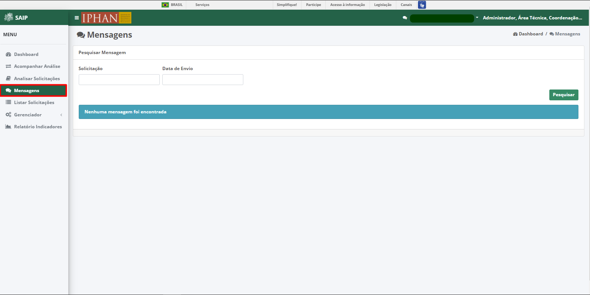
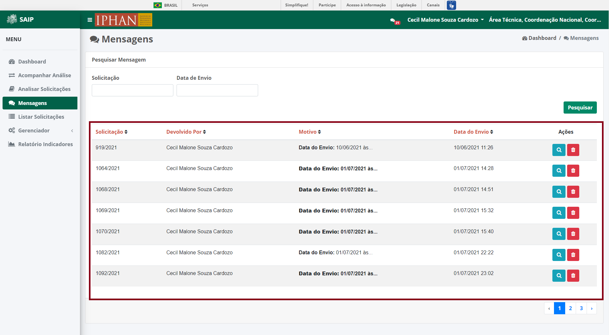
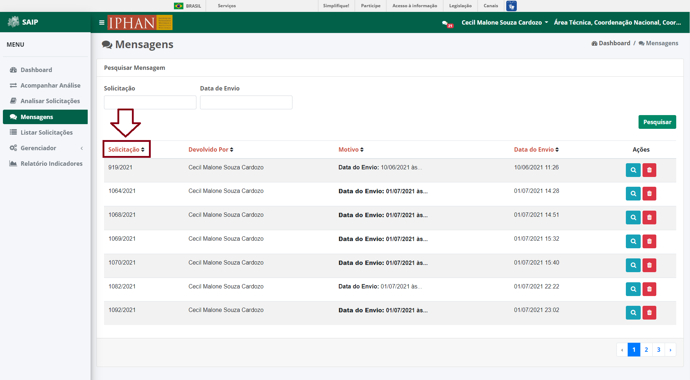
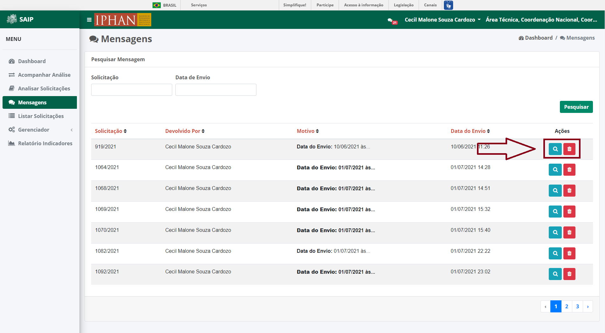
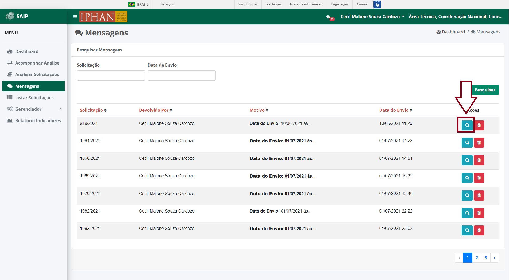
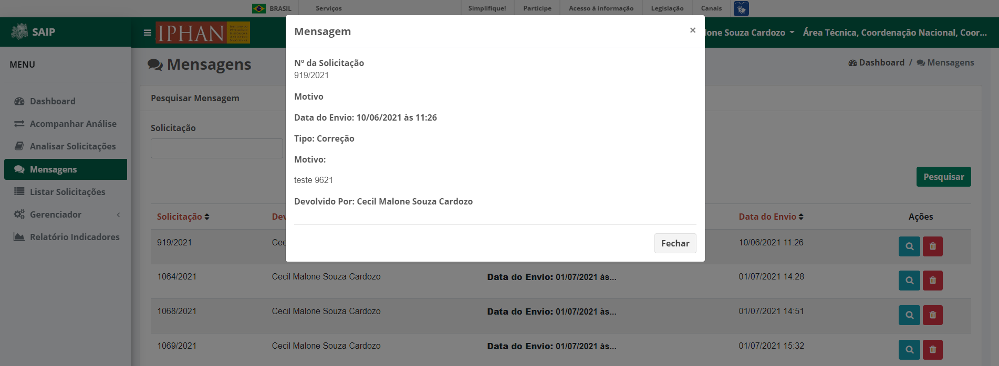
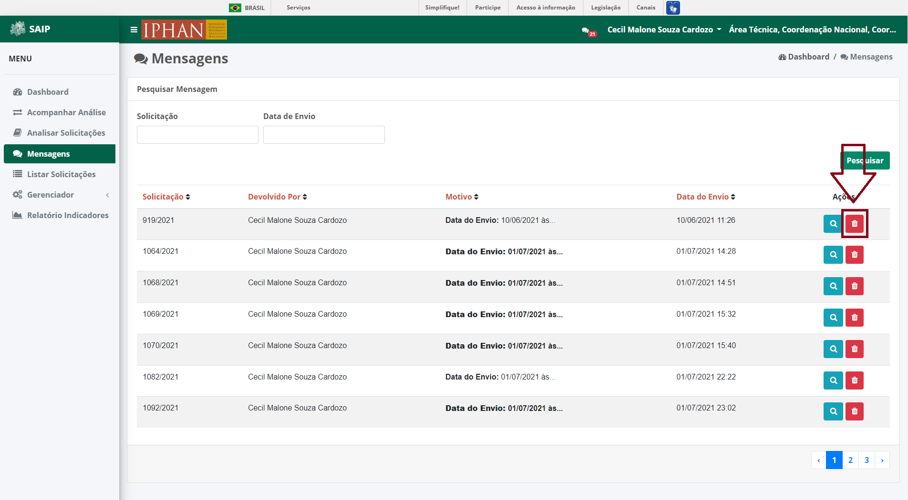

Mensagens
=============================

.. meta::
 :description: Apresentação do Mensagens.
  
Para acessar as mensagens encaminhadas pelo sistema, o sistema disponibiliza a opção **Mensagens** no menu lateral esquerdo.

Na parte superior do **Pesquisar Mensagem** são disponibilizados os filtros de pesquisa: **Solicitação** e **Data de Envio**.

.. image:: ../images/SAIP_Interno_Mensagens_Filtros.png 
     :alt: SAIP Interno Mensagens Filtros

.. note::
     Para que a ação de pesquisa seja executada, faz-se necessário que se preencha os filtros disponíveis e acione o botão **Pesquisar**.

.. image:: ../images/SAIP_Interno_Mensagens_Filtros_Pesquisar.png
     :alt: SAIP Interno Mensagens Pesquisa

Como resultado do **Pesquisar Mensagem** são apresentadas as colunas: **Solicitação**, **Devolvido Por**, **Motivo**, **Data do Envio** e **Ações**, e a quantidade total de registros.

.. note::
   O sistema permite que haja a ordenação das colunas na forma crescente ou decrescente, conforme se clica nos títulos de cada coluna.

Como ações disponíveis na lista de resultado do **Pesquisar Mensagem**, tem-se: **Visualizar Mensagem** e **Excluir Mensagem**.

Visualizar Mensagem
--------------------
Ao acionar o botão **Visualizar Mensagem**, o sistema apresenta uma tela contendo todas as informações detalhadas da mensagem. O botão **Fechar** é disponibilizado, permitindo o fechamento da tela da mensagem.

Excluir Mensagem
------------------

Ao acionar o botão **Excluir Mensagem**, o sistema apresenta uma tela para a confirmação da exclusão. Os botões **Cancelar** e **Ok** são disponibilizados, permitindo o cancelamento ou a confirmação da exclusão, respectivamente.

