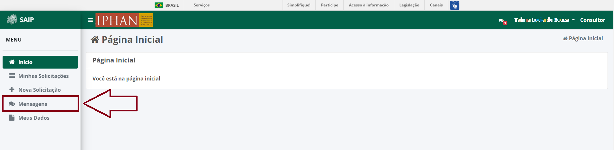
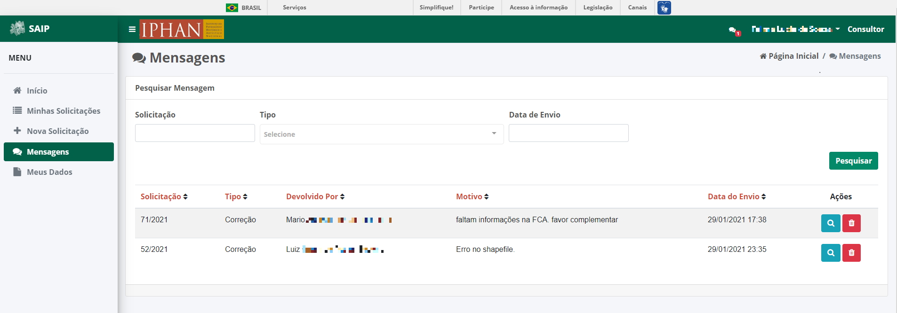
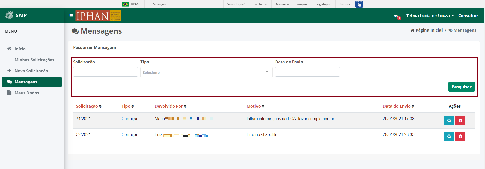
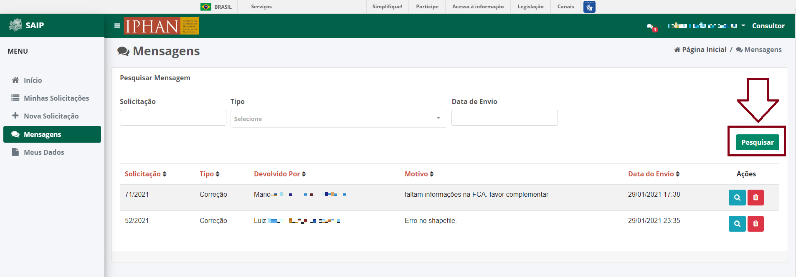
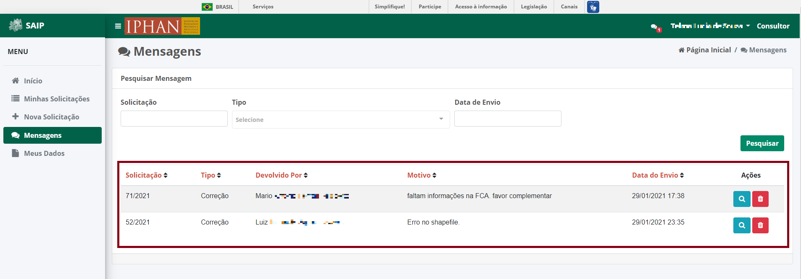
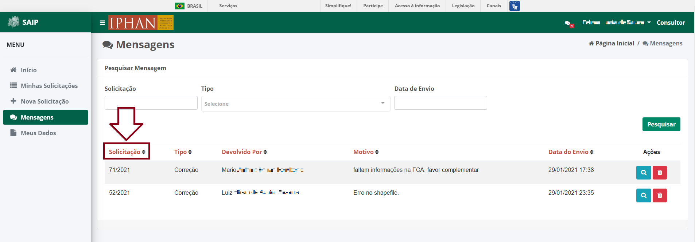
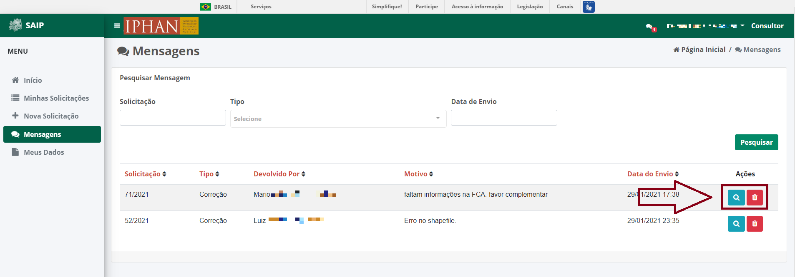
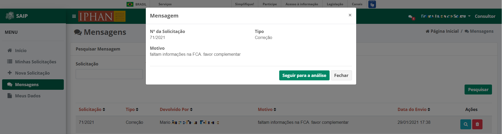
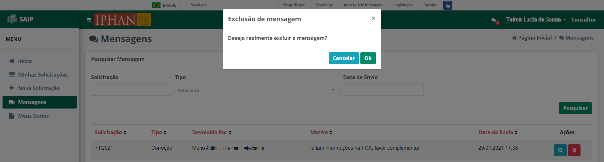

Verificar Mensagens
===========================

.. meta::
   :description: Visualizar mensagens recebidas.

Para acessar as mensagens encaminhadas pelo SAIP, clicar na opção **Mensagens** no menu lateral esquerdo.

Mensagens
----------------------------

Em **Pesquisar Mensagem**, na parte superior se encontram os filtros de pesquisa como Número da Solicitação, Tipo da Mensagem e Data de Envio.

.. note:: 
    Sempre que ao preencher os filtros, acionar o botão **Pesquisar** para que a ação possa ser executada.

.. note:: 
    Os tipos de mensagem poderão ser do Tipo **Correção**, onde deverá ser realizada alguma correção na solicitação para que a mesma seja aprovada, ou do Tipo **Indeferimento** onde apresentará motivo(s) pelo(s) qual(is) a sua solicitação foi indeferida.

Em **Pesquisar Mensagem** na parte inferior, encontram-se os registros totais de mensagem ou o resultado da pesquisa realizada com os filtros.  As colunas apresentadas são Solicitação, Tipo, Devolvido Por, Motivo, Data do Envio e Ações. 

.. note:: 
    O sistema permite que você ordene as colunas por ordem crescente ou decrescente conforme se clica nos títulos de cada coluna.

Na lista, há as ações de **Visualizar Mensagem** e **Excluir Mensagem**, respectivamente.

Visualizar Mensagem
----------------------------

O botão **Visualizar Mensagem**, o sistema apresenta uma janela com todas as informações detalhadas da mensagem. São apresentados os botões **Fechar** e **Seguir para análise** os quais respectivamente, realiza o fechamento da janela e encaminha o usuário para a solicitação relacionada a mensagem.

Excluir Mensagem
----------------------------

Ao acionar o botão **Excluir Mensagem**, o sistema apresenta uma janela de confirmação da exclusão. Serão apresentados os botões **Cancelar** e **Ok** os quais respectivamente, um realiza o fechamento da mensagem e o outro confirma a exclusão da mensagem.

.. note:: 
   Atenção: ao clicar em exclusão de mensagem não é possível sua recuperação, o sistema exclui em definitivo.