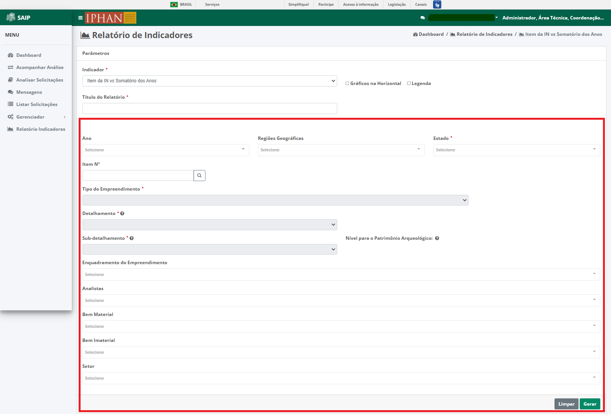
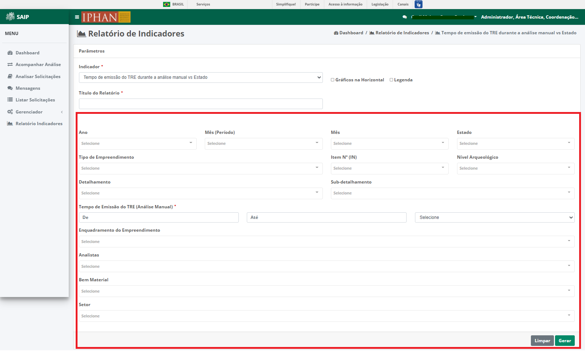
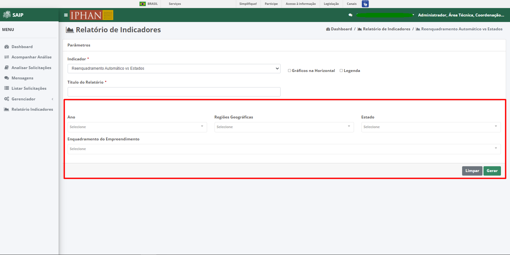

Relatório de Indicadores
==========================
.. meta::
   :description: Apresentação do Relatório de Indicadores.
  
Para acessar o **Relatório de Indicadores** do sistema, clique na opção **Relatório de Indicadores** no menu lateral esquerdo.

.. image:: ../images/SAIP_Interno_Relatorio_Indicadores.png  
     :alt: SAIP Interno Relatório de Indicadores

Em Parâmetros, na parte superior se encontram os parâmetros do Relatório como **Indicador**, **Título do Relatório** e as checkbox, **Gráficos na Horizontal** e **Legenda**.

Em Parâmetros, na parte inferior se encontram os parâmetros de pesquisa, de acordo com o indicador selecionado, podendo ser, **FCA vs Ano**, **Nível Arqueológico vs Ano**, **FCA vs Regiões Geográficas (para cada região)**, **Somatória de todas FCA vs Regiões Geográficas (para cada região)**, **Somatória de todas FCA vs Estados**, **Item da IN vs Ano**, **Item da IN vs Somatório dos Anos, Setores vs Ano**, **Setores vs Somatório dos Anos**, **Licenciamento Federal/Estadual/Municipal) vs Ano**, **(Licenciamento Federal/Estadual/Municipal) vs Somatório dos Anos**, **Tempo de emissão do TRE durante a análise manual vs Estado**, **Requisição Bem Material vs Ano**, **Requisição Bem Material vs Estado**, **Requisição de Bem Imaterial vs Ano**, **Requisição de Bem Imaterial vs Estado**, **Nº de discordância do TRE vs Ano**, **Nº de discordância do TRE vs Estado** e **Nº de discordância do TRE vs Tipologia**.

FCA vs Ano   
------------
Para o indicador **FCA vs Ano**, o sistema apresenta e permite a seleção dos seguintes filtros: Ano, Regiões Geográficas, Estado, Tipo do Empreendimento, Detalhamento, Sub-detalhamento, Item Nº (IN), Nível Arqueológico, Enquadramento do Empreendimento, Analistas, Bem Material, Bem Imaterial e Setor.

.. note::
   Tem-se os botões, **Limpar** onde remove os filtros selecionados e **Gerar**, que leva para a página **Relatório**, apresentando os dados de acordo com os filtros selecionados.

Nível Arqueológico vs Ano  
---------------------------
Para o indicador **Nível Arqueológico vs Ano**, o sistema apresenta e permite a seleção dos seguintes filtros: Ano, Regiões Geográficas, Estado, Tipo do Empreendimento, Detalhamento, Sub-detalhamento, Item Nº (IN), Nível Arqueológico, Enquadramento do Empreendimento, Analistas, Bem Material, Bem Imaterial e Setor.

.. note::
   Tem-se os botões, **Limpar** onde remove os filtros selecionados e **Gerar**, que leva para a página Relatório, apresentando os dados de acordo com os filtros selecionados.

FCA vs Regiões Geográficas (para cada região)   
------------------------------------------------
Para o indicador **FCA vs Regiões Geográficas (para cada região)**, o sistema apresenta e permite a seleção dos seguintes filtros: Ano, Mês (Período), Mês, Regiões Geográficas, Tipo do Empreendimento, Detalhamento, Sub-detalhamento, Item Nº (IN), Nível Arqueológico, Enquadramento do Empreendimento, Analistas, Bem Material, Bem Imaterial e Setor.

.. note::
   Tem-se os botões, **Limpar** onde remove os filtros selecionados e **Gerar**, que leva para a página Relatório, apresentando os dados de acordo com os filtros selecionados.

Somatória de todas FCA vs Regiões Geográficas (para cada região)       
------------------------------------------------------------------------
Para o indicador **Somatória de todas FCA vs Regiões Geográficas (para cada região)**, o sistema apresenta e permite a seleção dos seguintes filtros: Ano, Mês (Período), Mês, Regiões Geográficas, Tipo do Empreendimento, Detalhamento, Sub-detalhamento, Item Nº (IN), Nível Arqueológico, Enquadramento do Empreendimento, Analistas, Bem Material, Bem Imaterial e Setor.

.. note::
   Tem-se os botões, **Limpar** onde remove os filtros selecionados e **Gerar**, que leva para a página Relatório, apresentando os dados de acordo com os filtros selecionados.

Somatória de todas FCA vs Estados          
--------------------------------------

Para o indicador **Somatória de todas FCA vs Estados**, o sistema apresenta e permite a seleção dos seguintes filtros: Ano, Mês (Período), Mês, Estado, Tipo do Empreendimento, Detalhamento, Sub-detalhamento, Item Nº (IN), Nível Arqueológico, Enquadramento do Empreendimento, Analistas, Bem Material, Bem Imaterial e Setor.

.. note::
   Tem-se os botões, **Limpar** onde remove os filtros selecionados e **Gerar**, que leva para a página Relatório, apresentando os dados de acordo com os filtros selecionados.

Item da IN vs Ano            
--------------------

Para o indicador **Somatória de todas FCA vs Estados**, o sistema apresenta e permite a seleção dos seguintes filtros: Ano, Regiões Geográficas, Estado, Tipo do Empreendimento, Detalhamento, Sub-detalhamento, Item Nº (IN), Nível Arqueológico, Enquadramento do Empreendimento, Analistas, Bem Material, Bem Imaterial e Setor.

.. note::
   Tem-se os botões, **Limpar** onde remove os filtros selecionados e **Gerar**, que leva para a página Relatório, apresentando os dados de acordo com os filtros selecionados.

Item da IN vs Somatório dos Anos           
------------------------------------
Para o indicador **Item da IN vs Somatório dos Anos**, o sistema apresenta e permite a seleção dos seguintes filtros: Ano, Regiões Geográficas, Estado, Tipo do Empreendimento, Detalhamento, Sub-detalhamento, Item Nº (IN), Nível Arqueológico, Enquadramento do Empreendimento, Analistas, Bem Material, Bem Imaterial e Setor.

.. note::
   Tem-se os botões, **Limpar** onde remove os filtros selecionados e **Gerar**, que leva para a página Relatório, apresentando os dados de acordo com os filtros selecionados.

Setores vs Ano 
-----------------
Para o indicador **Setores vs Ano**, o sistema apresenta e permite a seleção dos seguintes filtros: Ano, Mês (Período), Mês, Regiões Geográficas, Estado, Tipo do Empreendimento, Detalhamento, Sub-detalhamento, Item Nº (IN), Nível Arqueológico, Enquadramento do Empreendimento, Analistas, Bem Material, Bem Imaterial e Setor.

.. note::
   Tem-se os botões, **Limpar** onde remove os filtros selecionados e **Gerar**, que leva para a página Relatório, apresentando os dados de acordo com os filtros selecionados.

Setores vs Somatório dos Anos    
------------------------------
Para o indicador **Setores vs Somatório dos Anos**, o sistema apresenta e permite a seleção dos seguintes filtros: Ano, Mês (Período), Mês, Regiões Geográficas, Estado, Tipo do Empreendimento, Detalhamento, Sub-detalhamento, Item Nº (IN), Nível Arqueológico, Enquadramento do Empreendimento, Analistas, Bem Material, Bem Imaterial e Setor.

.. note::
   Tem-se os botões, **Limpar** onde remove os filtros selecionados e **Gerar**, que leva para a página Relatório, apresentando os dados de acordo com os filtros selecionados.

(Licenciamento Federal/Estadual/Municipal) vs Ano   
------------------------------------------------------------
Para o indicador **(Licenciamento Federal/Estadual/Municipal) vs Ano**, o sistema apresenta e permite a seleção dos seguintes filtros: Ano, Mês (Período), Mês, Regiões Geográficas, Estado, Tipo do Empreendimento, Detalhamento, Sub-detalhamento, Item Nº (IN), Nível Arqueológico, Enquadramento do Empreendimento, Analistas, Bem Material, Bem Imaterial e Setor.

.. note::
   Tem-se os botões, **Limpar** onde remove os filtros selecionados e **Gerar**, que leva para a página Relatório, apresentando os dados de acordo com os filtros selecionados.

(Licenciamento Federal/Estadual/Municipal) vs Somatório dos Anos         
------------------------------------------------------------------------
Para o indicador **(Licenciamento Federal/Estadual/Municipal) vs Somatório dos Anos**, o sistema apresenta e permite a seleção dos seguintes filtros: Ano, Mês (Período), Mês, Regiões Geográficas, Estado, Tipo do Empreendimento, Detalhamento, Sub-detalhamento, Item Nº (IN), Nível Arqueológico, Enquadramento do Empreendimento, Analistas, Bem Material, Bem Imaterial e Setor.

.. note::
   Tem-se os botões, **Limpar** onde remove os filtros selecionados e **Gerar**, que leva para a página Relatório, apresentando os dados de acordo com os filtros selecionados.

Tempo de emissão do TRE durante a análise manual vs Estado   
------------------------------------------------------------
Para o indicador **Tempo de emissão do TRE durante a análise manual vs Estado**, o sistema apresenta e permite a seleção dos seguintes filtros: Ano, Mês (Período), Mês, Regiões Geográficas, Estado, Tipo do Empreendimento, Detalhamento, Sub-detalhamento, Item Nº (IN), Nível Arqueológico, Tempo de Emissão do TRE (Análise Manual), Enquadramento do Empreendimento, Analistas, Bem Material e Setor.

.. note::
   Tem-se os botões, **Limpar** onde remove os filtros selecionados e **Gerar**, que leva para a página Relatório, apresentando os dados de acordo com os filtros selecionados.

Requisição Bem Material vs Ano          
------------------------------------
Para o indicador **Requisição Bem Material vs Ano**, o sistema apresenta e permite a seleção dos seguintes filtros: Ano, Regiões Geográficas, Estado, Tipo do Empreendimento, Detalhamento, Sub-detalhamento, Item Nº (IN), Nível Arqueológico, Enquadramento do Empreendimento, Analistas, Bem Material e Setor.

.. note::
   Tem-se os botões, **Limpar** onde remove os filtros selecionados e **Gerar**, que leva para a página Relatório, apresentando os dados de acordo com os filtros selecionados.

Requisição Bem Material vs Estado     
------------------------------------
Para o indicador **Requisição Bem Material vs Ano**, o sistema apresenta e permite a seleção dos seguintes filtros: Ano, Mês (Período), Mês, Estado, Tipo do Empreendimento, Detalhamento, Sub-detalhamento, Item Nº (IN), Nível Arqueológico, Enquadramento do Empreendimento, Analistas, Bem Material e Setor.

.. note::
   Tem-se os botões, **Limpar** onde remove os filtros selecionados e **Gerar**, que leva para a página Relatório, apresentando os dados de acordo com os filtros selecionados.

Requisição de Bem Imaterial vs Ano                     
------------------------------------------------
Para o indicador **Requisição Bem Imaterial vs Ano**, o sistema apresenta e permite a seleção dos seguintes filtros: Ano, Regiões Geográficas, Estado, Tipo do Empreendimento, Detalhamento, Sub-detalhamento, Item Nº (IN), Nível Arqueológico, Enquadramento do Empreendimento, Analistas, Bem Imaterial e Setor.

.. note::
   Tem-se os botões, **Limpar** onde remove os filtros selecionados e **Gerar**, que leva para a página Relatório, apresentando os dados de acordo com os filtros selecionados.

Requisição de Bem Imaterial vs Estado                    
------------------------------------------------
Para o indicador **Requisição Bem Imaterial vs Ano**, o sistema apresenta e permite a seleção dos seguintes filtros: Ano, Mês (Período), Mês, Estado, Tipo do Empreendimento, Detalhamento, Sub-detalhamento, Item Nº (IN), Nível Arqueológico, Enquadramento do Empreendimento, Analistas, Bem Material, Bem Imaterial e Setor.

.. note::
   Tem-se os botões, **Limpar** onde remove os filtros selecionados e **Gerar**, que leva para a página Relatório, apresentando os dados de acordo com os filtros selecionados.

Nº de discordância do TRE vs Ano                               
------------------------------------------------
Para o indicador **Nº de discordância do TRE vs Ano**, o sistema apresenta e permite a seleção dos seguintes filtros: Ano, Regiões Geográficas, Estado, Tipo do Empreendimento, Detalhamento, Sub-detalhamento, Item Nº (IN), Nível Arqueológico, Enquadramento do Empreendimento, Discordância do TRE, Analistas, Bem Material, Bem Imaterial e Setor.

.. note::
   Tem-se os botões, **Limpar** onde remove os filtros selecionados e **Gerar**, que leva para a página Relatório, apresentando os dados de acordo com os filtros selecionados.

Nº de discordância do TRE vs Estado                                 
------------------------------------------------
Para o indicador **Nº de discordância do TRE vs Estado**, o sistema apresenta e permite a seleção dos seguintes filtros: Ano, Mês (Período), Mês, Estado, Tipo do Empreendimento, Detalhamento, Sub-detalhamento, Item Nº (IN), Nível Arqueológico, Enquadramento do Empreendimento, Discordância do TRE, Analistas, Bem Material, Bem Imaterial e Setor.

.. note::
   Tem-se os botões, **Limpar** onde remove os filtros selecionados e **Gerar**, que leva para a página Relatório, apresentando os dados de acordo com os filtros selecionados.

Nº de discordância do TRE vs Tipologia       
------------------------------------------------
Para o indicador **Nº de discordância do TRE vs Tipologia**, o sistema apresenta e permite a seleção dos seguintes filtros: Ano, Mês (Período), Mês, Regiões Geográficas, Estado, Tipo do Empreendimento, Item Nº (IN), Nível Arqueológico, Enquadramento do Empreendimento, Discordância do TRE, Analistas, Bem Material, Bem Imaterial e Setor.

.. note::
   Tem-se os botões, **Limpar** onde remove os filtros selecionados e **Gerar**, que leva para a página Relatório, apresentando os dados de acordo com os filtros selecionados.

Reenquadramento Automático vs Ano
----------------------------------------------------
Para o indicador **Reenquadramento Automático vs Ano**, o sistema apresenta e permite a seleção dos seguintes filtros: Ano, Regiões Geográficas, Estado e Enquadramento do Empreendimento.

.. note::
   Tem-se os botões, **Limpar** onde remove os filtros selecionados e **Gerar**, que leva para a página Relatório, apresentando os dados de acordo com os filtros selecionados.

Reenquadramento Automático vs Estados
-----------------------------------------
Para o indicador **Reenquadramento Automático vs Estados**, o sistema apresenta e permite a seleção dos seguintes filtros: Ano, Regiões Geográficas, Estado e Enquadramento do Empreendimento.

.. note::
   Tem-se os botões, **Limpar** onde remove os filtros selecionados e **Gerar**, que leva para a página Relatório, apresentando os dados de acordo com os filtros selecionados.

Gerar Relatório
----------------
Após a escolha de um dos Indicadores, seleção dos filtros e acionar o botão **Gerar**, é levado para a página **Relatório**, onde é apresentado as informações de acordo com os filtros selecionados, com os botões **Exportar PDF** e **Exportar Planilha**. 

.. note:: 
     No exemplo apresentado, para geração do relatório, foi selecionado o indicador **FCA vs Ano**.

Exportar PDF 
------------
Selecionando a opção **Exportar PDF**, é realizado o download do relatório em PDF.

Exportar Planilha
------------------
Selecionando a opção **Exportar Planilha**, é realizado o download do relatório em Excel.

