Cadastrar Solicitação (FCA)
=============================

.. meta::
   :description: Cadastrar a solicitação da FCA.

Para cadastrar uma nova solicitação, clicar na opção **Nova Solicitação** no menu lateral esquerdo.

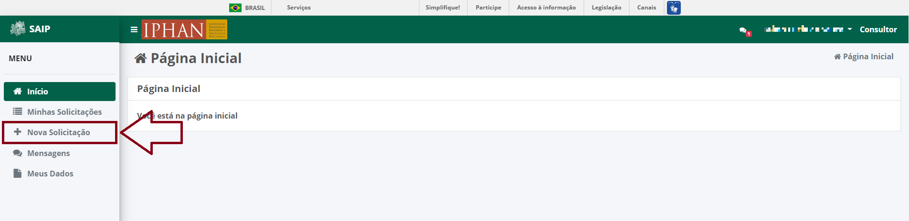

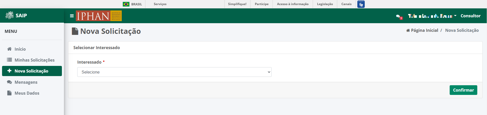

.. note:: 
   O sistema apresenta uma mensagem inicial informativa, para tratar sobre licenciamento no âmbito federal.

   Para continuar na solicitação, clique no botão **Concordo**.  Caso não concorde, clique no botão **Não Concordo**.    

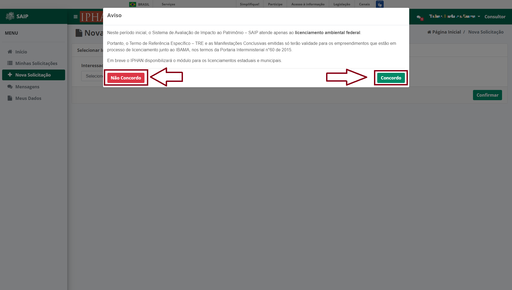

Selecionar Interessado
--------------------------------------------

Ao iniciar uma nova solicitação, selecionar o Interessado para qual a solicitação se refere. Após a seleção, clique no botão **Confirmar**.

Passo 1 - Empreendimento/ART
--------------------------------------------

No passo 1, informar os dados do empreendimento e a Anotação de Responsabilidade Técnica (ART).

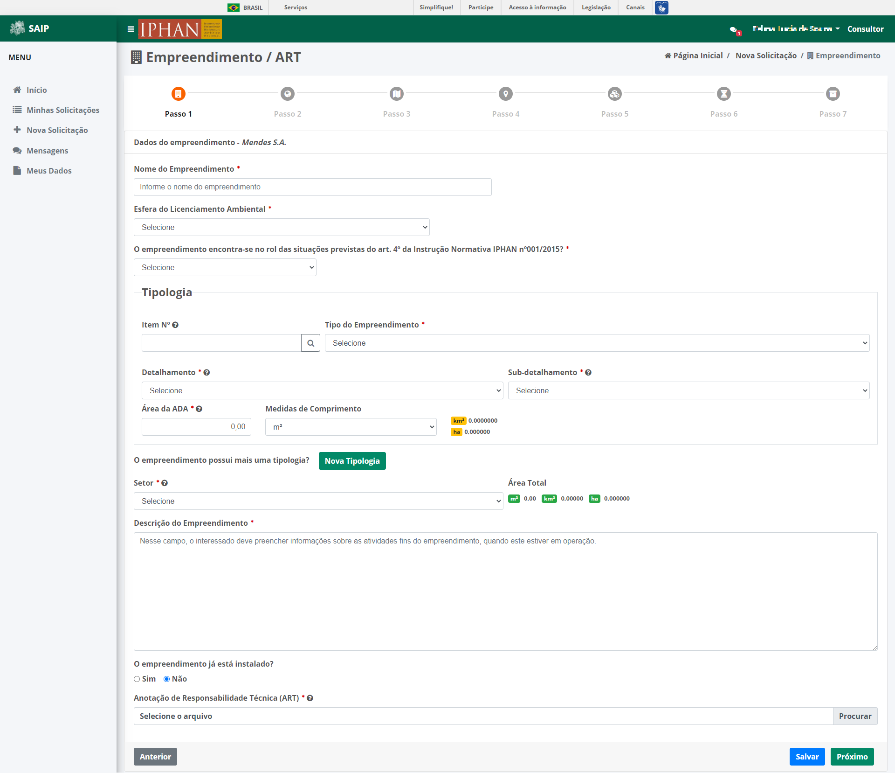

Ao informar a Esfera do Licenciamento Ambiental igual a **Federal**, o sistema apresenta uma mensagem explicativa sobre como informar um Processo no Passo 7 - Processos. 

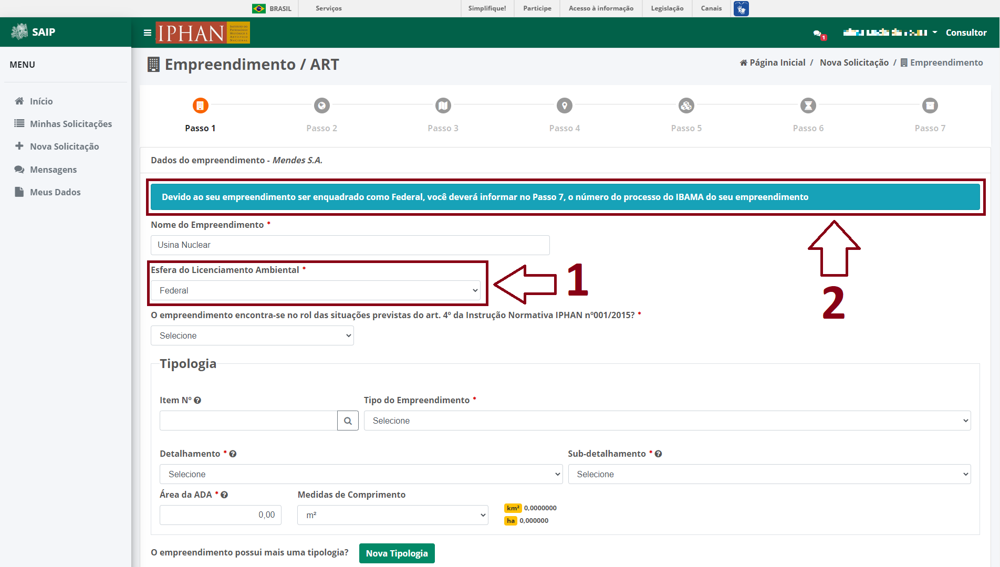

Informar se o empreendimento encontra-se ou não no rol do artigo 4º da IN de número 001/2015, o sistema apresenta uma mensagem de aviso para apenas aceitar licenciamentos federais.

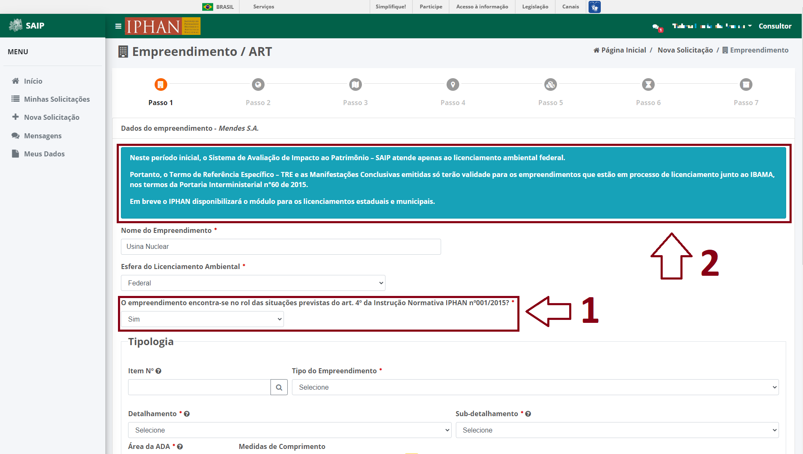

A Tipologia pode ser preenchida inserindo o código da IN no campo **Item Nº**, acionando a lupa ou selecionando item a item dos campos apresentados. Ao deixar o mouse em cima dos ícones das interrogações (?) ao lado de alguns campos, o sistema apresenta um texto de ajuda para o respectivo campo. 

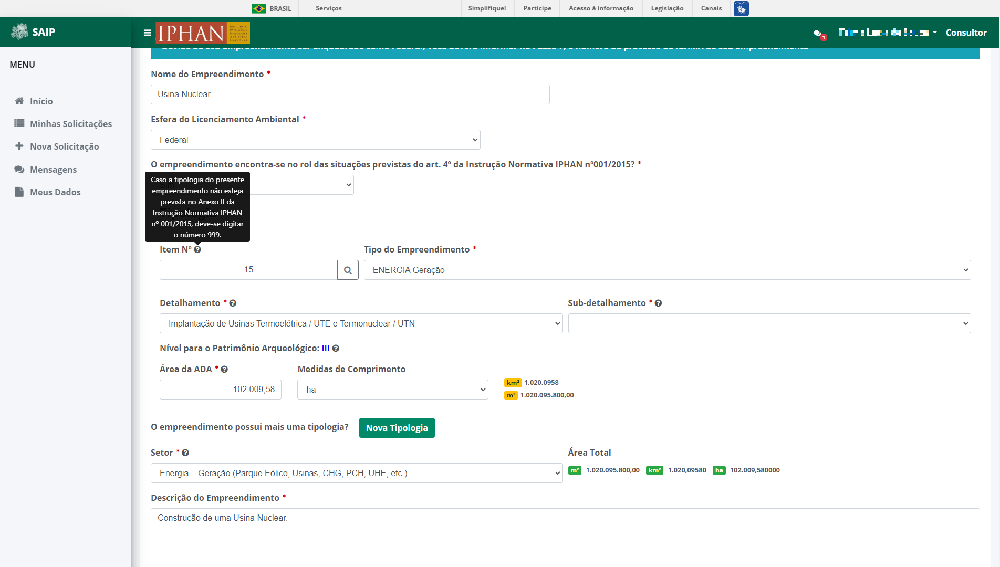

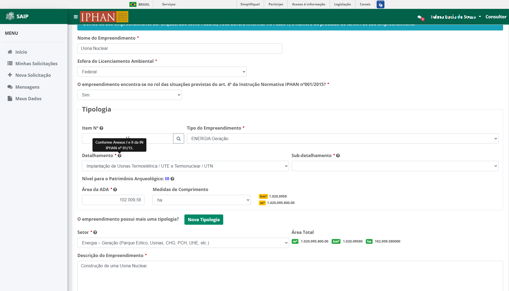

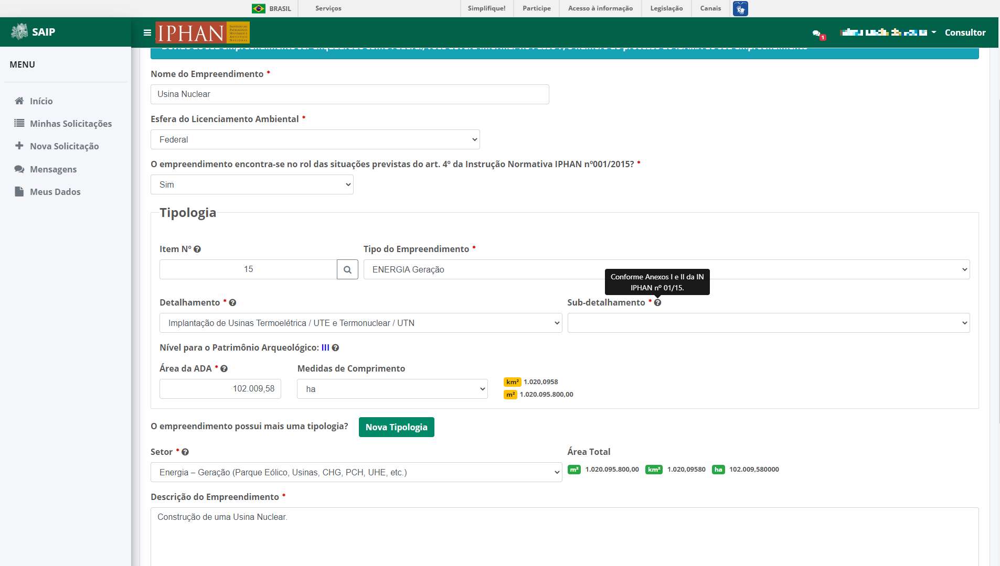

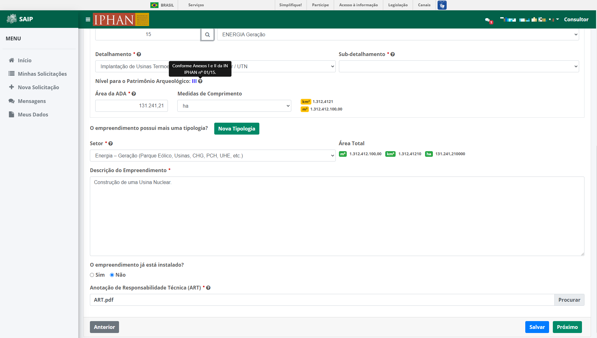

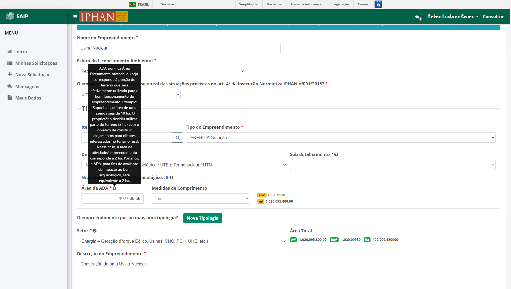

Ao informar se o empreendimento se encontra instalado, o sistema comunica que a respectiva solicitação será encaminhada para análise manual.

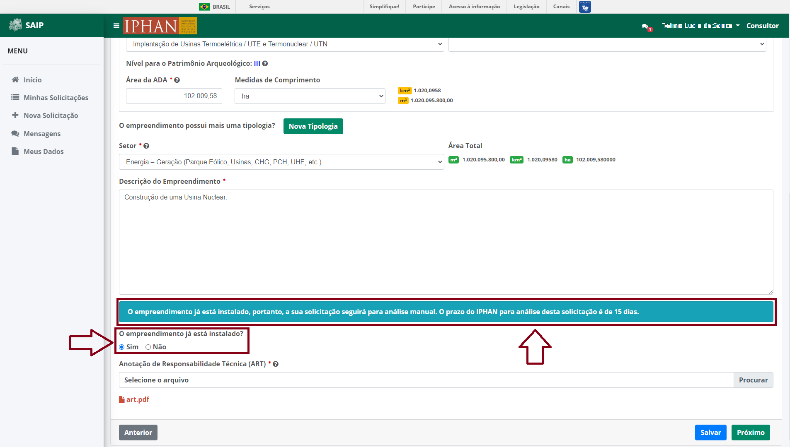
   
Os campos que possuem um asterisco em vermelho (:red:`*`) ao lado, são de preenchimento obrigatório.  E caso fiquem vazios, o sistema apresenta uma mensagem informando da obrigatoriedade da inserção das informações, conforme exemplo abaixo: 

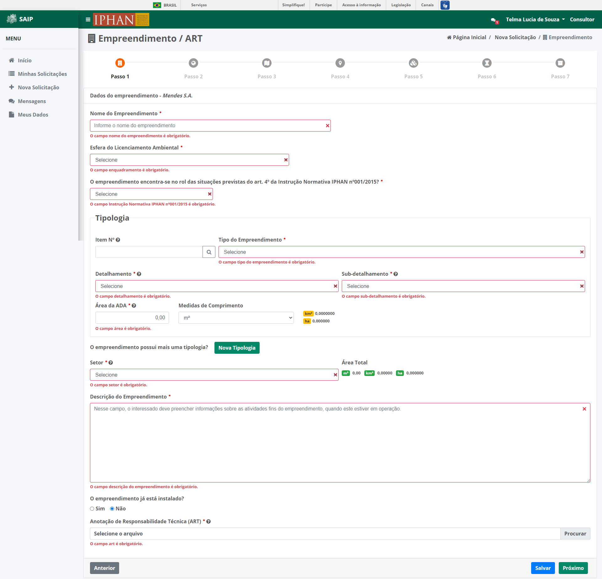

.. note::
   Caso não tenha preenchido todas as informações obrigatórias, mas deseje salvar as informações já preenchidas, acione o botão **Salvar**. O sistema salva todas as informações sem realizar as validações necessárias.

.. note::
 Ao finalizar o preenchimento de todas as informações, clique no botão **Próximo** para que o sistema valide as suas informações. E caso, estejam todas corretas o sistema direciona para o Passo 2 - Área Diretamente Afetada - ADA.

Passo 2 - Área Diretamente Afetada - ADA
--------------------------------------------

No passo 2, informar os dados da Área Diretamente Afetada (ADA) do Empreendimento. 

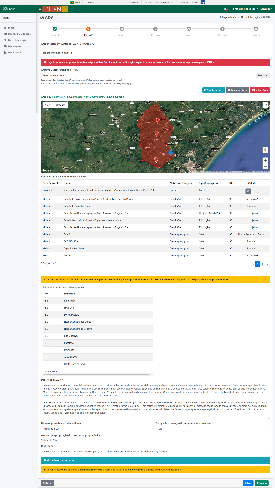

1. Área onde apresenta as tipologias informadas no Passo 1 - Empreendimento/ART.

2. Área onde será apresentada mensagens de erro ou casos que irão para análise manual.

3. Área onde são apresentadas as regras que o arquivo, que será utilizado no upload, deve seguir.

4. Área onde são apresentados os botões **Atualizar Bens**, **Desenhar Área** e **Excluir Área**.

   • Ao acionar **Atualizar Bens**, o sistema atualiza a lista (item 5) de bens presente na ADA informada.

   • Ao acionar **Desenhar Área**, o sistema permite que seja desenhada uma área no mapa, que representará a ADA do Empreendimento.

   • Ao acionar **Excluir Área**, o sistema remove todas as áreas informadas no mapa.

5. Área onde apresenta a lista de Bens Materiais, Bens Imateriais e Bens Arqueológicos presente no(s) polígono(s) informado(s) como ADA do Empreendimento.

6. Para Bens que estão presentes em mais de um município e/ou estado, o sistema apresenta o botão **Visualizar Estados/Municípios**. Ao acionar este botão, o sistema abre uma janela listando todos os municípios e estados do respectivo Bem.

7. Paginação do sistema para listas que possuem um elevado número de registros apresentados.

8. Aviso para verificar se a poligonal informada como ADA perpassa as respectivas UF e Municípios apresentados na lista abaixo.

9. Ao salvar, o sistema apresenta uma mensagem de sucesso juntamente com um aviso, informando que a sua solicitação deve ser encaminhada em um determinado período de tempo, e, caso não seja enviada será apagada da nossa base de dados.

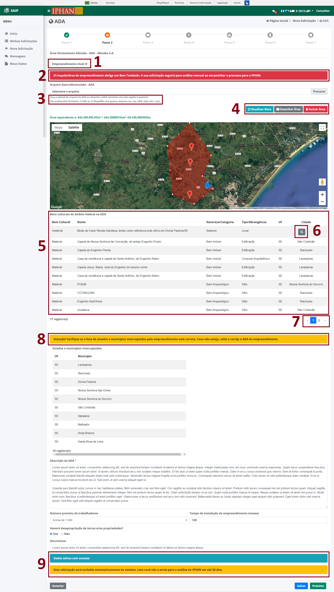

Os campos que possuem um asterisco em vermelho (:red:`*`) ao lado, com exceção do mapa que não possui, são de preenchimento obrigatório. E caso os campos fiquem vazios, o sistema apresenta uma mensagem informando da obrigatoriedade da inserção das informações, conforme exemplo abaixo:

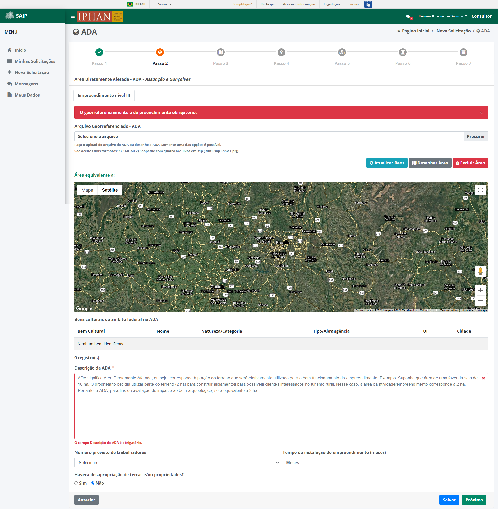

.. note::
   Caso não tenha preenchido todas as informações obrigatórias, mas deseje salvar as informações já preenchidas, acione o botão **Salvar**, que o sistema salva todas as informações sem realizar as validações necessárias.

.. note::
   Quando todas as informações estiverem corretamente preenchidas, acione o botão **Próximo** para que o sistema valide as suas informações e caso esteja tudo correto, será direcionado para o Passo 3 - Área de Influência Direta - AID.

Passo 3 - Área de Influência Direta - AID
--------------------------------------------

No passo 3, informar os dados da Área de Influência Direta (AID) do Empreendimento. 

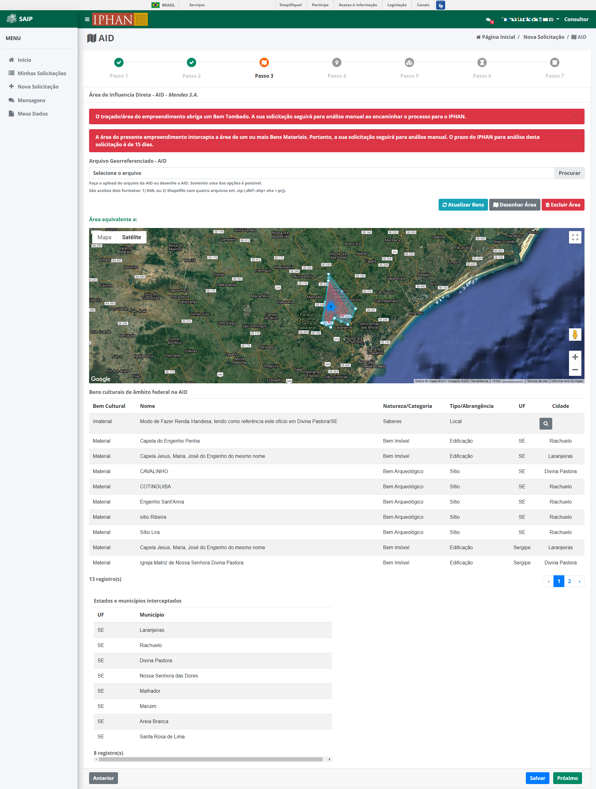

1. Área onde serão apresentadas as mensagens de erro ou casos que serão encaminhados para análise manual.
   
2. Área onde apresenta as regras que o arquivo, será utilizado no upload, deve seguir.

3. Área onde apresenta os botões **Atualizar Bens**, **Desenhar Área** e **Excluir Área**.

   • Ao acionar **Atualizar Bens**, o sistema atualiza a lista (item 4) de bens presentes na AID informada.

   • Ao acionar **Desenhar Área**, o sistema permite que seja desenhada uma área no mapa, que representará a AID do Empreendimento.

   • Ao acionar **Excluir Área**, o sistema remove todas as áreas informadas no mapa.

4. Área onde será apresenta a lista de Bens Materiais, Bens Imateriais e Bens Arqueológicos presente no(s) polígono(s) informado(s) como ADA do Empreendimento.

5. Para Bens que estão presente em mais de um município e/ou estado, o sistema apresenta o botão **Visualizar Estados/Municípios**. Ao acionar este botão, o sistema abre uma janela listando todos os municípios e estados do respectivo Bem.

6. Paginação do sistema para listas que possuem um elevado número de registros apresentados.

7. Apresenta a lista de UF e Municípios que perpassa na AID informada. 

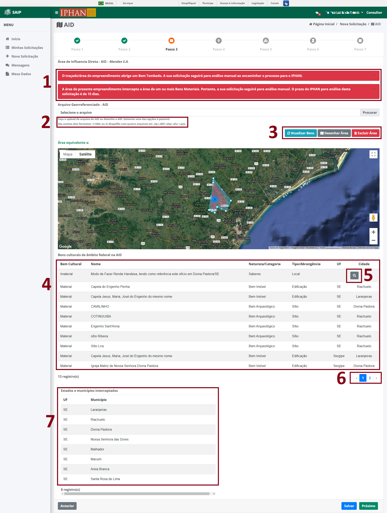

O mapa é único campo de preenchimento obrigatório. E caso, o campo não seja preenchido o sistema apresenta uma mensagem de alerta, conforme exemplo abaixo:

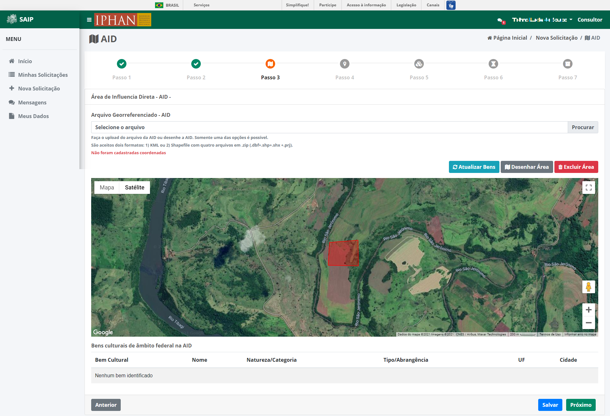

.. note::
   Caso não tenha preenchido todas as informações obrigatórias, mas deseja salvar as informações já preenchidas, acione o botão **Salvar**, que o sistema salva sem realizar as validações necessárias.

.. note::
   Quando todas as informações estiverem corretamente preenchidas, acione o botão **Próximo** para que o sistema valide e direcione para o Passo 4 - Municípios. 

Passo 4 - Municípios
--------------------------------------------

No passo 4, deverão ser visualizadas se as informações de municípios coincidem com a ADA e AID informada do empreendimento. 

.. note::
   Caso as informações sejam apresentadas corretamente, acione o botão **Próximo** para que o sistema direcione para o Passo 5 - Elementos do Projeto de Engenharia.

Passo 5 - Elementos do Projeto de Engenharia
--------------------------------------------

No passo 5, deverão ser informados os dados do projeto de engenharia e instalações secundárias do Empreendimento.

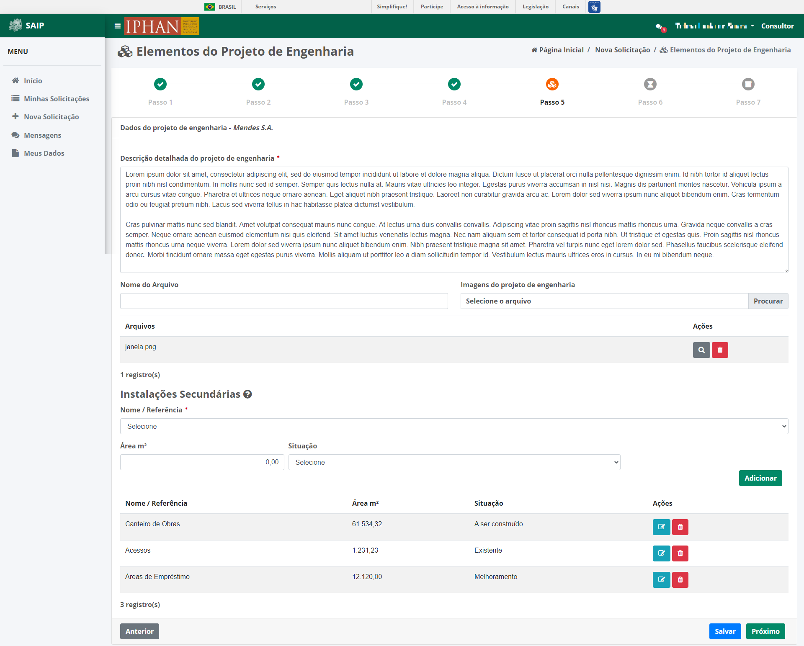

1. Área onde deverá ser informada a descrição detalhada do projeto de engenharia.

2. Área onde deverão constar as imagens do projeto de engenharia e listará todas as imagens já informadas.

3. Área onde são apresentados os botões **Visualizar Imagem** e **Excluir Imagem**.

   • Ao acionar **Visualizar Imagem**, o sistema apresenta a respectiva imagem em uma nova janela.

   • Ao acionar **Excluir Imagem**, o sistema apresenta mensagem de confirmação para excluir a respectiva imagem.

4. Área onde deverão ser informadas as instalações secundárias do projeto de engenharia e listará todas as instalações já cadastradas.

5. Área onde são apresentados os botões **Editar Instalação Secundária** e **Excluir Instalação Secundária**.
   
   • Ao acionar **Editar Instalação Secundária**, o sistema apresenta os dados da respectiva instalação secundária para a ser editado.

   • Ao acionar **Excluir Instalação Secundária**, o sistema apresenta mensagem de confirmação para excluir a respectiva instalação secundária.

6. Botão **Adicionar** ao ser acionado, adiciona os dados da Instalação Secundária na lista de Instalações. Ao editar, o botão tem a nomenclatura **Atualizar** que ao ser acionado atualiza os dados da respectiva Instalação Secundária.

.. note::
   Caso deseje que a imagem possua um nome diferente do arquivo original, informe primeiro no campo **Nome do Arquivo**, para então selecionar o arquivo a ser inserido. 

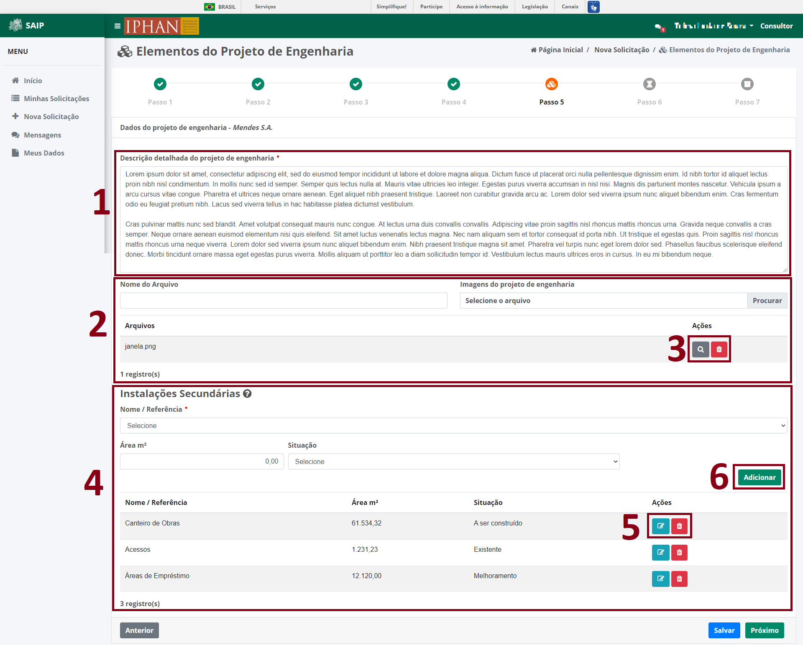

Os campos que possuem um asterisco em vermelho (:red:`*`) ao lado, são de preenchimento obrigatório. E caso, os campos fiquem vazios o sistema apresenta uma mensagem informando da obrigatoriedade da inserção das informações, conforme exemplo abaixo: 

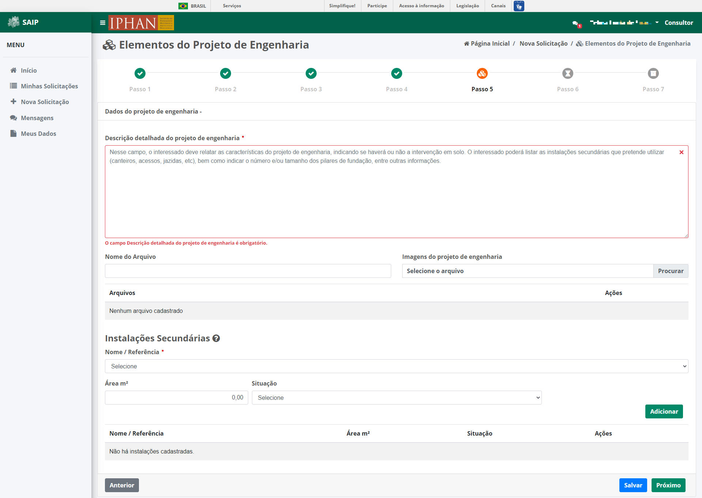

.. note::
   Caso não tenha preenchido todas as informações obrigatórias, mas deseja salvar as informações já preenchidas, acione o botão **Salvar**, que o sistema salva todas as informações sem realizar as validações necessárias.

.. note::
   Caso as informações sejam apresentadas corretamente, acione o botão **Próximo** para que o sistema direcione para o Passo 6 - Previsão de Impacto.

Passo 6 - Previsão de Impacto
--------------------------------------------

No passo 6, informar os dados sobre previsão de impacto no Empreendimento. 

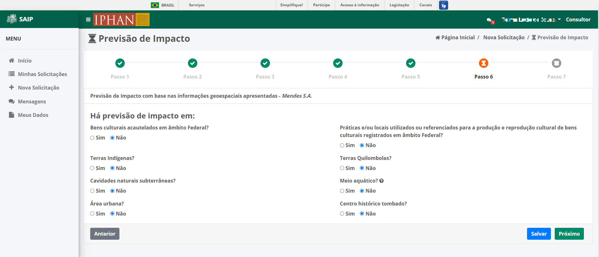

Ao deixar o mouse em cima dos ícones das interrogações (?) ao lado de alguns campos, o sistema apresenta um texto de ajuda para o respectivo campo.

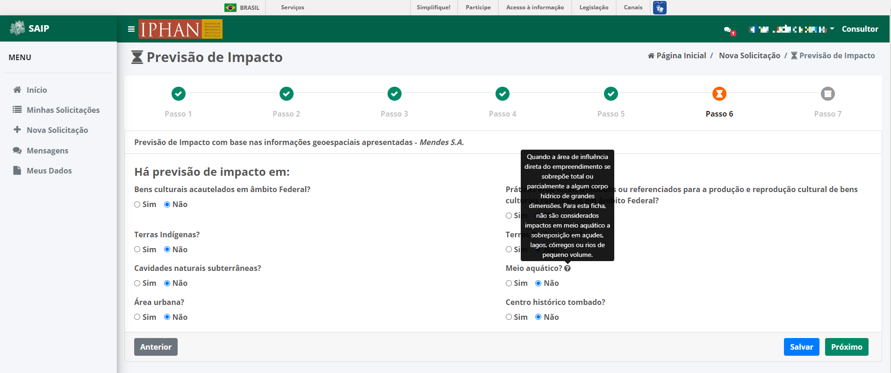

Ao informar que há impacto em meio aquático no Empreendimento, o sistema apresenta uma mensagem explicativa sobre análise manual da respectiva solicitação. 

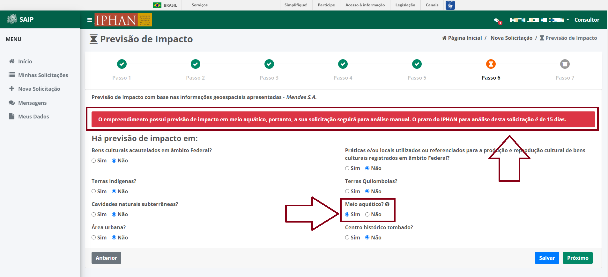

.. note::
   Caso não tenha preenchido todas as informações obrigatórias, mas deseje salvar as informações já preenchidas, acione o botão **Salvar**, que o sistema salva sem realizar as validações necessárias.

.. note::
   Caso as informações sejam apresentadas corretamente, acione o botão **Próximo** para que o sistema direcione para o Passo 6 - Previsão de Impacto.

Passo 7 - Processos
--------------------------------------------

No passo 7, informar os dados sobre os processos que envolvem o Empreendimento. 

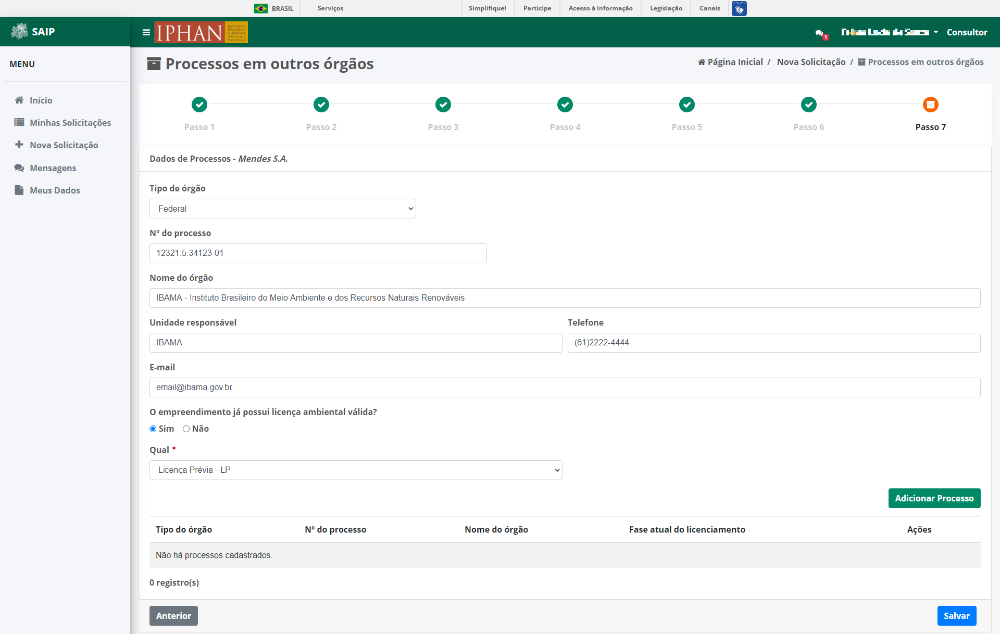

Em **Dados de Processos**, informar os dados dos processos que o Empreendimento possui como: Tipo de órgão, Número do Processo, Nome do órgão, Unidade responsável, Telefone, E-mail, se o Empreendimento possui licença ambiental válida, se for o caso.

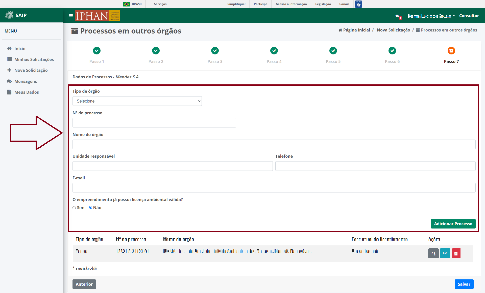

.. note:: 
    Lembre-se que, ao terminar de preencher os dados o botão **Adicionar** deverá ser clicado para que o sistema inclua os dados informados na solicitação

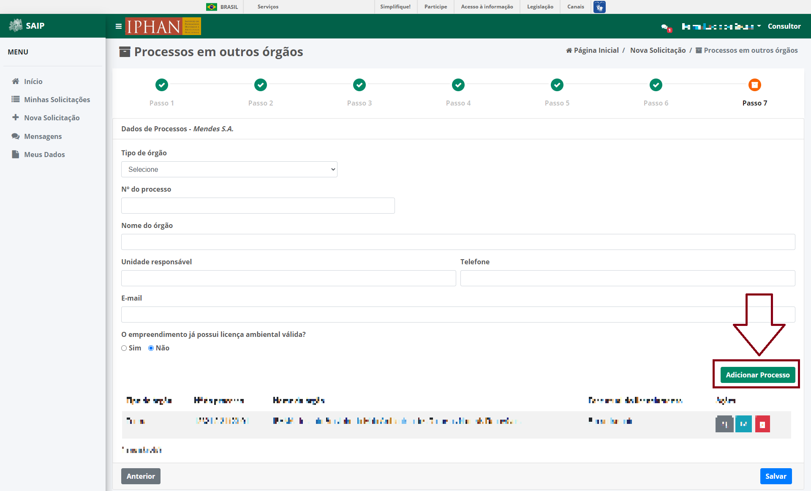

Abaixo, o sistema apresenta a lista de processos cadastrados na solicitação.

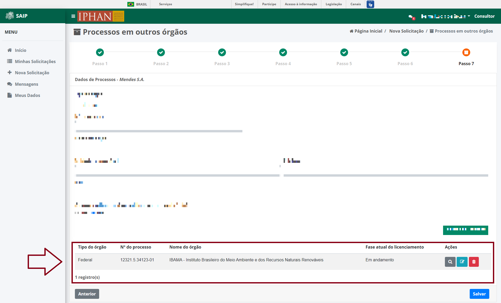

Na lista, as ações de **Visualizar Processo**, **Editar Processo** e **Excluir Processo**, respectivamente.

.. image:: ../images/SAIP-NovaSolicitacao-Passo7-Processos-ProcessoLista-Acoes.png
   :alt: SAIP Nova Solicitacao Passo 7 Processos Processo Lista Acoes

* Visualizar Interessado

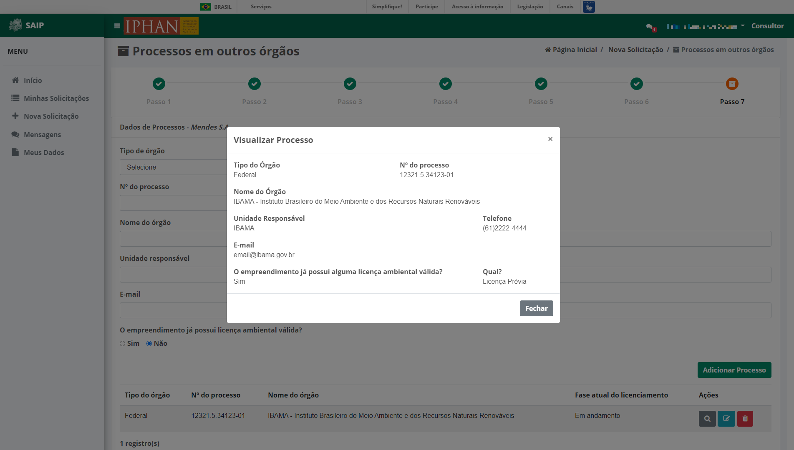

* Excluir Interessado

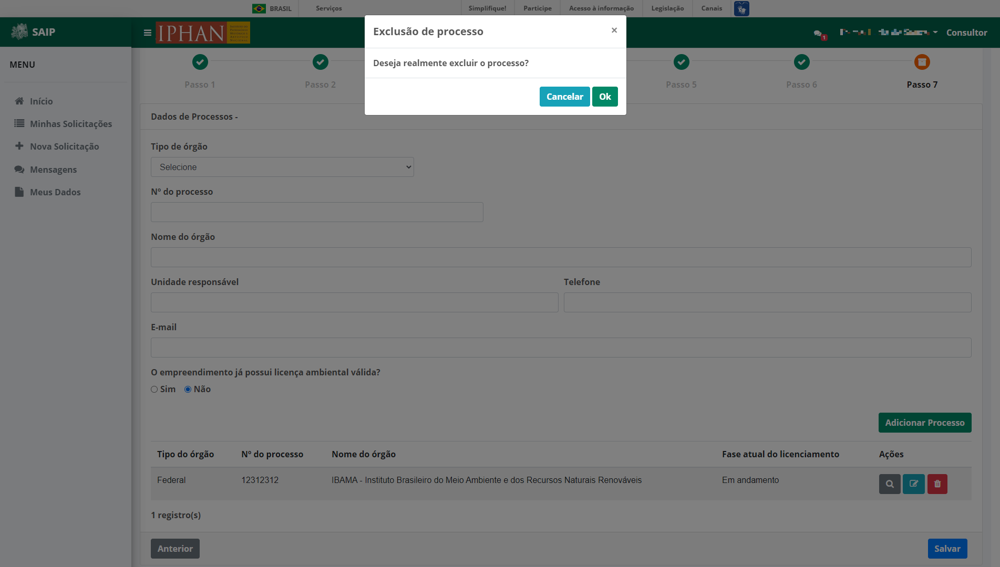
   
Ao acionar o botão **Salvar**, o sistema identifica se todas as informações necessárias estão corretas e então disponibilizará o botão **Enviar Solicitação**.  Ao salvar, caso necessário, o sistema informa no topo mensagens de alerta sobre a solicitação. 

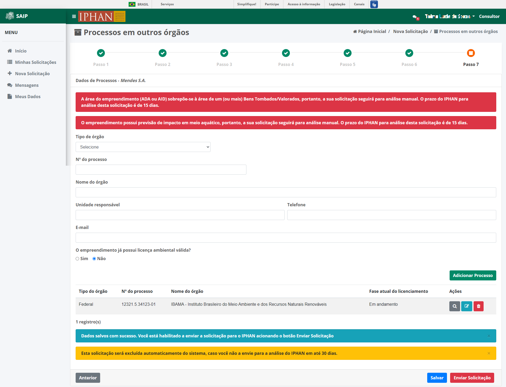

Ao acionar o botão **Enviar Solicitação**, o sistema encaminha a solicitação ao IPHAN para análise. 