Minhas Solicitações (FCA)
===========================

.. meta::
   :description: Visualizar as solicitações realizadas.

Para acessar, as solicitações já realizadas e acompanhá-las pelo SAIP clicar na opção **Minhas Solicitações** no menu lateral esquerdo.

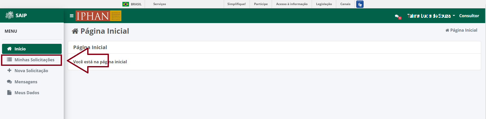

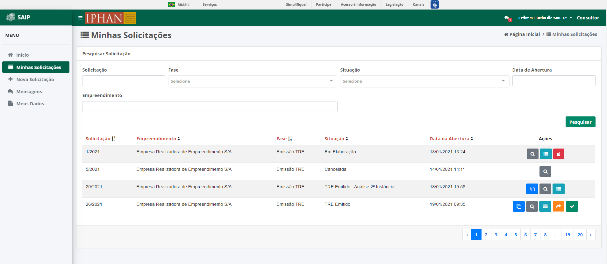

Solicitações
----------------------------

Em **Pesquisar Solicitação**, na parte superior se encontram os filtros de pesquisa como Número da Solicitação, Fase, Situação, Data de Abertura e Empreendimento.

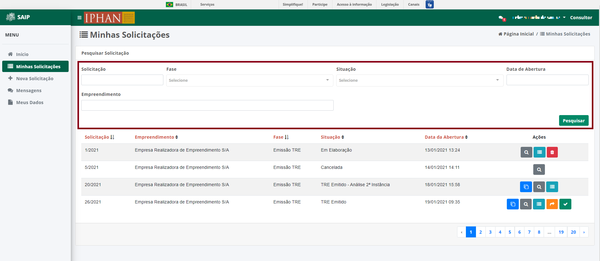

.. note:: 
    Sempre que preencher os filtros clique no botão **Pesquisar**, para que a ação seja executada.

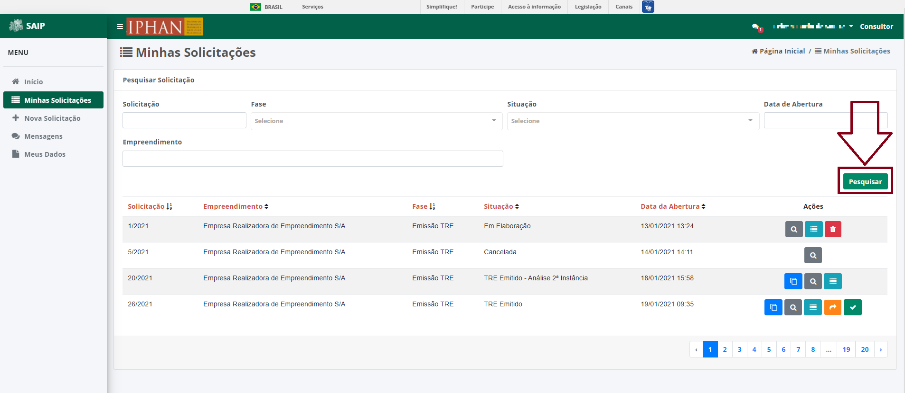

Em **Pesquisar Solicitação**, na parte inferior encontram se os registros totais de solicitações ou o resultado da pesquisa realizada com os filtros. As colunas apresentadas são: Solicitação, Empreendimento, Fase, Situação, Data de Abertura e Ações. 

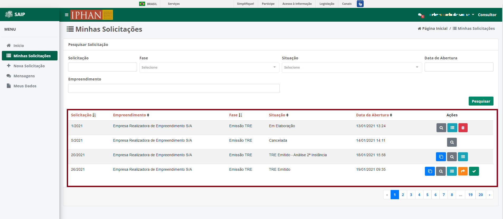

.. note:: 
    O sistema permite que você ordene as colunas por ordem crescente ou decrescente, conforme o clique nos títulos de cada coluna.

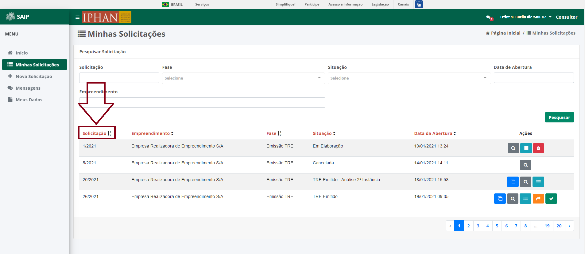

.. note:: 
    Na lista de solicitações, o sistema apresenta a paginação a cada 10 registros. É possível selecionar a página desejada e nas extremidades há a opção de selecionar os ícones de página anterior e próxima página.

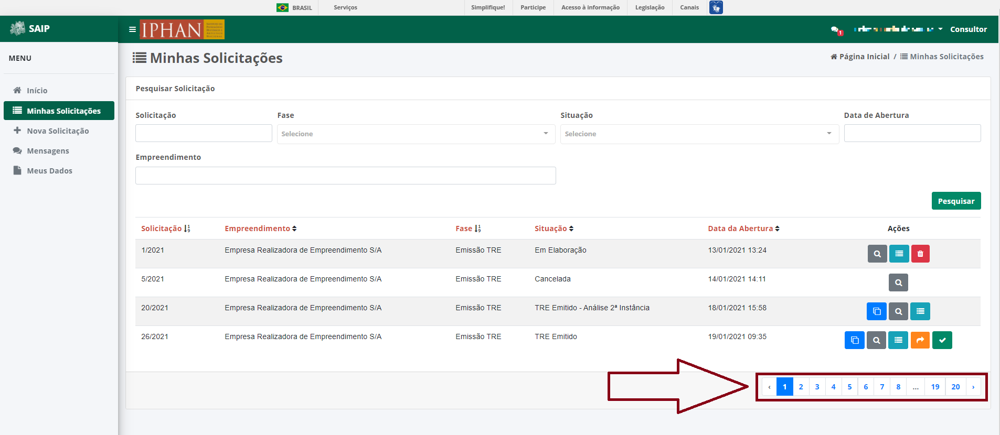

Na lista, há as ações de **Clonar Solicitação**, **Visualizar Solicitação**, **Detalhar Solicitação**, **Encaminhar para a Instância Recursal**, **Concordo com o TRE analisado manualmente** e **Excluir Solicitação**, respectivamente.

.. note:: 
    As ações são apresentadas, de acordo com a **Situação** atual da solicitação.

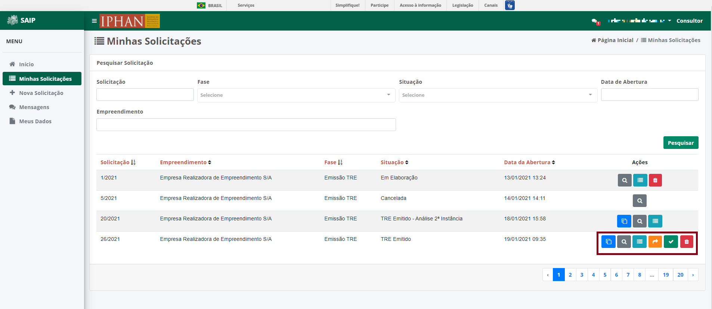

Clonar Solicitação
----------------------------

Ao acionar o botão **Clonar Solicitação**, o sistema clona a respectiva solicitação, informando um novo número da solicitação clonada.

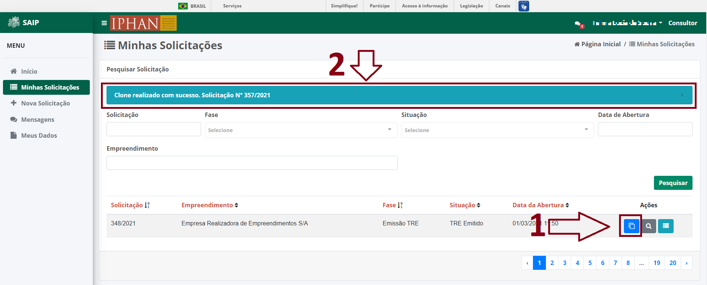

Visualizar Solicitação
----------------------------

Ao acionar o botão **Visualizar Solicitação**, o sistema apresenta uma janela com os dados da solicitação. Caso deseje fechar a janela, clique no botão **Fechar**.

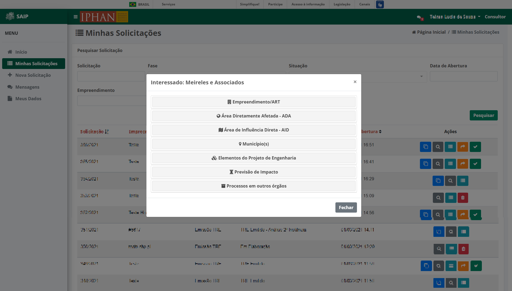

Detalhar Solicitação
----------------------------

Ao acionar o botão **Detalhar Solicitação**, o sistema apresenta uma janela com o número da solicitação, número do SEI, progresso atual do preenchimento, a situação e os arquivos anexados ou gerados pelo sistema para a solicitação. São apresentados os botões **Fechar**, **Encaminhar para a Instância Recursal** e **Concordo com o TRE analisado manualmente**, que ao ser acionado fecha a janela de detalhamento da solicitação, encaminha para a instância recursal e concordar com o TRE gerado na análise manual.

.. note:: 
    As ações **Encaminhar para a Instância Recursal** e **Concordo com o TRE analisado manualmente** são apresentadas de acordo com a **Situação** atual da solicitação.

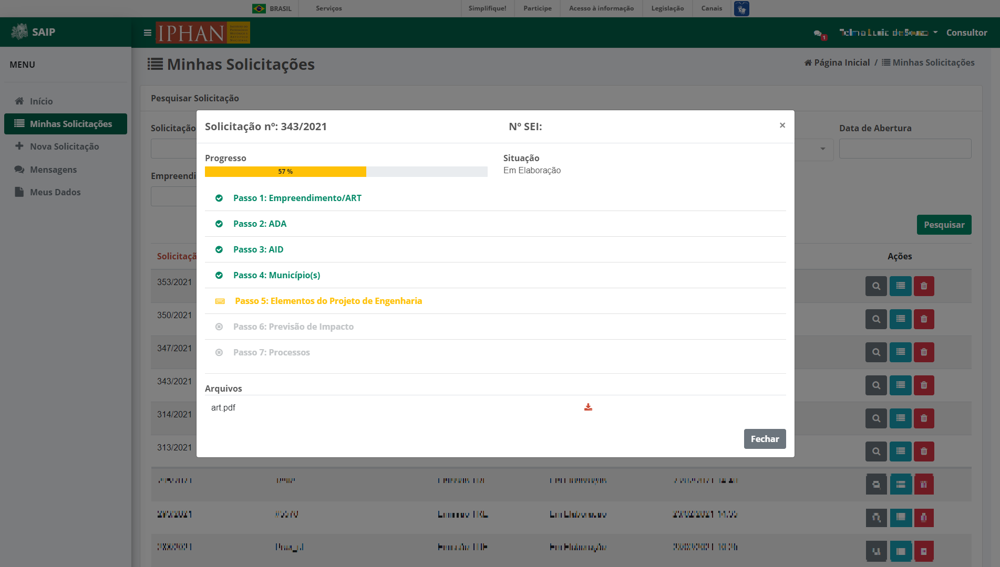

Encaminhar para a Instância Recursal
----------------------------------------

No caso da solicitação ter sido enviada para análise manual e retorne com um TRE gerado, o sistema permitirá que a mesma seja encaminhada para Instância Recursal. O sistema apresenta as opções na **Lista de Solicitações** e no **Detalhamento da Solicitação**. 

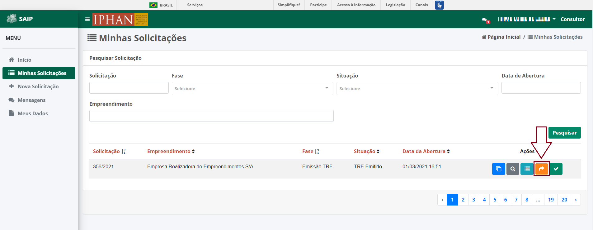

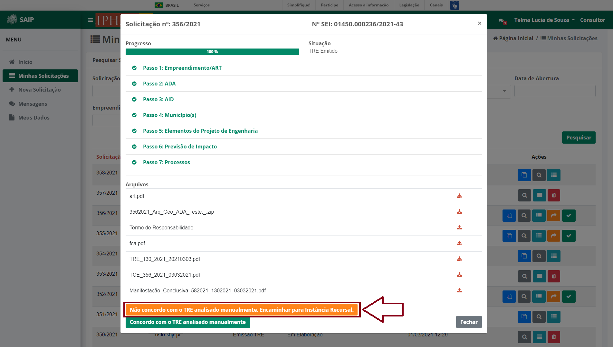
   
Ao clicar no botão **Não concordo com o TRE analisado manualmente. Encaminhar para Instância Recursal**, a solicitação é encaminhada para Instância Recursal. O sistema apresenta uma janela de confirmação, após o clique em **Não concordo com o TRE analisado manualmente. Encaminhar para Instância Recursal**  a solicitação é enviada para a segunda instância de análise pelo IPHAN. 

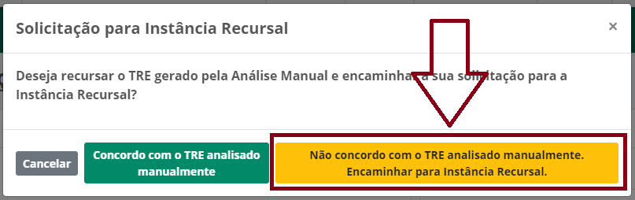

Caso deseje concordar com o TRE gerado, clique no botão **Concordo com o TRE analisado manualmente**. O sistema entende a concordância e remove a opção de solicitar a instância recursal.

.. image:: ../images/SAIP-MinhasSolicitacoes-InstanciaRecursal-Mensagem-ConcordarAnaliseManual.png
   :alt: SAIP Minhas Solicitacoes Instancia Recursal Mensagem Concordar Analise Manual

Concordo com o TRE analisado manualmente
-----------------------------------------

Caso a solicitação tenha sido enviada para análise manual no seu retorno com um TRE gerado, o sistema permite que se concorde com o TRE. O sistema apresenta as opções na **Lista de Solicitações** e no **Detalhamento da Solicitação**.

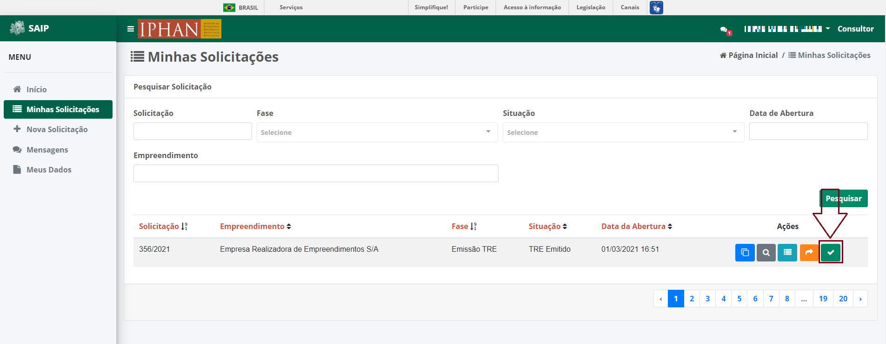

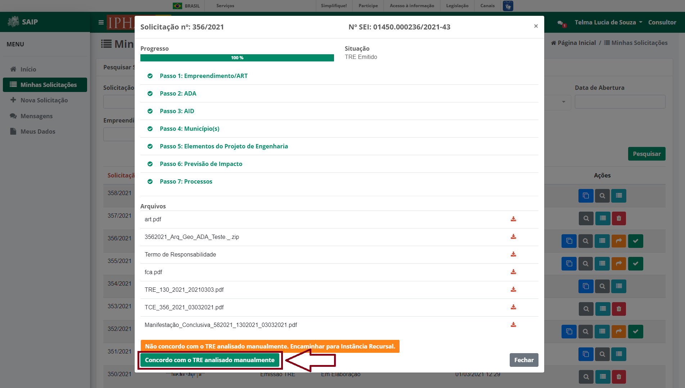

O clique no botão **Concordo com o TRE analisado manualmente**, o sistema entende a sua concordância e remove a opção de solicitar a instância recursal.

Excluir Solicitação
----------------------------

O clique no botão **Excluir Solicitação**, o sistema apresenta uma janela de confirmação da exclusão. São apresentados os botões **Cancelar** e **Ok** os quais respectivamente, um realiza o fechamento da mensagem e o outro confirma a exclusão da solicitação.

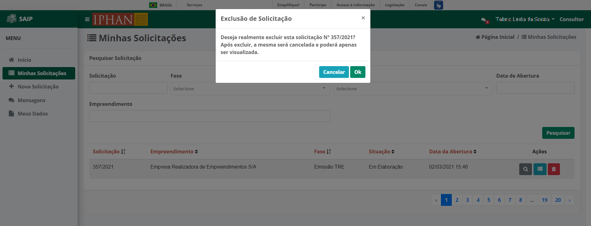

.. note:: 
   Ao excluir uma solicitação, o sistema modifica a situação para **Cancelada**. Nesse caso, apenas os dados podem ser visualizados.